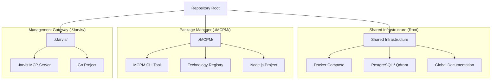

# System Architecture Map

This document outlines the high-level architecture of the repository, defining the relationships between the shared infrastructure, the MCPM package manager, and the Jarvis management server.

## 1. Repository Hierarchy

The repository is structured to separate concerns between management logic, package management implementation, and shared infrastructure.

## 2. Component Roles

### Root (Shared Infrastructure)
*   **Purpose:** Provides the foundational environment for all components.
*   **Key Files:** `docker-compose.yml`, `.env`, `docs/`.
*   **Responsibility:** Hosting databases (PostgreSQL, Qdrant) and defining global environment settings.

### MCPM (`./MCPM/`)
*   **Purpose:** The core logic for managing MCP servers.
*   **Key Files:** `package.json`, `config/technologies.toml`.
*   **Responsibility:**
    *   Defining the registry of available MCP technologies.
    *   Handling installation, configuration, and updates of servers.
    *   Generating IDE-specific configurations.

### Jarvis (`./Jarvis/`)
*   **Purpose:** The interface for AI agents to control the system.
*   **Key Files:** `main.go`, `Dockerfile`.
*   **Responsibility:**
    *   Exposing `mcpm` CLI functionality as callable MCP tools.
    *   Acting as the "hands" for an AI agent to manage the environment.
    *   **Relationship:** Jarvis *uses* MCPM. It does not contain MCPM logic but executes the `mcpm` binary found in the system PATH.

## 3. Data Flow & Management

1.  **Agent Request:** An AI agent connects to the Jarvis MCP server and requests to install a tool (e.g., `install_server("brave")`).
2.  **Execution:** Jarvis receives the request and executes the corresponding `mcpm` command (e.g., `mcpm install brave`).
3.  **Package Management:** The `mcpm` CLI (running from the global installation or PATH) reads the registry from `./MCPM/config/technologies.toml` (or its internal config) and performs the installation.
4.  **Configuration:** `mcpm` updates the local registry and generates the necessary JSON configuration for IDEs.

## 4. Future Roadmap

### Phase 1: Consolidation (Current)
*   [x] Centralize MCPM-specific code into `./MCPM/`.
*   [x] Establish Jarvis as a lightweight gateway.
*   [ ] Standardize configuration paths.

### Phase 2: Enhanced Integration
*   **Dynamic Config Loading:** Ensure `mcpm` can dynamically load configuration from the repository structure regardless of execution context.
*   **Containerization:** Fully containerize the Jarvis + MCPM stack so it can be deployed as a single unit (e.g., a "Management Sidecar").

### Phase 3: Autonomous Management
*   **Self-Healing:** Jarvis detects unhealthy servers (via `check_status`) and automatically attempts repairs using `mcpm`.
*   **Semantic Discovery:** Enhance `search_servers` to use the vector database (Qdrant) for finding tools based on natural language descriptions.