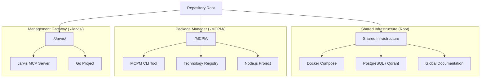

# System Architecture Map

This document outlines the high-level architecture of the repository, defining the relationships between the shared infrastructure, the MCPM package manager, and the Jarvis management server.

## 1. Repository Hierarchy

The repository is structured to separate concerns between management logic, package management implementation, and shared infrastructure.

## 2. Component Roles

### Root (Shared Infrastructure)
*   **Purpose:** Provides the foundational environment for all components.
*   **Key Files:** `docker-compose.yml`, `.env`, `docs/`.
*   **Responsibility:** Hosting databases (PostgreSQL, Qdrant) and defining global environment settings.

### MCPM (`./MCPM/`)
*   **Purpose:** The core logic for managing MCP servers.
*   **Key Files:** `package.json`, `config/technologies.toml`.
*   **Responsibility:**
    *   Defining the registry of available MCP technologies.
    *   Handling installation, configuration, and updates of servers.
    *   Generating IDE-specific configurations.

### Jarvis (`./Jarvis/`)
*   **Purpose:** The **intelligent presentation layer** and primary interface for AI agents to control the system.
*   **Key Files:** `main.go`, `tools.go`, `Dockerfile`.
*   **Responsibility:**
    *   **Presentation Layer:** Wraps raw MCPM CLI output with clean formatting, stripping ANSI codes and terminal noise.
    *   **Smart Error Handling:** Provides actionable error messages with suggestions for next steps.
    *   **Input Validation:** Prevents common mistakes before execution (invalid server names, empty queries, etc.).
    *   **Context Awareness:** Suggests appropriate actions based on project state and configuration.
    *   **Tool Exposure:** Exposes `mcpm` CLI functionality as 23 callable MCP tools with benefits-focused descriptions.
    *   **Batch Operations:** Enables complex workflows in single commands vs. multiple CLI invocations.
    *   **Relationship:** Jarvis *uses* MCPM. It does not contain MCPM logic but executes the `mcpm` binary found in the system PATH.

*   **Phase 1 Improvements (Latest):**
    *   Enhanced all 23 tool descriptions to highlight benefits and use cases
    *   Added intelligent validation and helpful suggestions to key tools
    *   Positioned as the primary interface over direct MCPM CLI for AI agents
    *   Comprehensive test suite (6 test functions, 23+ test cases)
    *   Pre-commit hooks enforcing Go formatting and security checks

## 3. Data Flow & Management (Presentation Layer Pattern)

Jarvis implements a **presentation layer pattern** that sits between AI agents and the MCPM CLI:

1.  **Agent Request:** An AI agent connects to the Jarvis MCP server and requests to install a tool (e.g., `install_server("brave")`).
2.  **Validation:** Jarvis validates the input (server name format, non-empty values, allowed actions).
3.  **Execution:** Jarvis executes the corresponding `mcpm` command with environment variables (e.g., `MCPM_NON_INTERACTIVE=true MCPM_FORCE=true mcpm install brave`).
4.  **Package Management:** The `mcpm` CLI (running from the global installation or PATH) reads the registry from `./MCPM/config/technologies.toml` (or its internal config) and performs the installation.
5.  **Output Processing:** Jarvis captures the raw CLI output, strips ANSI codes and terminal warnings, and formats it as clean Markdown.
6.  **Smart Response:** Jarvis adds context-aware suggestions (e.g., "Next step: Use manage_profile() to add it to a profile") and returns the enhanced response to the agent.
7.  **Configuration:** `mcpm` updates the local registry and generates the necessary JSON configuration for IDEs.

**Key Advantage:** AI agents receive clean, actionable responses instead of raw terminal output, reducing hallucinations and improving workflow efficiency.

## 4. Future Roadmap

### Phase 1: Making Jarvis the Obvious Choice (✅ Complete)
*   [x] Centralize MCPM-specific code into `./MCPM/`.
*   [x] Establish Jarvis as intelligent presentation layer.
*   [x] Enhanced all 23 tool descriptions with benefits-focused copy.
*   [x] Added smart error handling with validation and suggestions.
*   [x] Updated documentation positioning Jarvis as primary interface.
*   [x] Comprehensive test suite (23+ test cases, all passing).
*   [ ] Standardize configuration paths (deferred to Phase 2).

### Phase 2: Enhanced Integration
*   **Dynamic Config Loading:** Ensure `mcpm` can dynamically load configuration from the repository structure regardless of execution context.
*   **Containerization:** Fully containerize the Jarvis + MCPM stack so it can be deployed as a single unit (e.g., a "Management Sidecar").

### Phase 3: Autonomous Management
*   **Self-Healing:** Jarvis detects unhealthy servers (via `check_status`) and automatically attempts repairs using `mcpm`.
*   **Semantic Discovery:** Enhance `search_servers` to use the vector database (Qdrant) for finding tools based on natural language descriptions.
