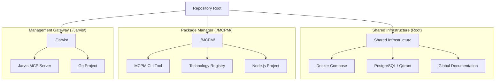

# System Architecture Map

This document outlines the high-level architecture of the repository, defining the relationships between the shared infrastructure, the MCPM package manager, and the Jarvis management server.

## 1. Repository Hierarchy

The repository is structured to separate concerns between management logic, package management implementation, and shared infrastructure.

## 2. Component Roles

### Root (Shared Infrastructure)
*   **Purpose:** Provides the foundational environment for all components.
*   **Key Files:** `docker-compose.yml`, `.env`, `docs/`.
*   **Responsibility:** Hosting databases (PostgreSQL, Qdrant) and defining global environment settings.

### MCPM (`./MCPM/`)
*   **Purpose:** The core logic for managing MCP servers.
*   **Key Files:** `package.json`, `config/technologies.toml`.
*   **Responsibility:**
    *   Defining the registry of available MCP technologies.
    *   Handling installation, configuration, and updates of servers.
    *   Generating IDE-specific configurations.

### Jarvis (`./Jarvis/`)
*   **Purpose:** The **intelligent presentation layer** and primary interface for AI agents to control the system.
*   **Version:** 3.1 (Consolidated Tools + Diagnostics)
*   **Key Files:** `main.go`, `handlers/consolidated.go`, `handlers/server.go`, `Dockerfile`.
*   **Responsibility:**
    *   **Presentation Layer:** Wraps raw MCPM CLI/API output with clean formatting, stripping ANSI codes and terminal noise.
    *   **Smart Error Handling:** Provides actionable error messages with suggestions for next steps.
    *   **Input Validation:** Prevents common mistakes before execution (invalid server names, empty queries, etc.).
    *   **Context Awareness:** Suggests appropriate actions based on project state and configuration.
    *   **Tool Exposure:** Exposes `mcpm` functionality as **9 consolidated MCP tools** (reduced from 24 for context efficiency).
    *   **Batch Operations:** Enables complex workflows in single commands vs. multiple CLI invocations.
    *   **Relationship:** Jarvis *uses* MCPM (via HTTP API or CLI fallback). It does not contain MCPM logic.

*   **v3.1 Tool Consolidation:**
    | Tool | Actions |
    |:-----|:--------|
    | `jarvis_check_status` | (single purpose) |
    | `jarvis_server` | list, info, install, uninstall, search, edit, create, usage |
    | `jarvis_profile` | list, create, edit, delete, suggest, restart |
    | `jarvis_client` | list, edit, import, config |
    | `jarvis_config` | get, set, list, migrate |
    | `jarvis_project` | analyze, diff, devops |
    | `jarvis_system` | bootstrap, restart, restart_infra |
    | `jarvis_share` | start, stop, list |
    | `jarvis_diagnose` | profile_health, test_endpoint, logs, full |

*   **Benefits:** 52% payload reduction (~5.3KB vs ~11KB), ~1,400 tokens saved per connection

## 3. Data Flow & Management (Presentation Layer Pattern)

Jarvis implements a **presentation layer pattern** that sits between AI agents and MCPM:

1.  **Agent Request:** An AI agent connects to the Jarvis MCP server and requests to install a tool (e.g., `jarvis_server(action="install", name="brave")`).
2.  **Validation:** Jarvis validates the input (action type, server name format, non-empty values).
3.  **Execution:** Jarvis calls the MCPM API (preferred) or CLI fallback with appropriate parameters.
4.  **Package Management:** MCPM reads the registry from `./MCPM/config/technologies.toml` and performs the installation.
5.  **Output Processing:** Jarvis captures the response, strips ANSI codes and terminal warnings, and formats it as clean Markdown.
6.  **Smart Response:** Jarvis adds context-aware suggestions (e.g., "Next step: Use `jarvis_profile(action='edit')` to add it to a profile") and returns the enhanced response to the agent.
7.  **Configuration:** MCPM updates the local registry and generates the necessary JSON configuration for IDEs.

**Key Advantage:** AI agents receive clean, actionable responses instead of raw terminal output, reducing hallucinations and improving workflow efficiency.

## 4. Roadmap

### Phase 1: Making Jarvis the Obvious Choice (✅ Complete)
*   [x] Centralize MCPM-specific code into `./MCPM/`.
*   [x] Establish Jarvis as intelligent presentation layer.
*   [x] Enhanced tool descriptions with benefits-focused copy.
*   [x] Added smart error handling with validation and suggestions.
*   [x] Updated documentation positioning Jarvis as primary interface.
*   [x] Comprehensive test suite (all passing).

### Phase 2: Tool Consolidation (✅ Complete - v3.0)
*   [x] Consolidated 24 tools into 8 action-based tools.
*   [x] Added MCPM HTTP API transport (with CLI fallback).
*   [x] 52% context token reduction (~1,400 tokens saved per connection).
*   [x] Standardized `jarvis_` prefix for all tools.
*   [x] Updated all documentation to v3.0 syntax.

### Phase 2.5: Diagnostics (✅ Complete - v3.1)
*   [x] Added `jarvis_diagnose` tool for MCP profile debugging.
*   [x] Profile health checks via supervisor status.
*   [x] MCP endpoint testing with tool listing.
*   [x] Subprocess log retrieval for debugging.
*   [x] Comprehensive full diagnostic reports.

### Phase 3: Enhanced Integration (In Progress)
*   **Dynamic Config Loading:** Ensure `mcpm` can dynamically load configuration from the repository structure regardless of execution context.
*   **Containerization:** Fully containerize the Jarvis + MCPM stack so it can be deployed as a single unit (e.g., a "Management Sidecar").

### Phase 4: Autonomous Management
*   **Self-Healing:** Jarvis detects unhealthy servers (via `jarvis_check_status`) and automatically attempts repairs.
*   **Semantic Discovery:** Enhance `jarvis_server(action="search")` to use the vector database (Qdrant) for finding tools based on natural language descriptions.
