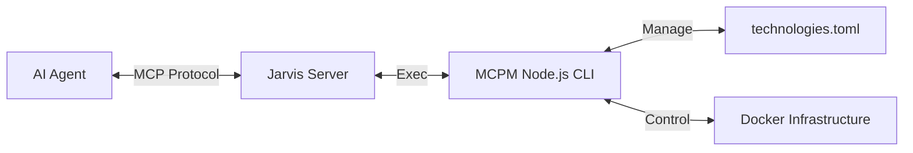

# 🤖 Jarvis - MCP Automation Gateway

> **"Just ask, and it shall be configured."**

Jarvis is a specialized **Model Context Protocol (MCP) Server** designed to act as an autonomous gateway for managing your local MCP tools and infrastructure.

It utilizes a **specialized, bundled fork** of the fantastic [MCPM (Model Context Protocol Manager)](https://github.com/pathintegral-institute/mcpm.sh) logic. While inspired by the official CLI, Jarvis includes a custom Node.js implementation (found in the `MCPM/` directory) to enable agent-specific features like JSON configuration output and Docker-first installation preferences.

Jarvis essentially gives your AI agent "hands" to drive this manager, allowing it to self-manage its own capabilities.

---

## ❤️ Credits & Disclaimer

Jarvis is a standalone open-source project. It is **not** affiliated with, endorsed by, or associated with the official MCPM developers ([Path Integral Institute](https://pathintegral.io)).

We built Jarvis out of love for the MCPM project, recognizing it as the gold standard for managing MCP servers. We simply wanted to give AI agents a way to use it directly.

---

## 🚀 Quick Start

### 1. Build Jarvis
Jarvis is a single binary. You only need Go installed to build it.

```bash
cd Jarvis
go build -o jarvis .
```

### 2. Connect Your Agent
Add Jarvis to your MCP client configuration.

**For Claude Desktop (`~/Library/Application Support/Claude/claude_desktop_config.json`):**
```json
{
  "mcpServers": {
    "jarvis": {
      "command": "/absolute/path/to/MCP/Jarvis/jarvis",
      "args": []
    }
  }
}
```

### 3. Bootstrap the System
Once connected, simply open your AI client and type:

> **"Please bootstrap the MCP system."**

Jarvis will use its `bootstrap_system` tool to:
1.  Install the **MCPM** (Package Manager) core dependencies.
2.  Link the `mcpm` CLI to your system path.
3.  Start the **Infrastructure** (PostgreSQL & Qdrant) via Docker.

---

## 🛠️ Capabilities

Jarvis exposes the following tools to your AI agent:

### 📦 Package Management
*   **`install_server(name)`**: Installs a new MCP server from the registry (e.g., "brave", "sqlite").
*   **`uninstall_server(name)`**: Removes a server and its configuration.
*   **`list_servers()`**: Shows all currently installed and active servers.
*   **`search_servers(query)`**: Finds new tools in the `technologies.toml` registry.
*   **`server_info(name)`**: Displays detailed metadata about a specific tool.

### ⚙️ System Configuration
*   **`bootstrap_system()`**: The one-click setup tool. Initializes the entire environment.
*   **`check_status()`**: Runs a system doctor (checks Node, Docker, Config health).
*   **`manage_config(action, key, value)`**: Modifies core MCPM settings.
*   **`manage_profile(action, name)`**: Creates or switches between tool profiles (e.g., "dev", "research").

### 🌐 Sharing & Tunnels
*   **`share_server(name)`**: Exposes a local MCP server via a secure public tunnel (great for demos or remote agents).
*   **`stop_sharing_server(name)`**: Tears down the tunnel.
*   **`list_shared_servers()`**: Shows active tunnels.

---

## 🏗️ Architecture

Jarvis acts as a **Translation Layer**:



*   **Jarvis (Go):** Handles the high-performance MCP connection, threading, and process lifecycle.
*   **MCPM (Node.js Fork):** A custom CLI implementation included in this repo. It handles package resolution, dependency management (`npm`), and file generation.
    *   *Why a fork?* To support specific agentic workflows (like `docker run` config generation) that are not yet part of the upstream Python-based CLI.

## 🐛 Troubleshooting

**"Command not found"**
If Jarvis reports errors running `mcpm`, ensure you have run the `bootstrap_system` tool at least once, or manually run `npm link` inside the `MCPM/` directory.

**Docker issues**
Jarvis requires Docker to be running for the database components. If `bootstrap_system` fails, check if Docker Desktop/Engine is active.

## 📜 License
MIT License

