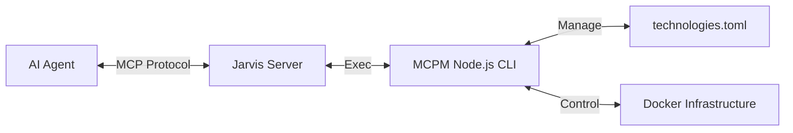

# 🤖 Jarvis: The MCP Automation Gateway

> **"Just ask, and it shall be configured."**

Jarvis is a specialized **Model Context Protocol (MCP) Server** written in Go. It acts as the intelligent "Hands" of the MCP ecosystem, allowing AI agents (like Claude, Cursor, or generic LLMs) to autonomously manage their own tools, infrastructure, and configuration.

By connecting Jarvis to your AI client, you give the AI the power to install new capabilities, fix its own environment, and manage local servers without you needing to open a terminal.

---

## 🚀 Quick Start

### 1. Build Jarvis
Jarvis is a single binary. You only need Go installed to build it.

```bash
cd Jarvis
go build -o jarvis .
```

### 2. Connect Your Agent
Add Jarvis to your MCP client configuration.

**For Claude Desktop (`~/Library/Application Support/Claude/claude_desktop_config.json`):**
```json
{
  "mcpServers": {
    "jarvis": {
      "command": "/absolute/path/to/MCP/Jarvis/jarvis",
      "args": []
    }
  }
}
```

### 3. Bootstrap the System
Once connected, simply open your AI client and type:

> **"Please bootstrap the MCP system."**

Jarvis will use its `bootstrap_system` tool to:
1.  Install the **MCPM** (Package Manager) core dependencies (Node.js).
2.  Link the `mcpm` CLI to your system path.
3.  Start the **Infrastructure** (PostgreSQL & Qdrant) via Docker.

---

## 🛠️ Capabilities

Jarvis exposes the following tools to your AI agent:

### 📦 Package Management
*   **`install_server(name)`**: Installs a new MCP server from the registry (e.g., "brave", "sqlite").
*   **`uninstall_server(name)`**: Removes a server and its configuration.
*   **`list_servers()`**: Shows all currently installed and active servers.
*   **`search_servers(query)`**: Finds new tools in the `technologies.toml` registry.
*   **`server_info(name)`**: Displays detailed metadata about a specific tool.

### ⚙️ System Configuration
*   **`bootstrap_system()`**: The one-click setup tool. Initializes the entire environment.
*   **`check_status()`**: Runs a system doctor (checks Node, Docker, Config health).
*   **`manage_config(action, key, value)`**: Modifies core MCPM settings.
*   **`manage_profile(action, name)`**: Creates or switches between tool profiles (e.g., "dev", "research").

### 🌐 Sharing & Tunnels
*   **`share_server(name)`**: Exposes a local MCP server via a secure public tunnel (great for demos or remote agents).
*   **`stop_sharing_server(name)`**: Tears down the tunnel.
*   **`list_shared_servers()`**: Shows active tunnels.

---

## 🏗️ Architecture

Jarvis acts as a **Translation Layer**:



*   **Jarvis (Go):** Handles the high-performance MCP connection, threading, and process lifecycle.
*   **MCPM (Node.js):** Handles the logic of package resolution, dependency management (`npm`), and file generation.

## 🐛 Troubleshooting

**"Command not found"**
If Jarvis reports errors running `mcpm`, ensure you have run the `bootstrap_system` tool at least once, or manually run `npm link` inside the `MCPM/` directory.

**Docker issues**
Jarvis requires Docker to be running for the database components. If `bootstrap_system` fails, check if Docker Desktop/Engine is active.

## 📜 License
Part of the MCP Jungle ecosystem. Internal Research Preview.
