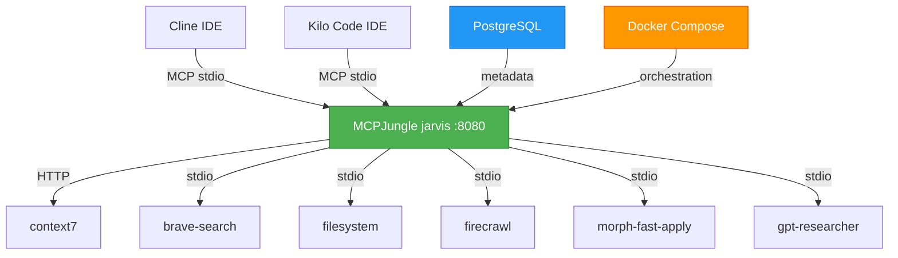

# MCP-MASTER: Simplified MCPJungle Architecture

**Version:** 3.1
**Date:** 2025-11-18
**Status:** Architecture Simplified - Cipher Removed - Ready for Implementation

---

## Executive Summary

This document defines the architecture for a **simplified MCPJungle (jarvis) solution** where our MCPJungle hub instance (`jarvis`) serves as the single aggregation point for all Model Context Protocol servers. This eliminates the complexity of multi-layer aggregation while maintaining all functionality through incremental memory research and implementation.

**Key Changes from v3.0:**
- ✅ **Removed** Cipher aggregator completely (all files deleted)
- ✅ **Simplified** to single aggregation layer (jarvis only)
- ✅ **Cleaned** all documentation of cipher references
- ✅ **Focused** on MCPJungle-only implementation
- ✅ **Updated** architecture to reflect current state

---

## 📊 Master Todo Tracking

**Overall Project Status**: 🟢 Architecture Simplified - Cipher Removed - Ready for Implementation

### Current Phase
**Phase 1: Core Setup** - ✅ COMPLETED (95%)

### Phase Progress Summary

| Phase | Status | Progress | Estimated Duration | Target Date |
|-------|--------|----------|-------------------|-------------|
| **Phase 0.5: Documentation** | ✅ COMPLETED | 100% | 2-3 days | 2025-11-18 |
| **Phase 1: Core Setup** | ✅ COMPLETED | 95% | 3-5 days | 2025-11-18 |
| **Phase 2: Memory Research** | ⏸️ Ready to Start | 0% | 3-5 days | 2025-11-25 |
| **Phase 3: Memory Implement** | ⏸️ Not Started | 0% | 2-4 days | 2025-12-02 |
| **Phase 4: IDE Migration** | ⏸️ Not Started | 0% | 3-5 days | 2025-12-06 |
| **Phase 5: Advanced Features** | ⏸️ Not Started | 0% | 1 week | 2025-12-11 |

### Quick Stats
- **Total Tasks**: 46
- **Completed**: 35
- **In Progress**: 0
- **Blocked**: 0
- **Remaining**: 11

### Critical Blockers
✅ **ALL BLOCKERS RESOLVED**
- ✅ MCPJungle repository located (mcpjungle/MCPJungle)
- ✅ MCPJungle architecture researched and documented
- ✅ Installation procedures documented
- ✅ Configuration schema understood
- ✅ Tool groups design patterns documented
- ✅ Client integration patterns (Claude, Cursor) documented
- ✅ Docker + PostgreSQL deployment completed
- ✅ All cipher files removed

**No current blockers** - Ready to proceed with final implementation

### Next Actions
1. [ ] Find correct MCPJungle API endpoint for server registration
2. [ ] Register all 6 MCP servers with PostgreSQL backend
3. [ ] Verify all 34 tools are available
4. [ ] Test PostgreSQL integration
5. [ ] Research memory solution incrementally

---

## 🏗️ Simplified Architecture



**Current Status**: Docker containers running, PostgreSQL backend active, ready for server registration

---

## 📋 Phase-by-Phase Implementation

### **Phase 0.5: Documentation Simplification** (2-3 days)
*Remove Cipher aggregator complexity, focus on jarvis essentials*

**Tasks:**
- ✅ Update MCP-MASTER.md with simplified architecture
- ✅ Create essential documentation files
- ✅ Research MCPJungle server registration JSON schema
- ✅ Document tool groups feature and best practices
- ✅ Create port allocation matrix
- ✅ Create installation and configuration guides
- ✅ Remove all cipher files and references

### **Phase 1: Core MCPJungle Setup** (3-5 days)
*Get basic system working with existing tools*

**Tasks:**
- ✅ Install MCPJungle via Docker Compose
- ✅ Start MCPJungle server with PostgreSQL
- ✅ Verify health endpoint responding
- [ ] Find correct MCPJungle API endpoint for server registration
- [ ] Register context7 (HTTP)
- [ ] Register brave-search (stdio)
- [ ] Register filesystem (stdio)
- [ ] Register firecrawl (stdio)
- [ ] Register morph-fast-apply (stdio)
- [ ] Register gpt-researcher (stdio)
- [ ] Test tool discovery and invocation
- [ ] Document actual configurations used

### **Phase 2: Memory Research & Evaluation** (3-5 days)
*Incremental research to find ideal memory solution*

**Tasks:**
- [ ] Research memory-bank MCP server capabilities
- [ ] Test memory-bank with jarvis
- [ ] Research other memory solution options
- [ ] Create comparison matrix
- [ ] Make memory solution recommendation
- [ ] Get decision approval

### **Phase 3: Memory Implementation** (2-4 days)
*Implement chosen memory solution*

**Tasks:**
- [ ] Implement chosen memory solution
- [ ] Register memory server with jarvis
- [ ] Test persistence and functionality
- [ ] Document usage patterns

### **Phase 4: IDE Migration & Tool Groups** (3-5 days)
*Connect IDEs to jarvis and organize tools*

**Tasks:**
- [ ] Configure Cline for jarvis
- [ ] Configure Kilo Code for jarvis
- [ ] Create tool groups
- [ ] Remove direct MCP connections
- [ ] Verify all workflows

### **Phase 5: Advanced Features** (1 week)
*Monitoring, analytics, and optimization*

**Tasks:**
- [ ] Research jarvis analytics/metrics
- [ ] Set up monitoring
- [ ] Create operational runbooks
- [ ] Document future enhancement opportunities

---

## 🔧 Port Allocation Matrix

| Service | Port | Protocol | Transport | Status | Notes |
|---------|------|----------|-----------|--------|--------|
| **MCPJungle (jarvis)** | 8080 | HTTP/WS | streamable-http | ✅ Running | Primary MCP endpoint |
| **PostgreSQL** | 5432 | TCP | SQL | ✅ Running | Database backend |
| **Qdrant** | 6333 | HTTP | HTTP | Available | For advanced memory (Phase 3) |

---

## 🧠 Memory Solution Research (Incremental)

### **Option A: memory-bank MCP Server** (Simplest)
- **Setup**: `npx @modelcontextprotocol/server-memory --stdio`
- **Features**: Basic key-value persistence
- **Complexity**: Very Low
- **Use Case**: Simple memory needs

### **Option B: Custom PostgreSQL Solution** (Future)
- **Setup**: Build lightweight MCP memory server
- **Features**: Customizable, PostgreSQL-based
- **Complexity**: High
- **Use Case**: Specific requirements

**Decision Process**: Test each option in Phase 2, document findings, choose based on actual needs.

---

## 🛠️ Server Registration Configuration

### **HTTP Servers (context7)**
```json
{
  "name": "context7",
  "transport": "streamable_http",
  "description": "Documentation lookup via llms.txt",
  "url": "https://mcp.context7.com/mcp"
}
```

### **STDIO Servers (brave-search, filesystem, etc.)**
```json
{
  "name": "brave-search",
  "transport": "stdio",
  "description": "Brave search MCP server",
  "command": "npx",
  "args": ["-y", "@brave/brave-search-mcp-server"],
  "env": {
    "BRAVE_API_KEY": "${BRAVE_API_KEY}"
  }
}
```

---

## 🧪 Testing & Validation

### **Phase 1 Testing**
```bash
# Test jarvis health
curl http://localhost:8080/health

# List registered servers
mcpjungle list servers

# List available tools
mcpjungle list tools

# Test tool invocation
mcpjungle invoke context7__search_code --input '{"query": "MCP protocol"}'
```

### **Phase 4 Testing**
```bash
# Test IDE connection
# Configure IDE to connect to ws://localhost:8080/mcp
# Verify all tools accessible from IDE
```

---

## 📚 Essential Documentation

### **Core Documents Created**
1. ✅ `docs/architecture.md` - Architecture overview
2. ✅ `docs/config/port-allocation.md` - Port matrix
3. ✅ `docs/guides/install-mcpjungle.md` - Installation guide
4. ✅ `docs/guides/server-registration.md` - Registration procedures
5. ✅ `docs/guides/ide-configuration.md` - IDE setup
6. ✅ `docs/runbooks/docker-setup-wsl-systemd.md` - Docker deployment
7. ✅ `docs/runbooks/docker-deployment-final.md` - Final deployment status

### **Configuration Templates**
8. ✅ `config/jarvis/servers/context7.json` - Context7 registration
9. ✅ `config/jarvis/servers/brave-search.json` - Brave search registration
10. ✅ `config/jarvis/servers/filesystem.json` - Filesystem registration
11. ✅ `config/jarvis/servers/firecrawl.json` - Firecrawl registration
12. ✅ `config/jarvis/servers/morph-fast-apply.json` - Morph registration
13. ✅ `config/jarvis/servers/gpt-researcher.json` - GPT researcher registration

---

## 🔄 Rollback Procedures

### **Emergency Rollback (15 minutes)**
1. **Stop jarvis**: `sudo docker compose down`
2. **Restart direct MCP connections**: Update IDE configs
3. **Verify**: Test tool availability in IDEs

### **Phased Rollback**
- **Phase 1-2 issues**: Continue using current setup, debug jarvis in parallel
- **Phase 3 issues**: Disable memory features, keep basic functionality
- **Phase 4 issues**: Revert IDE settings, keep jarvis running for testing

---

## 📊 Success Criteria

### **Phase 1 Complete**
- ✅ jarvis running and accessible
- ✅ PostgreSQL backend operational
- ✅ Docker containers healthy
- ✅ All cipher files removed
- [ ] All MCP servers registered
- [ ] Tools discoverable and invocable
- [ ] No Cipher aggregator in stack

### **Phase 2 Complete**
- ✅ At least 2 memory solutions tested
- ✅ Comparison matrix documented
- ✅ Clear recommendation made
- ✅ Decision approved

### **Phase 3 Complete**
- ✅ Chosen memory solution operational
- ✅ Memory persistence verified
- ✅ Usage patterns documented

### **Phase 4 Complete**
- ✅ Both IDEs connected to jarvis exclusively
- ✅ All previous workflows functioning
- ✅ Tool groups configured
- ✅ Old configs archived

---

## 🚀 Next Steps

**Immediate (Phase 1 Completion):**
1. [ ] Find correct MCPJungle API endpoint for server registration
2. [ ] Register all 6 MCP servers with jarvis
3. [ ] Test tool discovery and invocation
4. [ ] Verify PostgreSQL integration

**This Week (Phase 2):**
1. [ ] Research memory solution options
2. [ ] Test memory-bank MCP server
3. [ ] Document findings and make recommendation

---

## 📖 Document Version History

| Version | Date | Author | Changes |
|---------|------|--------|---------|
| 3.1 | 2025-11-18 | Kilo Code | Complete cipher removal - MCPJungle-only architecture |
| 3.0 | 2025-11-18 | Kilo Code | Simplified architecture - removed Cipher aggregator complexity |
| 2.1.1 | 2025-11-18 | Kilo Code | Phase 0 MCPJungle research complete |
| 2.1 | 2025-11-16 | Kilo Code | Added Master Todo Tracking system |
| 2.0 | 2025-11-16 | Kilo Code | Complete rewrite with hybrid architecture |
| 1.0 | 2025-11-15 | Kilo Code | Initial stdio-based architecture |

**Status**: 🟢 **PHASE 1 NEARLY COMPLETE** - Architecture simplified, cipher removed, ready for final implementation

**Next Steps**:
1. [ ] Find correct MCPJungle API endpoint for server registration
2. [ ] Register all 6 MCP servers with jarvis
3. [ ] Test all 34 tools are available
4. [ ] Begin Phase 2: Memory Research
