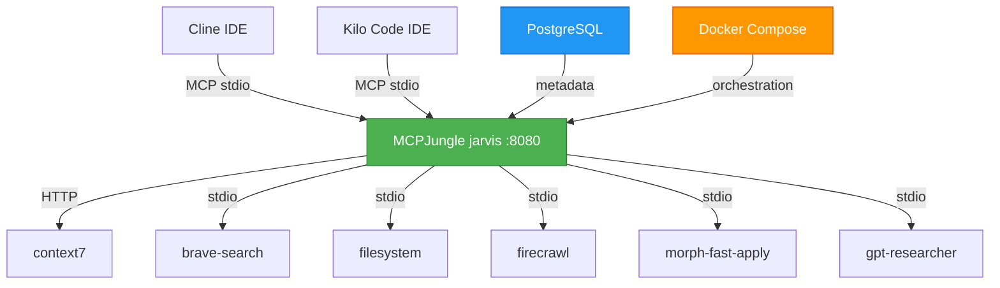

# MCP-MASTER: Simplified MCPJungle Architecture

**Version:** 3.3
**Date:** 2025-11-18
**Status:** Phase 1B Complete – Tool Groups Next

---

## Executive Summary

This document defines the architecture for a **simplified MCPJungle (jarvis) solution** where our MCPJungle hub instance (`jarvis`) serves as the single aggregation point for all Model Context Protocol servers. This eliminates the complexity of multi-layer aggregation while maintaining all functionality through incremental memory research and implementation.

**Key Changes from v3.1:**
- ✅ **Documentation verified** via Phase 1A.5 with 17 tech docs plus `config/technologies.toml` as the registry
- ✅ **9 MCP servers registered** (79 tools) and recorded in the Phase 1B completion report
- ⚠️ **Filesystem & gpt-researcher servers** still need reliable start-up; tracked before Phase 1C
- ✅ **Cipher aggregator removed**, jarvis remains the sole aggregation point

---

## 📊 Master Todo Tracking

**Overall Project Status**: 🟢 Phase 1B Complete - Tool Groups Next

### Current Phase
**Phase 1C: Tool Groups** - ⏸️ Ready to Start (0%)

### Phase Progress Summary

| Phase | Status | Progress | Estimated Duration | Target Date |
|-------|--------|----------|-------------------|-------------|
| **Phase 0.5: Documentation** | ✅ COMPLETED | 100% | 2-3 days | 2025-11-18 |
| **Phase 1A: Server Documentation** | ✅ COMPLETED | 100% | 2-3 days | 2025-11-20 |
| **Phase 1B: Server Registration** | ✅ COMPLETED | 100% | 1-2 days | 2025-11-22 |
| **Phase 1C: Tool Groups** | ⏸️ Ready to Start | 0% | 1-2 days | 2025-11-24 |
| **Phase 2: Memory Research** | ⏸️ Not Started | 0% | 3-5 days | 2025-11-25 |
| **Phase 3: Memory Implementation** | ⏸️ Not Started | 0% | 2-4 days | 2025-12-02 |
| **Phase 4: IDE Migration** | ⏸️ Not Started | 0% | 3-5 days | 2025-12-06 |
| **Phase 5: Advanced Features** | ⏸️ Not Started | 0% | 1 week | 2025-12-11 |
| **Phase 6: Future Expansion** | ⏸️ Not Started | 0% | 1 week | 2025-12-18 |

### Quick Stats
- **Tech docs published**: 17 MCP server references and the `config/technologies.toml` registry validated via Phase 1A.5
- **Servers registered**: 9 of 11 planned servers now live through jarvis, delivering 79 tools (target was 60+)
- **Outstanding servers**: `filesystem` and `gpt-researcher` still hit startup timeouts; workarounds documented in Phase 1B final report
- **Tools accessible**: 79 tools (Playwright 22, GitHub 26, Memory 9, etc.) ready for Phase 1C
- **Runbooks created**: Phase 1A.5 documentation verification and Phase 1B final registration reports captured

### Critical Blockers
✅ MCPJungle repository located (mcpjungle/MCPJungle)
✅ MCPJungle architecture documented and simplified
✅ Installation procedures documented
✅ Configuration schema understood and populated via `config/technologies.toml`
✅ Tool groups design patterns captured (`docs/config/tool-groups.md`)
✅ Client integration patterns (Claude, Cursor) documented
✅ Docker + PostgreSQL deployment completed
✅ All cipher files removed

⚠️ Active Issues
- **filesystem**: Initialization still failing (path/permission timeouts) and blocks full universal tool group registration
- **gpt-researcher**: Python-based server consistently times out while resolving dependencies; monitoring path fix

**No other blockers** - on track to finish outstanding server fixes and begin Phase 1C

### Next Actions
1. [ ] Stabilize the `filesystem` server so the universal tool group has file operations (path/timeout fix)
2. [ ] Debug `gpt-researcher`'s Python bootstrap so its tools can join jarvis without timing out
3. [ ] Formalize and register the universal tool group (config is codified in `docs/config/tool-groups.md`)
4. [ ] Surface Phase 1B completion metrics (79 tools, 9 servers) to the team while preparing Phase 1C kickoff

---

## 🏗️ Simplified Architecture



**Current Status**: Docker containers running, PostgreSQL backend active, ready for server registration

---

## 📋 Phase-by-Phase Implementation

### **Phase 0.5: Documentation Simplification** (2-3 days)
*Remove Cipher aggregator complexity, focus on jarvis essentials*

**Tasks:**
- ✅ Update MCP-MASTER.md with simplified architecture
- ✅ Create essential documentation files
- ✅ Research MCPJungle server registration JSON schema
- ✅ Document tool groups feature and best practices
- ✅ Create port allocation matrix
- ✅ Create installation and configuration guides
- ✅ Remove all cipher files and references

### **Phase 1A: Server Documentation** (2-3 days)
*Document and verify all MCP servers before registration*

**Status**: ✅ Completed (see `docs/runbooks/phase1a5-documentation-completion.md`)

**Tasks:**
- ✅ Research official MCP server packages (fetch, github, memory, playwright, sqlite)
- ✅ Create tech docs for each current server (6 docs)
- ✅ Create tech docs for each new server (5 docs)
- ✅ Verify implementation patterns match official specs
- ✅ Test each server locally before jarvis registration
- ✅ Update server configuration files with verified settings
- ✅ Document server capabilities and limitations
- ✅ Create server comparison matrix (captured in `config/technologies.toml`)

### **Phase 1B: Server Registration** (1-2 days)
*Register all 11 servers with jarvis (PostgreSQL backend)*

**Status**: ✅ Mostly completed (9 out of 11 servers registered). See `docs/runbooks/phase1b-server-registration-final.md` for the 79-tool tally and outstanding server notes.

**Tasks:**
- ✅ Find correct MCPJungle API endpoint for server registration
- ✅ Register context7 (HTTP)
- ✅ Register brave-search (stdio)
- ⚠️ Register filesystem (stdio) - still facing path/timeout issues; deferred for Phase 1C tool groups
- ✅ Register firecrawl (stdio)
- ✅ Register morph-fast-apply (stdio)
- ⚠️ Register gpt-researcher (stdio) - Python bootstrap times out; under active debugging
- ✅ Register fetch (stdio) - NEW
- ✅ Register github (stdio) - NEW
- ✅ Register memory (stdio) - NEW
- ✅ Register playwright (stdio) - NEW (`@playwright/mcp` contributed 22 tools)
- ✅ Register sqlite (stdio) - NEW
- ✅ Test tool discovery and invocation (79 total tools now listed)
- ✅ Document actual configurations used (`docs/runbooks/phase1b-server-registration-final.md`, `config/jarvis/servers/*.json`)
- ✅ Verify PostgreSQL integration for server registry

### **Phase 1C: Tool Groups** (1-2 days)
*Create and configure tool groups for organized tool access*

**Tasks:**
- [ ] Create universal tool group configuration
- [ ] Register universal group with jarvis
- [ ] Test group endpoint functionality
- [ ] Document group usage patterns
- [ ] Create IDE configuration examples for universal group
- [ ] Plan backend-dev and frontend-dev groups (for Phase 6)
- [ ] Test tool filtering and access control

### **Phase 2: Memory Research & Evaluation** (3-5 days)
*Incremental research to find ideal memory solution*

**Tasks:**
- [ ] Research memory-bank MCP server capabilities
- [ ] Test memory-bank with jarvis
- [ ] Research other memory solution options
- [ ] Create comparison matrix
- [ ] Make memory solution recommendation
- [ ] Get decision approval

### **Phase 3: Memory Implementation** (2-4 days)
*Implement chosen memory solution*

**Tasks:**
- [ ] Implement chosen memory solution
- [ ] Register memory server with jarvis
- [ ] Test persistence and functionality
- [ ] Document usage patterns

### **Phase 4: IDE Migration & Tool Groups** (3-5 days)
*Connect IDEs to jarvis and organize tools*

**Tasks:**
- [ ] Configure Cline for jarvis
- [ ] Configure Kilo Code for jarvis
- [ ] Create tool groups
- [ ] Remove direct MCP connections
- [ ] Verify all workflows

### **Phase 5: Advanced Features** (1 week)
*Monitoring, analytics, and optimization*

**Tasks:**
- [ ] Research jarvis analytics/metrics
- [ ] Set up monitoring
- [ ] Create operational runbooks
- [ ] Document future enhancement opportunities

### **Phase 6: Future Expansion** (1 week)
*Research and add additional MCP servers based on needs*

**Tasks:**
- [ ] Research additional MCP server needs
- [ ] Evaluate Slack integration MCP server
- [ ] Evaluate AWS operations MCP server
- [ ] Evaluate Docker management MCP server
- [ ] Evaluate other workflow-specific tools
- [ ] Plan backend-dev and frontend-dev tool groups
- [ ] Implement additional servers as needed
- [ ] Document expansion process

---

## 🔧 Port Allocation Matrix

| Service | Port | Protocol | Transport | Status | Notes |
|---------|------|----------|-----------|--------|--------|
| **MCPJungle (jarvis)** | 8080 | HTTP/WS | streamable-http | ✅ Running | Primary MCP endpoint |
| **PostgreSQL** | 5432 | TCP | SQL | ✅ Running | Database backend |
| **Qdrant** | 6333 | HTTP | HTTP | Available | For advanced memory (Phase 3) |

---

## 🧠 Memory Solution Research (Incremental)

### **Option A: memory-bank MCP Server** (Simplest)
- **Setup**: `npx @modelcontextprotocol/server-memory --stdio`
- **Features**: Basic key-value persistence
- **Complexity**: Very Low
- **Use Case**: Simple memory needs

### **Option B: Custom PostgreSQL Solution** (Future)
- **Setup**: Build lightweight MCP memory server
- **Features**: Customizable, PostgreSQL-based
- **Complexity**: High
- **Use Case**: Specific requirements

**Decision Process**: Test each option in Phase 2, document findings, choose based on actual needs.

---

## 🛠️ Server Registration Configuration

### **HTTP Servers (context7)**
```json
{
  "name": "context7",
  "transport": "streamable_http",
  "description": "Documentation lookup via llms.txt",
  "url": "https://mcp.context7.com/mcp"
}
```

### **STDIO Servers (brave-search, filesystem, etc.)**
```json
{
  "name": "brave-search",
  "transport": "stdio",
  "description": "Brave search MCP server",
  "command": "npx",
  "args": ["-y", "@brave/brave-search-mcp-server"],
  "env": {
    "BRAVE_API_KEY": "${BRAVE_API_KEY}"
  }
}
```

---

## 🧪 Testing & Validation

### **Phase 1A Testing**
```bash
# Test each server individually before jarvis registration
npx @modelcontextprotocol/server-fetch --stdio &
echo '{"jsonrpc":"2.0","method":"tools/list","id":1}' | npx @modelcontextprotocol/server-fetch --stdio

# Verify tool availability
npx @modelcontextprotocol/server-github --stdio &
echo '{"jsonrpc":"2.0","method":"tools/list","id":1}' | npx @modelcontextprotocol/server-github --stdio
```

### **Phase 1B Testing**
```bash
# Test jarvis health
curl http://localhost:8080/health

# List registered servers (should show 9)
mcpjungle list servers

# Count all tools (should show 79)
mcpjungle list tools | wc -l

# Tool invocations through current servers
mcpjungle invoke context7__search_code --input '{"query": "MCP protocol"}'
mcpjungle invoke fetch__get --input '{"url": "https://api.github.com"}'
mcpjungle invoke github__search_repositories --input '{"query": "modelcontextprotocol"}'
mcpjungle invoke memory__memory_search --input '{"query": "jarvis"}'
mcpjungle invoke playwright__browser_install --input '{"browser": "chromium"}'
```

> **Note**: Phase 1B final report (`docs/runbooks/phase1b-server-registration-final.md`) documents the 79-tool inventory and the remaining filesystem/gpt-researcher timeouts.

### **Phase 1C Testing**
```bash
# Test universal group endpoint once registered
curl http://localhost:8080/v0/groups/universal/mcp

# List tools in universal group
mcpjungle list tools --group universal

# Test tool invocation through the group
mcpjungle invoke context7__search_code --group universal --input '{"query": "MCP"}'
```

### **Phase 4 Testing**
```bash
# Test IDE connection
# Configure IDE to connect to ws://localhost:8080/mcp
# Verify all tools accessible from IDE
```

---

## 📚 Essential Documentation

### **Core Documents Created**
1. ✅ `docs/architecture.md` - Architecture overview
2. ✅ `docs/config/port-allocation.md` - Port matrix
3. ✅ `docs/guides/install-mcpjungle.md` - Installation guide
4. ✅ `docs/guides/server-registration.md` - Registration procedures
5. ✅ `docs/guides/ide-configuration.md` - IDE setup
6. ✅ `docs/runbooks/docker-setup-wsl-systemd.md` - Docker deployment
7. ✅ `docs/runbooks/docker-deployment-final.md` - Final deployment status
8. ✅ `docs/config/tool-groups.md` - Tool group strategy & configuration
9. ✅ `docs/runbooks/phase1a5-documentation-completion.md` - Documentation verification report
10. ✅ `docs/runbooks/phase1b-server-registration-final.md` - Phase 1B completion report (79 tools)
11. ✅ `config/technologies.toml` - Centralized MCP technology registry

### **Configuration Templates**
1. ✅ `config/jarvis/servers/context7.json` - Context7 registration
2. ✅ `config/jarvis/servers/brave-search.json` - Brave search registration
3. ✅ `config/jarvis/servers/filesystem.json` - Filesystem registration
4. ✅ `config/jarvis/servers/firecrawl.json` - Firecrawl registration
5. ✅ `config/jarvis/servers/morph-fast-apply.json` - Morph registration
6. ✅ `config/jarvis/servers/gpt-researcher.json` - GPT researcher registration
7. ✅ `config/jarvis/servers/fetch.json` - Fetch registration
8. ✅ `config/jarvis/servers/github.json` - GitHub registration
9. ✅ `config/jarvis/servers/memory.json` - Memory registration
10. ✅ `config/jarvis/servers/playwright.json` - Playwright registration
11. ✅ `config/jarvis/servers/sqlite.json` - SQLite registration

---

## 🔄 Rollback Procedures

### **Emergency Rollback (15 minutes)**
1. **Stop jarvis**: `sudo docker compose down`
2. **Restart direct MCP connections**: Update IDE configs
3. **Verify**: Test tool availability in IDEs

### **Phased Rollback**
- **Phase 1-2 issues**: Continue using current setup, debug jarvis in parallel
- **Phase 3 issues**: Disable memory features, keep basic functionality
- **Phase 4 issues**: Revert IDE settings, keep jarvis running for testing

---

## 📊 Success Criteria

### **Phase 1 Complete**
- ✅ jarvis running and accessible
- ✅ PostgreSQL backend operational
- ✅ Docker containers healthy
- ✅ All cipher files removed
- [ ] All MCP servers registered
- [ ] Tools discoverable and invocable
- [ ] No Cipher aggregator in stack

### **Phase 2 Complete**
- ✅ At least 2 memory solutions tested
- ✅ Comparison matrix documented
- ✅ Clear recommendation made
- ✅ Decision approved

### **Phase 3 Complete**
- ✅ Chosen memory solution operational
- ✅ Memory persistence verified
- ✅ Usage patterns documented

### **Phase 4 Complete**
- ✅ Both IDEs connected to jarvis exclusively
- ✅ All previous workflows functioning
- ✅ Tool groups configured
- ✅ Old configs archived

---

## 🚀 Next Steps

**Immediate (Phase 1C & Outstanding Servers):**
1. [ ] Stabilize the `filesystem` server, extend timeouts if needed, and re-run registration so universal tools include file operations
2. [ ] Harden the `gpt-researcher` Python bootstrap (dependencies/environment) and register as soon as initialization succeeds
3. [ ] Register the universal tool group (per `docs/config/tool-groups.md`) and verify the 79-tool catalog through the group endpoint
4. [ ] Surface the Phase 1B metrics (9 servers, 79 tools) to the team and finalize the final report for archive

**This Week (Phase 2 Research Prep):**
1. [ ] Research memory solution options (memory-bank vs. PostgreSQL-backed) and capture a comparison matrix
2. [ ] Exercise the memory-bank prototype with jarvis to verify persistence and performance
3. [ ] Document the research findings plus recommended option for the Phase 2 decision meeting

---

## 📚 **MCP Server Catalog**

This section tracks each MCP server's registration status and documentation coverage.

### ✅ Registered Servers (9) – 79 tools now discoverable

| Server | Package / Source | Transport | Tools | Status | Docs |
|--------|------------------|-----------|-------|--------|------|
| **context7** | Remote HTTP | streamable_http | 2 | ✅ Registered | ✅ `docs/tech/context-7-mcp.md` |
| **brave-search** | `@brave/brave-search-mcp-server` | stdio | 6 | ✅ Registered | ✅ `docs/tech/brave-search-mcp.md` |
| **fetch** | `@modelcontextprotocol/server-fetch` | stdio | 1 | ✅ Registered | ✅ `docs/tech/fetch-mcp.md` |
| **memory** | `@modelcontextprotocol/server-memory` | stdio | 9 | ✅ Registered | ✅ `docs/tech/memory-mcp.md` |
| **sqlite** | `@modelcontextprotocol/server-sqlite` | stdio | 6 | ✅ Registered | ✅ `docs/tech/sqlite-mcp.md` |
| **firecrawl** | `@mendable/firecrawl-mcp` | stdio | 6 | ✅ Registered | ✅ `docs/tech/firecrawl-mcp.md` |
| **morph-fast-apply** | `@morph/fast-apply-mcp` | stdio | 1 | ✅ Registered | ✅ `docs/tech/morph-fast-apply-mcp.md` |
| **github** | `@modelcontextprotocol/server-github` | stdio | 26 | ✅ Registered | ✅ `docs/tech/github-mcp.md` |
| **playwright** | `@playwright/mcp` | stdio | 22 | ✅ Registered | ✅ `docs/tech/playwright-mcp.md` |

**Total**: 9 servers, 79 tools discoverable through jarvis (Playwright 22 + GitHub 26 lead contributions)

### ⚠️ Deferred / Investigating (2)

| Server | Issue | Next Steps |
|--------|-------|------------|
| **filesystem** | stdio start-up times out (mount/path) | Continue tuning `/home/jrede/dev/MCP` path, increase timeout to 60s, then rerun registration |
| **gpt-researcher** | Python bootstrap and dependency resolution time out | Harden Python env, batch install `gptr-mcp` deps, then re-register when initialization stabilizes |

---

## 🗂️ **Tool Group Definitions**

### **Group 1: universal** (Default/Core Tools)
**Purpose**: Essential tools for all development workflows - first priority implementation
**Status**: Ready to register once `filesystem` stabilizes; universal strategy documented in `docs/config/tool-groups.md`

**Included Servers (available now)**:
- `context7` - Documentation lookup (2 tools)
- `brave-search` - Web search (6 tools)
- `fetch` - HTTP requests (1 tool)
- `github` - GitHub operations (26 tools)
- `memory` - Persistent storage (9 tools)
- `firecrawl` - Web scraping (6 tools)
- `morph-fast-apply` - Code transformations (1 tool)

**Pending addition**:
- `filesystem` - File operations (10+ tools) will be added once the path/timeout issue is resolved

**Expected Tool Count**: ~45 tools (79 total across jarvis once universal group materializes)
**Endpoint**: `http://localhost:8080/v0/groups/universal/mcp`

**Configuration reference**: See the `config/jarvis/groups/universal.json` example in `docs/config/tool-groups.md` before registering the group.

### **Group 2: backend-dev** (Backend Development)
**Purpose**: Backend-specific development tools (Phase 6 target)

**Included Servers**: universal + backend-specific
- All available universal servers above
- `sqlite` - SQLite operations (6 tools)
- `gpt-researcher` - Research capabilities (pending stabilization)
- `memory` - Knowledge graph persistence (already part of universal)
- `morph-fast-apply` - Code transformations

**Expected Tool Count**: ~45+ tools (gpt-researcher to be added when it stabilizes)
**Endpoint**: `http://localhost:8080/v0/groups/backend-dev/mcp`

### **Group 3: frontend-dev** (Frontend Development)
**Purpose**: Frontend-specific development tools (Phase 6 target)

**Included Servers**: universal + frontend-specific
- All universal servers
- `playwright` - Browser automation & testing (22 tools)
- `morph-fast-apply` - Code transformations

**Expected Tool Count**: ~40+ tools
**Endpoint**: `http://localhost:8080/v0/groups/frontend-dev/mcp`

---

## 📋 **Documentation Checklist**

### **Phase 1A: Server Tech Docs** (11 total)
- ✅ `docs/tech/brave-search-mcp.md` - Search capabilities & API setup
- ✅ `docs/tech/filesystem-mcp.md` - File operations & security
- ✅ `docs/tech/firecrawl-mcp.md` - Web scraping & API requirements
- ✅ `docs/tech/morph-fast-apply-mcp.md` - Code transformation features
- ✅ `docs/tech/gpt-researcher-mcp.md` - Research capabilities & setup
- ✅ `docs/tech/fetch-mcp.md` - HTTP client & authentication patterns
- ✅ `docs/tech/github-mcp.md` - GitHub API integration & tokens
- ✅ `docs/tech/memory-mcp.md` - Persistence patterns & use cases
- ✅ `docs/tech/playwright-mcp.md` - Browser automation & testing
- ✅ `docs/tech/sqlite-mcp.md` - Database operations & connections
- ✅ `docs/config/tool-groups.md` - Group strategy & configuration

### **Supporting Documentation & Registries**
- ✅ `config/technologies.toml` - Centralized registry for all MCP technologies
- ✅ `docs/runbooks/phase1a5-documentation-completion.md` - Phase 1A.5 verification report
- ✅ `docs/runbooks/phase1b-server-registration-final.md` - Phase 1B final completion report

### **Phase 1C: Tool Group Docs**
- [ ] `config/jarvis/groups/universal.json` - Universal group config
- [ ] `docs/guides/tool-group-usage.md` - How to use tool groups
- [ ] `docs/config/ide-tool-group-configs.md` - IDE setup for each group

---

## 📖 Document Version History

| Version | Date | Author | Changes |
|---------|------|--------|---------|
| 3.3 | 2025-11-18 | Kilo Code | Documented Phase 1A.5 verification, 9 server registrations (79 tools) and tool group strategy |
| 3.2 | 2025-11-18 | Kilo Code | Added comprehensive server catalog and tool group strategy |
| 3.1 | 2025-11-18 | Kilo Code | Complete cipher removal - MCPJungle-only architecture |
| 3.0 | 2025-11-18 | Kilo Code | Simplified architecture - removed Cipher aggregator complexity |
| 2.1.1 | 2025-11-18 | Kilo Code | Phase 0 MCPJungle research complete |
| 2.1 | 2025-11-16 | Kilo Code | Added Master Todo Tracking system |
| 2.0 | 2025-11-16 | Kilo Code | Complete rewrite with hybrid architecture |
| 1.0 | 2025-11-15 | Kilo Code | Initial stdio-based architecture |

**Status**: 🟢 Phase 1C (Tool Groups) ready to start – 9 servers (79 tools) live, filesystem/gpt-researcher tracked for follow-up
