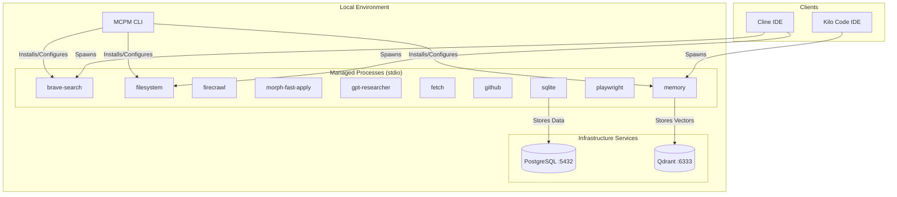

# MCPM Architecture Map

This document provides a comprehensive map of the MCPM (Model Context Protocol Manager) system architecture, file structure, and component relationships within this repository.

## 1. System Overview

**MCPM (Model Context Protocol Manager)** is the core tool for managing MCP servers. **MCPM** focuses on managing individual server installations and configurations that IDEs (Cline, Cursor) connect to directly or via generated configurations.

### Core Components

*   **MCPM (CLI):** The primary interface for installing, configuring, and managing MCP servers. It handles package downloads, environment configuration, and IDE config generation.
*   **MCP Servers:** Independent services providing specific capabilities (e.g., file system access, web search, GitHub integration). These run as local processes (stdio) managed by the IDEs.
*   **Qdrant:** A vector database used by specific MCP servers (like `memory`) for semantic search and storage.
*   **PostgreSQL:** Optional backend for specific tools requiring relational data storage.

## 2. Architecture Diagram

## 3. File Structure & Key Files

### Root Directory
*   `README.md`: Project overview and quick start guide.
*   `docker-compose.yml`: Defines infrastructure services (PostgreSQL, Qdrant).
*   `package.json`: Node.js dependencies, including `mcpm`.
*   `.env`: Environment variables for infrastructure and server configuration.
*   `config/`: Configuration directory.
    *   `technologies.toml`: Central registry of all supported MCP technologies.

### Documentation (`docs/`)
*   `architecture/`: Detailed architectural documents.
    *   `optimization-roadmap.md`: Plans for system optimization and the role of `mcpm`.
*   `config/`: Configuration documentation.
    *   `port-allocation.md`: Matrix of ports used by infrastructure services.
    *   `tool-groups.md`: Definitions for tool grouping strategies.
*   `guides/`: User and setup guides.
    *   `server-registration.md`: How to install and register servers using `mcpm`.
    *   `ide-configuration.md`: Generating IDE configurations with `mcpm`.
*   `tech/`: Technical documentation for individual MCP servers.

## 4. Component Relationships

### MCPM <-> MCP Servers
*   **Relationship:** Management
*   **Mechanism:** `mcpm` installs server packages from npm or git, manages their environment variables, and generates the JSON configuration required by IDEs to spawn them.

### IDEs <-> MCP Servers
*   **Relationship:** Execution
*   **Mechanism:** IDEs read the configuration generated by `mcpm` and spawn server processes directly using `stdio` transport. There is no intermediate gateway.

### MCP Servers <-> Infrastructure
*   **Relationship:** Persistence
*   **Mechanism:** Specific servers connect to local infrastructure services.
    *   `memory` server connects to **Qdrant** (port 6333) for vector storage.
    *   `sqlite` or custom servers may connect to **PostgreSQL** (port 5432).

## 5. Key Data Flows

1.  **Installation:** User runs `mcpm install <server>` -> MCPM downloads package and updates local registry.
2.  **Configuration:** User runs `mcpm config` -> MCPM outputs JSON config -> User updates IDE settings.
3.  **Runtime:** IDE starts -> Spawns configured MCP servers -> Servers communicate via stdio -> Servers access local resources or APIs.

## 6. Technology Stack

*   **Management:** `mcpm` (Node.js CLI).
*   **Runtime:** Node.js (for most servers), Python (for specific AI/ML servers).
*   **Infrastructure:** Docker (hosting Qdrant, PostgreSQL).
*   **Protocol:** Model Context Protocol (MCP) over `stdio`.