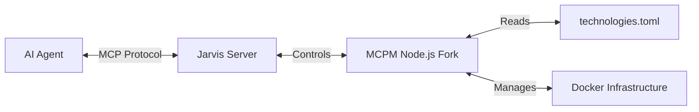

# 🤖 Jarvis: Give Your AI Agent the Ability to Manage MCP Tooling

**The missing link between your AI and your local tools.**

Let’s be honest: The Model Context Protocol (MCP) ecosystem is exploding, which is awesome. But managing all these local servers manually? That’s friction. You shouldn’t have to context-switch to your terminal just to give your AI a new capability.

**Enter Jarvis.**

Jarvis is an autonomous gateway that lets your AI agent (like Claude, Cursor, or any LLM) manage its *own* infrastructure. It’s the pilot; the package manager is the engine. You just tell the agent what you need, and Jarvis makes it happen.

---

## 💡 The "Why"

We built Jarvis because we wanted a seamless "Agentic" experience.
*   **Self-Managing:** Your agent can discover, install, and configure its own tools.
*   **Secure by Default:** It prefers running tools in Docker containers to keep your host machine clean.
*   **Zero Friction:** No python virtual environment headaches. We bundled a specialized Node.js implementation of the MCPM logic right in.

---

## 🚀 Getting Started (The Happy Path)

We’ve kept this super simple. You’re three steps away from automation.

### 1. Build the Binary
You’ll need Go installed. Just clone this repo and run:

```bash
cd Jarvis
go build -o jarvis .
```

### 2. Connect Your Agent
Tell your AI client where Jarvis lives.
*Example for **Claude Desktop** (`~/Library/Application Support/Claude/claude_desktop_config.json`):*

```json
{
  "mcpServers": {
    "jarvis": {
      "command": "/absolute/path/to/MCP/Jarvis/jarvis",
      "args": []
    }
  }
}
```

### 3. The "Bootstrap" Moment
This is the cool part. Open your AI client and just say:

> **"Please bootstrap the MCP system."**

Jarvis will spin up the necessary infrastructure (Package Manager + Docker DBs) for you. You don't need to memorize CLI commands.

---

## 🛠️ What Jarvis Can Do

Once running, Jarvis gives your agent a suite of powerful tools:

*   **📦 Install & Manage:** "Install the `brave` search tool." (It will even generate the exact JSON config you need to paste to finish the setup).
*   **🧠 Discovery:** "Find me a tool for interacting with GitHub."
*   **⚙️ System Health:** "Check system status" (Runs a full doctor check on Node, Docker, and Config).
*   **🌐 Secure Sharing:** "Share my local dev server with a public URL."

---

## 🏗️ Under the Hood

For the engineers in the room, here is how the architecture stacks up:



*   **Jarvis (Go):** The high-performance server handling the connection and lifecycle.
*   **MCPM (Node.js Fork):** We included a custom, agent-optimized fork of the `mcpm` CLI. It handles the heavy lifting—package resolution, dependency management, and file generation.

---

## ❤️ Credits & Disclaimer

Just to be 100% clear: **Jarvis is a standalone open-source project.**

We are **not** affiliated with the official MCPM developers ([Path Integral Institute](https://pathintegral.io)), though we are huge fans of their work. We built Jarvis because we love the standard they set and wanted to extend it specifically for autonomous agents.

## 📚 Documentation
*   [**Technical Architecture**](docs/TECHNICAL_ARCHITECTURE.md) - The deep dive.
*   [**Jarvis Development**](Jarvis/README.md) - For the Go devs.
*   [**MCPM Bundle Details**](MCPM/README.md) - About our CLI fork.

## 📜 License
MIT License. Free, open, and ready to build.
