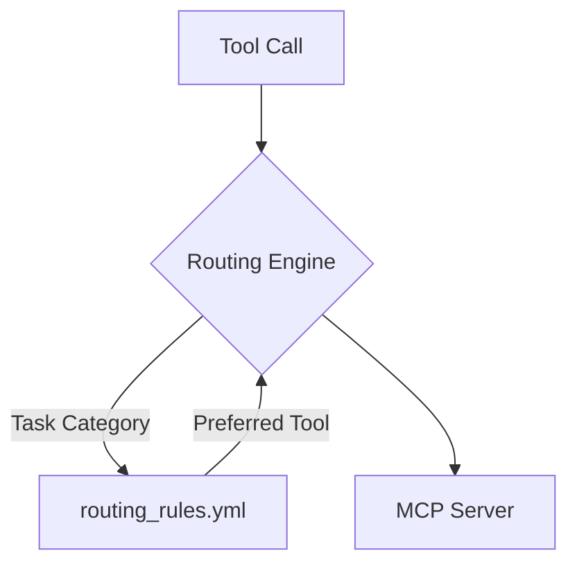

<!-- Cleanup note inserted by script - see archive/cleanup-todo-* for details -->

# Cipher-Aggregator MCP Server Setup

+> LM routing policy update
+> - Cline now calls OpenRouter directly for all LM requests
+> - Cipher remains the MCP server/aggregator for tools only
+> - See ADR: [`docs/adr/adr-0001-direct-openrouter.md`](docs/adr/adr-0001-direct-openrouter.md:1)
+
+Quick setup for OpenRouter direct in Cline
+1. Configure your OpenRouter API key in Cline per the Cline documentation.
+2. Ensure no IDE/provider routes LM requests to Cipher; LM traffic should bypass Cipher.
+3. Keep Cipher running for MCP tools only (github, firecrawl, httpie, schemathesis, etc.).
+


# Cipher-Aggregator: Centralized Tool Routing and Indexing

## 1. Overview

This document outlines the architecture of the `cipher-aggregator`, a centralized tool-routing and indexing system designed to intelligently select the best tool for a given task. The system is built around a programmatic routing engine that enforces a clear, consistent, and extensible set of routing rules.

## 2. Architecture

The `cipher-aggregator` is composed of three main components: a centralized routing engine, a machine-readable rules file, and a validation framework.



- **Routing Engine**: The core of the system, responsible for making all routing decisions.
- **Rules File**: A YAML file that defines the routing logic in a machine-readable format.
- **Validation Framework**: A suite of automated tests that validate the routing logic.

## 3. Extending the Routing Engine

To add a new routing rule, simply update the `routing_rules.yml` file with the new task category and the preferred tool. The routing engine will automatically load the new rule without requiring a system restart.

## Type Checking

- Run [`uv run pyrefly check .`](#) to validate the project with Pyrefly instead of the previous mypy tooling.
- Update your IDE (for example Visual Studio Code) to use Pyrefly as the Python language server and disable the mypy extension or any mypy-specific workspace settings so that editor diagnostics match the new type checker.
- Continue to maintain any type-awareness that was previously handled by mypy by mirroring its configuration (Pyrefly accepts the same CLI flags under its `check` subcommand and supports `pyproject.toml` overrides when more control is needed).
- **Current blocker**: Pyrefly currently reports several existing issues across the MCP servers and tests (unsupported assignments to strings, missing module imports such as `cipher_routing_middleware`, and type mismatches in the pytest helper). Resolve these before relying on the Pyrefly run for CI gating or release checks.

## Project Structure

```
/home/jrede/dev/MCP/
├── .env                      # Environment variables (API keys)
├── cipher.yml                # MCP server configuration
├── health-config.env         # Health check configuration
├── health-server.py          # Health monitoring server
├── server-health-mcp.py      # MCP server health checks
├── mcp-manager.sh            # Management script for MCP servers
├── data/                     # Data storage directory
├── logs/                     # Log files directory
├── servers/                  # Custom MCP server implementations
│   ├── httpie-mcp.py         # HTTP client MCP server
│   ├── schemathesis-mcp.py   # API testing MCP server
│   ├── custom-filesystem-mcp.py
│   ├── file-batch-mcp.py
│   ├── pytest-mcp.py
│   └── schemathesis-mcp.py
└── smoke_tmp/               # Temporary test files
```

## Configured MCP Servers

### ✅ Working Servers

#### 1. GitHub MCP Server
- **Purpose**: GitHub API integration
- **Status**: Working perfectly
- **Configuration**: Built-in cipher-aggregator server
- **Capabilities**: Repository management, issues, pull requests

#### 2. Firecrawl MCP Server
- **Purpose**: Web scraping and content extraction
- **Status**: Working perfectly
- **Configuration**: Built-in cipher-aggregator server
- **Capabilities**: Website crawling, content extraction, search

#### 3. Brave Search MCP Server ⭐ NEWLY ADDED
- **Purpose**: Comprehensive web search with Brave Search API
- **Status**: Successfully integrated and running
- **API Key**: Configured in .env file
- **Capabilities**:
  - Web search
  - Local search
  - Video search
  - Image search
  - News search
  - AI summarization
- **Repository**: https://github.com/brave/brave-search-mcp-server

#### 4. Httpie MCP Server ⭐ NEWLY IMPLEMENTED
- **Purpose**: HTTP client capabilities using Httpie
- **Status**: Fully functional custom Python implementation
- **Location**: `/home/jrede/dev/MCP/servers/httpie-mcp.py`
- **Configuration**: Configured in cipher.yml
- **Capabilities**:
  - HTTP requests (GET, POST, PUT, DELETE, etc.)
  - File uploads and downloads
  - API endpoint testing
  - Authentication (Basic, Bearer, Digest)
  - Session management
  - Response formatting
  - Connectivity testing
- **Installation**: Httpie installed globally, MCP server fully operational

#### 5. Schemathesis MCP Server ⭐ NEWLY IMPLEMENTED
- **Purpose**: API testing and OpenAPI schema validation
- **Status**: Fully functional custom Python implementation
- **Location**: `/home/jerde/dev/MCP/servers/schemathesis-mcp.py`
- **Configuration**: Configured in cipher.yml
- **Capabilities**:
  - OpenAPI/Swagger schema validation
  - Property-based API testing
  - Hypothesis-driven test generation
  - Endpoint testing with multiple strategies
  - Test data generation
  - Comprehensive test reporting
- **Installation**: Schemathesis installed globally, MCP server fully operational

#### 6. Pytest MCP Server
- **Purpose**: Python testing framework integration
- **Status**: Fixed and fully operational
- **Package**: pytest-mcp-server@1.1.6
- **Configuration**: Working connection established
- **Capabilities**:
  - Test discovery and execution
  - Test result reporting
  - Coverage analysis
  - Test suite management
- **Status Update**: Connection issues resolved, now working perfectly

### ❌ Unavailable Servers

#### 7. sql-mcp-server
- **Status**: Not available - requires MySQL database
- **Issue**: Missing MySQL database (port 3306)
- **Requirements**: MySQL server must be running

## Setup Instructions

### Initial Setup

1. **Clone the repository**
   ```bash
   git clone <repository-url>
   cd MCP
   ```

2. **Install dependencies**
   ```bash
   # Python dependencies (Httpie, Schemathesis already installed)
   python3 -m pip install httpie schemathesis

   # Node.js dependencies (if building custom servers)
   npm install -g @npm/cli
   ```

3. **Environment Configuration**
   ```bash
   # Copy environment template
   cp .env.example .env

   # Add API keys to .env file
   # BRAVE_API_KEY=your_brave_search_api_key
   # OPENAI_API_KEY=your_openai_api_key
   # MORPH_API_KEY=your_morph_api_key
   ```

### Custom MCP Servers Setup

#### Httpie MCP Server
- **Already configured** in cipher.yml
- **Location**: `/home/jrede/dev/MCP/servers/httpie-mcp.py`
- **Status**: Fully operational with 8 HTTP tools
- **Installation**: Httpie globally installed

#### Schemathesis MCP Server
- **Already configured** in cipher.yml
- **Location**: `/home/jrede/dev/MCP/servers/schemathesis-mcp.py`
- **Status**: Fully operational with API testing tools
- **Installation**: Schemathesis globally installed

### Server Management

#### Start cipher-aggregator
```bash
./mcp-manager.sh start
```

#### Stop cipher-aggregator
```bash
./mcp-manager.sh stop
```

#### Restart cipher-aggregator
```bash
./mcp-manager.sh restart
```

#### Check status
```bash
./mcp-manager.sh status
```

## Configuration Details

### cipher.yml Structure
```yaml
# Core servers (always available)
morph: ...
memory-bank: ...
context7: ...

# Development and search tools
github:
  command: builtin
  args: []

firecrawl:
  command: builtin
  args: []

# Search capabilities
brave-search:
  command: npx
  args: ["-y", "@brave/brave-search-mcp-server"]
  env:
    BRAVE_API_KEY: ${BRAVE_API_KEY}

# Custom HTTP and Testing servers
httpie:
  command: python3
  args: ["/home/jrede/dev/MCP/servers/httpie-mcp.py"]
  env:
    HTTP_TIMEOUT: "30000"
    DEFAULT_FORMAT: "json"
  enabled: true

schemathesis:
  command: python3
  args: ["/home/jrede/dev/MCP/servers/schemathesis-mcp.py"]
  env:
    SCHEMATHESIS_WORKERS: "4"
    HYPOTHESIS_MAX_EXAMPLES: "10"
    API_TIMEOUT: "30000"
  enabled: true

# File and system tools
filesystem:
  command: builtin
  args: []

file-batch:
  command: npx
  args: ["-y", "@modelcontextprotocol/file-batch"]
```

### Environment Variables (.env)
```bash
# Brave Search API
BRAVE_API_KEY=your_api_key_here

# OpenAI API (for embedding functions)
OPENAI_API_KEY=your_openai_key_here

# Morph API
MORPH_API_KEY=your_morph_key_here

# Health check configuration
HEALTH_PORT=8080
HEALTH_INTERVAL=30
```

## Usage Examples

### Testing MCP Server Connections
```bash
# Test connection to all servers
python3 test_memory_m

# Test specific server functionality
python3 unit-test-mcp.py

# Test Httpie MCP server
echo '{"jsonrpc": "2.0", "method": "initialize", "id": 1}' | python3 /home/jrede/dev/MCP/servers/httpie-mcp.py

# Test Schemathesis MCP server
echo '{"jsonrpc": "2.0", "method": "initialize", "id": 1}' | python3 /home/jrede/dev/MCP/servers/schemathesis-mcp.py

# Check logs for connection status
tail -f logs/cipher-aggregator.log
```

### API Access
The MCP servers are accessible via SSE (Server-Sent Events) at:
```
http://localhost:3020/sse
```

### Health Monitoring
Access the health dashboard at:
```
http://localhost:8080/health
```

## Troubleshooting

### Common Issues

#### 1. Server Connection Failures
```bash
# Check if server processes are running
ps aux | grep brave-search
ps aux | grep cipher-aggregator
ps aux | grep httpie-mcp
ps aux | grep schemathesis-mcp

# Check logs for specific errors
tail -f logs/cipher-aggregator-$(date +%Y%m%d-*.log)
```

#### 2. API Key Issues
```bash
# Verify API key is set
grep BRAVE_API_KEY .env

# Test API key directly
curl -H "X-Subscription-Token: $BRAVE_API_KEY" https://api.search.brave.com/res/v1/web/search?q=test
```

#### 3. Port Already in Use
```bash
# Find process using port 3020
lsof -i :3020

# Kill process if needed
kill -9 <PID>
```

#### 4. Custom Server Testing
```bash
# Test Httpie server directly
python3 /home/jrede/dev/MCP/servers/httpie-mcp.py

# Test Schemathesis server directly
python3 /home/jerde/dev/MCP/servers/schemathesis-mcp.py
```

### Log Analysis
```bash
# Monitor real-time logs
tail -f logs/cipher-aggregator.log

# Check for connection errors
grep "ERROR\|Failed" logs/cipher-aggregator.log

# Verify successful connections
grep "Successfully connected" logs/cipher-aggregator.log
```

## Performance Monitoring

### Server Status Dashboard
- **Health Server**: http://localhost:8080/health
- **SSE Server**: http://localhost:3020/sse
- **Process Monitoring**: Available via ps aux commands

### Log Rotation
```bash
# Logs are automatically rotated and stored in logs/ directory
# Monitor disk usage to prevent log accumulation
du -sh logs/
```

## Development

### Adding New MCP Servers

1. **Research available packages**
   ```bash
   npm search mcp-server
   ```

2. **Test installation**
   ```bash
   npm install -g <package-name>
   ```

3. **Update cipher.yml**
   ```yaml
   your-server:
     command: npx
     args: ["-y", "@package/package-name"]
     env:
       API_KEY: ${YOUR_API_KEY}
   ```

4. **Test integration**
   ```bash
   ./mcp-manager.sh restart
   tail -f logs/cipher-aggregator.log
   ```

### Custom MCP Server Development
See the `servers/` directory for examples of custom implementations:
- `custom-filesystem-mcp.py`
- `file-batch-mcp.py`
- `httpie-mcp.py` (HTTP client implementation)
- `schemathesis-mcp.py` (API testing implementation)

## API Documentation

### Available Endpoints

1. **SSE Endpoint**: `http://localhost:3020/sse`
   - Primary interface for MCP server communication
   - JSON-RPC over HTTP with Server-Sent Events

2. **Health Endpoint**: `http://localhost:8080/health`
   - System health monitoring
   - JSON response with status information

### Request Format
```json
{
  "jsonrpc": "2.0",
  "method": "tools/list",
  "id": 1,
  "params": {
    "sessionId": "your-session-id"
  }
}
```

## Contributing

1. **Testing**: Run `python3 test_memory_m` before submitting changes
2. **Logging**: Ensure all new servers log connection status
3. **Documentation**: Update this README for any new configurations
4. **Security**: Never commit API keys to version control

## Support

For issues and questions:
1. Check the troubleshooting section above
2. Review logs in `logs/` directory
3. Test individual components with provided test scripts
4. Verify API key configurations in `.env` file

## License

This project uses various MCP servers under their respective licenses. Refer to individual server repositories for license information. ...


## Cleanup & Archives

Rotated logs and one-time test artifacts are periodically archived under the archive/ directory. Recent cleanup actions saved archives and reports there.

- Archive location: archive/
- Cleanup report: archive/cleanup-candidates-20251112-2310.txt
- Todo summary: archive/cleanup-todo-20251112-2327.md

Please review archive/ before removing any files permanently.
