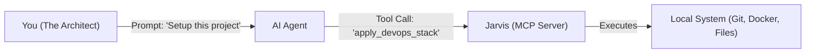

# Jarvis

**The DevOps Hand of the AI Agent.**

Jarvis is an MCP server that allows an AI Agent (like Claude, Codex, or Gemini) to securely control your local development environment.

It is not a CLI tool for humans. It is an API for your Agent.


---

## The Concept: Agent-Driven Engineering

In a traditional workflow, you are the engineer and the AI is just a text generator.
With Jarvis, you become the **Architect**, and the AI Agent becomes the **Engineer**.

**Jarvis provides the tools that the Agent needs to do the job.**



---

## 🤖 What Jarvis Enables Your Agent To Do

Jarvis transforms your LLM from a "text generator" into a **Full-Stack Operator**. It works silently in the background, giving the agent the hands it needs to touch the world.

### 1. 🧠 Intelligent Context Switching
**The Challenge:** You work on multiple projects (`frontend-app`, `backend-api`, `data-pipeline`). Each needs different tools.
**The Jarvis Fix:**
*   **Dynamic Profiling:** When you switch directories, Jarvis auto-detects the context (e.g., "I see `go.mod`, loading Go tools").
*   **Client Adaptation:** It knows if you are using Claude or Gemini and loads specific adapter tools (like `morph-fast-apply` for code application) optimized for that model's capabilities.
*   **Zero-Config Transitions:** Your agent seamlessly drops specialized tools from the previous project and picks up the new ones without you restarting the session.

### 2. 🏭 Agentic Infrastructure Management
**The Challenge:** "I need a vector database for this RAG app."
**The Jarvis Fix:**
*   **Self-Healing Infrastructure:** Your agent can spin up, stop, and *restart* Docker containers (Postgres, Qdrant) on demand.
*   **Health Diagnostics:** If a service fails, the agent can run diagnostics, read the logs, and fix the config—without waking you up.
*   **Secure Tunnels:** Need to show a demo? Your agent can securely expose a local server to the internet via `mcpm share` so you can send a link to your team.

### 3. 🛡️ The "Prime" DevOps Pipeline
**The Challenge:** "Agents write buggy code and ignore security."
**The Jarvis Fix:**
*   **One-Shot Scaffolding:** `jarvis.apply_devops_stack()` analyzes your legacy repo and instantly retrofits it with a modern CI/CD pipeline.
*   **Enforced Quality:** It installs **Pre-commit hooks** that block the agent (and you) from committing secrets, trailing whitespace, or unformatted code.
*   **AI Code Review:** It sets up **GitHub Actions** that auto-review every Pull Request, allowing the AI to critique its own work before merging.

### 4. 🔌 Autonomous Tool Installation
**The Challenge:** "I need to search the web, but I don't have a browser tool."
**The Jarvis Fix:**
*   **Self-Expansion:** The agent can say, *"I need web search capability."* Jarvis will find the `brave-search` MCP package, install it, configure the API keys, and hot-load it into the session.
*   **Registry Access:** Immediate access to the entire MCPM registry of 800+ tools (Filesystem, GitHub, Slack, Google Drive).

---

## 🛠️ Setup in 30 Seconds

### 1. Install & Build
Run this one-liner to build Jarvis and generate the config for your Agent:

```bash
git clone https://github.com/JRedeker/Jarvis-mcpm.git && ./Jarvis-mcpm/scripts/setup-jarvis.sh
```

### 2. Connect Your Agent
The script will output a JSON block.
*   **Option A (Manual):** Copy the JSON into your client's config file (e.g., `claude_desktop_config.json` or Kilo Code settings).
*   **Option B (Agentic):** Just paste the output to your Agent and say:
    > *"Configure yourself to use this MCP server."*

### 3. Bootstrap
Open your Agent and say:
> **"Bootstrap the system."**

The Agent will call `jarvis.bootstrap_system()`, which will automatically install dependencies, spin up the local Docker infrastructure, and verify the environment is ready.

---

## 📚 Documentation

*   [**Technical Architecture**](docs/TECHNICAL_ARCHITECTURE.md) - How Jarvis, MCPM, and the Agent interact.
*   [**Configuration Strategy**](docs/CONFIGURATION_STRATEGY.md) - How the Agent decides which tools to load.
*   [**Jarvis Development**](Jarvis/README.md) - Source code documentation.

## 📜 License

MIT License.
