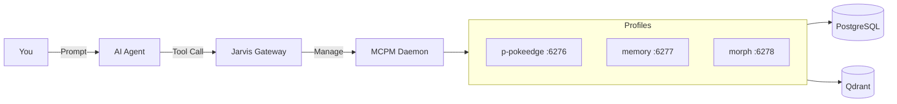

# Jarvis

```
     ██╗ █████╗ ██████╗ ██╗   ██╗██╗███████╗
     ██║██╔══██╗██╔══██╗██║   ██║██║██╔════╝
     ██║███████║██████╔╝██║   ██║██║███████╗
██   ██║██╔══██║██╔══██╗╚██╗ ██╔╝██║╚════██║
╚█████╔╝██║  ██║██║  ██║ ╚████╔╝ ██║███████║
 ╚════╝ ╚═╝  ╚═╝╚═╝  ╚═╝  ╚═══╝  ╚═╝╚══════╝
```

**The Intelligent Infrastructure Layer for AI Agents**

<div align="center">

[](https://go.dev/)
[](LICENSE)
[](https://modelcontextprotocol.io/)
[](https://github.com/JRedeker/Jarvis-mcpm/actions)
[](https://goreportcard.com/report/github.com/JRedeker/Jarvis-mcpm)

</div>

> Agents are great at logic, bad at logistics. Jarvis enforces the engineering loop—scaffolding projects, running pre-commits, and managing infrastructure so your agent stays on the rails.

---

## Installation

| Method | Command |
|--------|---------|
| **Quick Start** | `git clone https://github.com/JRedeker/Jarvis-mcpm.git && ./Jarvis-mcpm/scripts/setup-jarvis.sh` |
| **Auto-Configure** | `./scripts/setup-jarvis.sh --auto-config` |
| **HTTP Mode** | `./scripts/setup-jarvis.sh --http --port 6275` |

---

## Quick Start

### 1. Install
```bash
git clone https://github.com/JRedeker/Jarvis-mcpm.git
./Jarvis-mcpm/scripts/setup-jarvis.sh
```

### 2. Configure Your Client
Copy the JSON output into your client config:
- **Claude Desktop:** `~/.config/Claude/claude_desktop_config.json`
- **Cursor:** `~/.cursor/mcp.json`
- **Claude CLI:** `~/.claude.json`

### 3. Test It
Tell your agent:
> "Bootstrap the system and analyze this project"

**Expected Output:**
```
✅ MCPM installed successfully
✅ Infrastructure started (PostgreSQL: healthy, Qdrant: healthy)
✅ Detected: Python project (pyproject.toml)
✅ Created .pre-commit-config.yaml (Ruff, Gitleaks)
✅ Created .github/workflows/ci.yml

💡 Next: Make a commit to test the pre-commit hooks
```

---

## How It Works



**Jarvis** validates inputs, formats outputs, and provides DevOps scaffolding.
**MCPM Daemon** hosts 200+ MCP servers as composable profiles.
**Infrastructure** powers persistent memory and vector search.

---

## What Makes Jarvis Different

| Feature | Standard Gateway | Jarvis |
|---------|-----------------|--------|
| **Output** | Raw CLI + ANSI codes | Clean Markdown with emojis |
| **Validation** | None | Pre-execution checks |
| **DevOps** | Manual | Auto CI/CD, pre-commit, secrets |
| **Recovery** | Manual | Self-healing |
| **Tools** | Fixed | 200+ installable on-demand |

---

## Example Workflows

<details>
<summary><b>DevOps Scaffolding</b> — Production-ready in one request</summary>

**You:** *"This repo needs proper CI/CD"*

**Jarvis creates:**
- `.pre-commit-config.yaml` (Ruff + Gitleaks)
- `.github/workflows/ci.yml`
- Pre-commit hooks installed
</details>

<details>
<summary><b>Self-Healing</b> — Auto-repair crashed services</summary>

**You:** *"My search is broken"*

**Jarvis:** Detects Qdrant is down → restarts containers → confirms healthy
</details>

<details>
<summary><b>Dynamic Tools</b> — Install capabilities mid-conversation</summary>

**You:** *"Summarize this PDF"*

**Jarvis:** Searches registry → installs `pdf-parse` → hot-loads without restart
</details>

<details>
<summary><b>Security</b> — Block secrets before commit</summary>

**Agent:** *"Committing..."* → **Blocked:** Secret in line 42 → Moves to `.env` → Commits clean
</details>

---

## Tool Reference (v3.0)

8 consolidated tools with action-based routing:

| Tool | Actions |
|:-----|:--------|
| `jarvis_check_status` | System health |
| `jarvis_server` | list, info, install, uninstall, search, edit, create |
| `jarvis_profile` | list, create, edit, delete, suggest, restart |
| `jarvis_client` | list, edit, import, config |
| `jarvis_config` | get, set, list, migrate |
| `jarvis_project` | analyze, diff, devops |
| `jarvis_system` | bootstrap, restart, restart_infra |
| `jarvis_share` | start, stop, list |

<details>
<summary><b>Examples</b></summary>

```javascript
jarvis_check_status()
jarvis_server({ action: "install", name: "pdf-parse" })
jarvis_profile({ action: "suggest" })
jarvis_project({ action: "devops", project_type: "python" })
jarvis_system({ action: "bootstrap" })
```
</details>

---

## Compatibility

**Models:** Claude, GPT, Gemini, DeepSeek, Llama — any MCP-compatible model

**Clients:** Claude Desktop, Cursor, Windsurf, VS Code, Zed, OpenCode

<details>
<summary><b>Client Config Example</b></summary>

```json
{
  "mcpServers": {
    "jarvis": {
      "command": "/path/to/Jarvis/jarvis",
      "args": []
    },
    "memory": {
      "url": "http://localhost:6277/mcp"
    }
  }
}
```
</details>

---

## Profile Endpoints

| Profile | Port | Purpose |
|---------|------|---------|
| `p-pokeedge` | 6276 | Research (Context7, Brave, Firecrawl) |
| `memory` | 6277 | Persistent memory |
| `morph` | 6278 | Semantic code transforms |
| `qdrant` | 6279 | Vector database |

---

## Troubleshooting

| Issue | Solution |
|-------|----------|
| Docker not running | `sudo systemctl start docker` |
| MCPM not found | `jarvis_system({ action: "bootstrap" })` |
| Full diagnostics | `jarvis_check_status()` |

---

## Documentation

| Doc | Description |
|-----|-------------|
| [Examples](docs/EXAMPLES.md) | Workflow examples |
| [FAQ](docs/FAQ.md) | Common questions |
| [Architecture](docs/TECHNICAL_ARCHITECTURE.md) | Technical deep dive |
| [Configuration](docs/CONFIGURATION_STRATEGY.md) | 3-Layer Profile Stack |
| [API Reference](docs/API_REFERENCE.md) | Full tool docs |
| [Troubleshooting](docs/TROUBLESHOOTING.md) | Issue resolution |

---

## Contributing

```bash
git clone https://github.com/YOUR_USERNAME/Jarvis-mcpm.git
cd Jarvis && go build -o jarvis . && go test -v ./...
```

---

<div align="center">

**MIT License** · [Issues](https://github.com/JRedeker/Jarvis-mcpm/issues) · [Discussions](https://github.com/JRedeker/Jarvis-mcpm/discussions)

</div>
