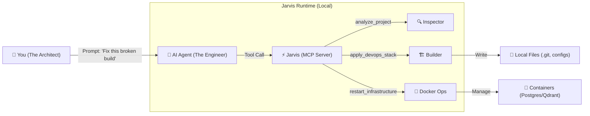

# Jarvis

**The Local Infrastructure Layer for AI Agents.**

> *"Agents are great at logic, but bad at logistics. Jarvis gives them hands."*


---

## ⚡ The "Prime" Stack for AI Engineering

Jarvis is not just a CLI tool. It is a **Model Context Protocol (MCP) Server** that transforms your AI Agent (Claude, Gemini, Codex) into a **Full-Stack DevOps Engineer**. It enforces a strict "Prime" stack on every project it touches:

| Component | Technology | Agent's Role |
| :--- | :--- | :--- |
| **Guardrails** | `pre-commit` + `gitleaks` | **The Guardian:** Blocks secrets & bad formatting before commit. |
| **Review** | `CodiumAI PR-Agent` | **The Critic:** Auto-reviews PRs with `/review` & `/improve`. |
| **Memory** | `Qdrant` (Vector DB) | **The Librarian:** Remembers codebase context across sessions. |
| **Scaffold** | `Ruff`, `GoFmt`, `Prettier` | **The Architect:** Enforces language-specific standards. |
| **Search** | `Brave Search` | **The Researcher:** Fetches live docs via the web. |

---

## 🧠 How It Works

Jarvis sits between your Agent and your Machine. It acts as a secure, intelligent layer that translates "intent" into "infrastructure."



---

## 🚀 Core Capabilities

### 🏗️ The Architect (`apply_devops_stack`)
**Goal:** Eliminate "blank page" paralysis and ensure security from line 1.

<details>
<summary><strong>Click to see the Agent's Workflow</strong></summary>

1.  **Analysis:** The Agent calls `jarvis.analyze_project()` to detect languages.
    ```json
    { "languages": ["python"], "has_gitleaks": false }
    ```
2.  **Decision:** "Security risk detected. Missing secret scanning."
3.  **Action:** The Agent calls `jarvis.apply_devops_stack(project_type="python", force=true)`.
4.  **Result:** Jarvis writes a strict `.pre-commit-config.yaml` with `ruff` and `gitleaks`.
</details>

### 🛡️ The Guardian (Automatic Safety)
**Goal:** Stop the Agent from hallucinating broken code into your repo.

*   **Secret Scanning:** Jarvis refuses to let the Agent commit API keys (via `gitleaks`).
*   **Diff Review:** The Agent calls `fetch_diff_context()` to review its own work against `git status` before finalizing tasks.
*   **Self-Healing:** If the Agent breaks the DB, it calls `restart_infrastructure()` to reboot the Docker containers.

### 🧩 Intelligent Context Switching
**Goal:** One Agent, many projects.

| Context | Jarvis Action |
| :--- | :--- |
| **User enters `~/backend-go`** | Jarvis loads `go-tools`, `postgres`, and `context7` docs. |
| **User switches to `~/frontend`** | Jarvis drops Go tools, loads `react-tools`, `brave-search`, and `prettier`. |

---

## 🛠️ Setup in 30 Seconds

### 1. Install & Build
Run this one-liner to build Jarvis and generate the config for your Agent:

```bash
git clone https://github.com/JRedeker/Jarvis-mcpm.git && ./Jarvis-mcpm/scripts/setup-jarvis.sh
```

### 2. Connect Your Agent
The script will output a JSON block.
*   **Option A (Manual):** Copy the JSON into your client's config file (e.g., `claude_desktop_config.json` or Kilo Code settings).
*   **Option B (Agentic):** Just paste the output to your Agent and say:
    > *"Configure yourself to use this MCP server."*

### 3. Bootstrap
Open your Agent and say:
> **"Bootstrap the system."**

The Agent will call `jarvis.bootstrap_system()`, which will:
1.  Install the **MCPM** package manager.
2.  Spin up **Postgres** and **Qdrant** (Docker).
3.  Install the **Guardian Stack** (`context7`, `brave-search`, `github`).

---

## 📚 Documentation Hub

| Resource | Description |
| :--- | :--- |
| [**Examples & Workflows**](docs/EXAMPLES.md) | See exactly what to say to your Agent to trigger these tools. |
| [**Technical Architecture**](docs/TECHNICAL_ARCHITECTURE.md) | Deep dive into how Jarvis wraps the CLI and manages state. |
| [**Configuration Strategy**](docs/CONFIGURATION_STRATEGY.md) | How the "3-Layer Profile Stack" works under the hood. |
| [**Jarvis Source**](Jarvis/README.md) | Go documentation for contributors. |

## 📜 License

MIT License.
