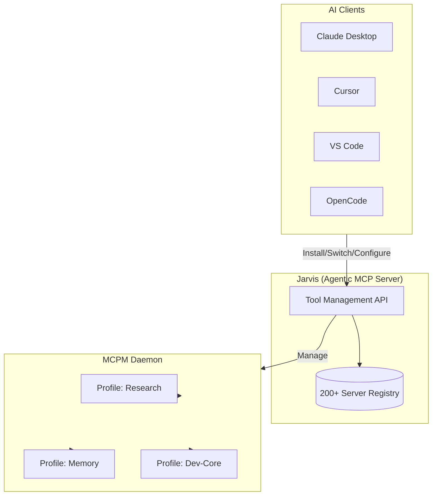

# Jarvis

```
     ██╗ █████╗ ██████╗ ██╗   ██╗██╗███████╗
     ██║██╔══██╗██╔══██╗██║   ██║██║██╔════╝
     ██║███████║██████╔╝██║   ██║██║███████╗
██   ██║██╔══██║██╔══██╗╚██╗ ██╔╝██║╚════██║
╚█████╔╝██║  ██║██║  ██║ ╚████╔╝ ██║███████║
 ╚════╝ ╚═╝  ╚═╝╚═╝  ╚═╝  ╚═══╝  ╚═╝╚══════╝
```

**The Agentic MCP Server for Dynamic Tool Management**

<div align="center">

[](https://go.dev/)
[](LICENSE)
[](https://modelcontextprotocol.io/)
[](https://github.com/JRedeker/Jarvis-mcpm/actions)
[](https://goreportcard.com/report/github.com/JRedeker/Jarvis-mcpm)

</div>

> **Jarvis lets your AI agent manage its own tools.** Install servers, switch profiles, configure clients—all through natural language. One MCP server to rule them all.

---

## The Problem

You're using Claude, Cursor, or another AI client. You have MCP servers for memory, search, code tools. But:

- **Static configs** — Every new tool requires manual JSON editing and client restart
- **Per-client duplication** — Same servers configured separately in Claude, Cursor, VS Code
- **No agent autonomy** — Your agent can't install tools it needs mid-conversation
- **Context switching** — Different projects need different tool sets

## The Solution

Jarvis is an **agentic-first MCP server** that gives your AI agent control over its own tooling:

```
You: "I need to analyze some PDFs"
Agent: [searches registry → installs pdf-parse → uses it immediately]
Agent: "Done. The contract has a 30-day payment term on page 3."
```

**No config editing. No restart. The agent handles it.**

---

## Key Features

- **Dynamic Tool Installation** — Install MCP servers mid-conversation from 200+ registry
- **Profile-Based Tool Sets** — Composable micro-profiles for different workflows
- **Multi-Client Management** — Configure Claude, Cursor, VS Code from one place
- **Self-Healing Infrastructure** — Agent detects and repairs its own tooling
- **Context-Efficient** — 52% smaller tool definitions (~1,400 tokens saved per connection)

---

## Core Capabilities

### 1. Dynamic Tool Installation

Your agent discovers and installs tools from a registry of 200+ MCP servers:

```javascript
jarvis_server({ action: "search", query: "pdf" })     // Find tools
jarvis_server({ action: "install", name: "pdf-parse" }) // Install
// Tool is immediately available—no restart needed
```

### 2. Profile-Based Tool Sets

Group tools into composable profiles. Switch entire toolsets based on project context:

```javascript
jarvis_profile({ action: "suggest" })  // Auto-detect best profile for current directory
// Returns: "essentials,dev-core,research" for coding projects
```

| Profile | Tools | Use Case |
|---------|-------|----------|
| `essentials` | Time, Fetch | Always-on utilities |
| `dev-core` | Context7 | Coding intelligence |
| `research` | Kagi, Firecrawl | Web research (Docker) |
| `memory` | Basic Memory | Persistence |
| `data` | Qdrant, Postgres | Heavy DBs |

### 3. Multi-Client Management

Configure Claude Desktop, Cursor, VS Code, OpenCode—all from one place:

```javascript
jarvis_client({ action: "edit", client_name: "cursor", add_profile: "memory" })
// Cursor now has memory tools. No manual JSON editing.
```

### 4. Self-Healing Infrastructure

Agent detects and repairs its own infrastructure:

```
You: "My search isn't working"
Agent: [checks status → finds Qdrant down → restarts → confirms healthy]
Agent: "Fixed. Qdrant was down, restarted it. Search should work now."
```

---

## Installation

```bash
git clone https://github.com/JRedeker/Jarvis-mcpm.git
./Jarvis-mcpm/scripts/setup-jarvis.sh
```

Copy the output JSON into your AI client config, or use `--auto-config` to do it automatically.

---

## How It Works



**Jarvis sits between your AI clients and the MCP ecosystem.** It's the only MCP server your agent needs to manage all other MCP servers.

---

## Tool Reference

**9 consolidated tools** using action-based routing — **52% smaller** than traditional definitions (~1,400 tokens saved per connection):

| Tool | Actions | Purpose |
|:-----|:--------|:--------|
| `jarvis_check_status` | — | System health check |
| `jarvis_server` | list, info, install, uninstall, search, edit, create, usage | MCP server management |
| `jarvis_profile` | list, create, edit, delete, suggest, restart | Profile management |
| `jarvis_client` | list, edit, import, config | AI client configuration |
| `jarvis_config` | get, set, list, migrate | MCPM settings |
| `jarvis_project` | analyze, diff, devops | Project analysis & DevOps |
| `jarvis_system` | bootstrap, restart, restart_infra | System operations |
| `jarvis_share` | start, stop, list | Server sharing |
| `jarvis_diagnose` | profile_health, test_endpoint, logs, full, config_sync | MCP debugging |

<details>
<summary><b>Example Commands</b></summary>

```javascript
// Install a new tool
jarvis_server({ action: "install", name: "brave-search" })

// Switch project profile
jarvis_profile({ action: "edit", name: "my-project", add_servers: "context7,firecrawl" })

// Configure a client
jarvis_client({ action: "edit", client_name: "opencode", add_profile: "memory" })

// Check system health
jarvis_check_status()

// Bootstrap everything
jarvis_system({ action: "bootstrap" })

// Debug when tools fail to load
jarvis_diagnose({ action: "profile_health" })
jarvis_diagnose({ action: "logs", profile: "research" })

// Audit config synchronization
jarvis_diagnose({ action: "config_sync" })
```
</details>

---

## Universal Compatibility

**Models:** Any MCP-compatible model — Claude, GPT, Gemini, DeepSeek, Llama

**Clients:** Claude Desktop, Claude CLI, Cursor, Windsurf, VS Code, Zed, OpenCode, Kilo Code

<details>
<summary><b>Client Configuration</b></summary>

```json
{
  "mcpServers": {
    "jarvis": {
      "command": "/path/to/Jarvis/jarvis",
      "args": []
    }
  }
}
```

That's it. Jarvis manages everything else.
</details>

---

## Why Jarvis?

| Without Jarvis | With Jarvis |
|----------------|-------------|
| Edit JSON configs manually | Agent installs tools via natural language |
| Restart client for new tools | Hot-load tools mid-conversation |
| Duplicate configs per client | One source of truth, multi-client |
| Fixed tool set per session | Dynamic capabilities on-demand |
| Manual infrastructure repair | Self-healing |
| Large tool definitions (~2,750 tokens) | Consolidated tools (~1,350 tokens) |

---

## Roadmap

See [ROADMAP.yaml](ROADMAP.yaml) for the full development plan.

### Now

| Feature | Description |
|:--------|:------------|
| **Daemon Stability** | Auto-restart failed servers with backoff, health checks per profile |
| **Config Hot Reload** | Watch config files and apply changes without manual restarts |
| **Smart Error Recovery** | Actionable recovery suggestions when tool calls fail |

### Next

| Feature | Description |
|:--------|:------------|
| **Profile Templates** | Pre-built profiles for research, coding, data workflows |
| **Multi-Model Optimization** | Context-aware tool pruning for different LLM providers |
| **Usage Analytics** | Track tool usage patterns, error rates, response times |

### Proposed

| Feature | Description |
|:--------|:------------|
| **Granular Client Editing** | Fine-grained server config (env vars, headers, enable/disable) via `jarvis_client` |

<details>
<summary><b>Recently Completed</b></summary>

- **v5.1** — Docker operations, test runner, config backup/restore
- **v3.1** — `jarvis_diagnose` tool for self-debugging
- **v3.0** — Tool consolidation (24 → 9 tools, 52% token reduction)
- **HTTP API Transport** — MCPM REST API with CLI fallback

</details>

---

## Documentation

| Doc | Description |
|-----|-------------|
| [Examples](docs/EXAMPLES.md) | Workflow examples |
| [FAQ](docs/FAQ.md) | Common questions |
| [Architecture](docs/TECHNICAL_ARCHITECTURE.md) | Technical deep dive |
| [Configuration](docs/CONFIGURATION_STRATEGY.md) | Micro-Profile Strategy |
| [Troubleshooting](docs/TROUBLESHOOTING.md) | Issue resolution |
| [API Reference](docs/API_REFERENCE.md) | Complete tool reference |

---

## Contributing

```bash
git clone https://github.com/YOUR_USERNAME/Jarvis-mcpm.git
cd Jarvis && go build -o jarvis . && go test -v ./...
```

---

<div align="center">

**MIT License** · [Issues](https://github.com/JRedeker/Jarvis-mcpm/issues) · [Discussions](https://github.com/JRedeker/Jarvis-mcpm/discussions)

</div>
