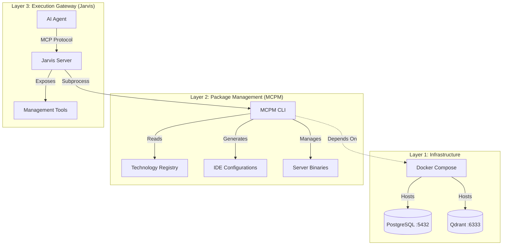

# MCP Ecosystem: Technical Reference

**System Context:** Model Context Protocol (MCP) Management & Execution Environment
**Primary Function:** Orchestration of MCP servers via CLI management and agentic gateways.

## 1. System Architecture

The repository implements a layered architecture separating infrastructure, package management, and execution gateways.



## 2. Component Specifications

### 2.1. Jarvis Gateway (`./Jarvis/`)
*   **Type:** MCP Server (Go)
*   **Role:** Agentic Interface for System Management.
*   **Mechanism:** Wraps `mcpm` CLI commands into executable MCP tools.
*   **Key Tools:**
    *   `install_server(name: str)`: Invokes `mcpm install`.
    *   `list_servers()`: Invokes `mcpm list --json`.
    *   `check_status()`: Diagnostics via `mcpm doctor`.
*   **Dependency:** Requires `mcpm` binary in system PATH.

### 2.2. MCPM Core (`./MCPM/`)
*   **Type:** Node.js CLI Application
*   **Role:** Package Manager & Configuration Generator.
*   **Data Source:** `config/technologies.toml` (Registry of supported servers).
*   **Outputs:**
    *   `cline_mcp_settings.json`: Configuration for Cline IDE.
    *   `cursor_mcp_settings.json`: Configuration for Cursor IDE.

### 2.3. Infrastructure (`./`)
*   **Container Runtime:** Docker Compose (`docker-compose.yml`).
*   **Services:**
    *   **PostgreSQL:** `postgres:15` on port `5432`.
    *   **Qdrant:** `qdrant/qdrant:latest` on port `6333` (Vector Store).

## 3. Operational Workflows

### 3.1. Server Installation Path
1.  **Trigger:** Agent calls `jarvis.install_server("brave")`.
2.  **Execution:** Jarvis spawns `mcpm install brave`.
3.  **Resolution:** MCPM resolves "brave" from `technologies.toml`.
4.  **Action:** MCPM installs npm package `@modelcontextprotocol/server-brave-search`.
5.  **Config:** MCPM updates local registry and regenerates IDE config files.

### 3.2. Semantic Search Path (Future)
1.  **Trigger:** Agent calls `jarvis.search_servers("web search")`.
2.  **Query:** Jarvis queries Qdrant vector store (via `memory` server or direct client).
3.  **Result:** Returns relevant server packages based on description embeddings.

## 4. Development Environment Setup

### 4.1. Prerequisites
*   **Runtime:** Go 1.24+, Node.js 18+, Docker Engine.
*   **Environment:** Linux/macOS (Windows via WSL2).

### 4.2. Initialization Sequence
```bash
# 1. Start Infrastructure
docker-compose up -d

# 2. Install MCPM Core
cd MCPM && npm install && npm link

# 3. Build Jarvis Gateway
cd ../Jarvis && go build -o jarvis .

# 4. Verify System Status
./jarvis -mode=diagnose
```

## 5. Documentation Index

*   **Architecture:** [`ARCHITECTURE-MAP.md`](./ARCHITECTURE-MAP.md)
*   **MCPM Spec:** [`docs/MCPM-documentation.md`](./docs/MCPM-documentation.md)
*   **Server Registry:** [`MCPM/config/technologies.toml`](./MCPM/config/technologies.toml)

## 6. Reference Material

*   **`mcpm_source/`**: This directory contains source code for reference purposes only. It is not part of the active system or build pipeline.
