# Jarvis

**The Local Infrastructure Layer for AI Agents.**

> *"Agents are great at logic, but bad at logistics. Jarvis gives them hands."*


---

## 🌍 Universal Compatibility

Jarvis is built on the **Model Context Protocol (MCP)**, making it instantly compatible with any model and any client that speaks the language.

*   **Supported Models:** Claude 3.5/3.7, Gemini 1.5/2.0, GPT-4o, DeepSeek R1, Llama 3, and more.
*   **Supported Clients:** Claude Desktop, Cursor, Windsurf, VS Code (via extensions), Zed, Kilo Code, and any other MCP-compliant interface.

If your tool supports MCP, it supports Jarvis.

---

## ⚡ The "Prime" Stack for AI Engineering

Jarvis is not just a CLI tool. It is a **Model Context Protocol (MCP) Server** that transforms your AI Agent into a **Full-Stack DevOps Engineer**. It enforces a strict "Prime" stack on every project it touches:

| Component | Technology | Agent's Role |
| :--- | :--- | :--- |
| **Guardrails** | `pre-commit` + `gitleaks` | **The Guardian:** Blocks secrets & bad formatting before commit. |
| **Review** | `CodiumAI PR-Agent` | **The Critic:** Auto-reviews PRs with `/review` & `/improve`. |
| **Memory** | `Qdrant` (Vector DB) | **The Librarian:** Remembers codebase context across sessions. |
| **Scaffold** | `Ruff`, `GoFmt`, `Prettier` | **The Architect:** Enforces language-specific standards. |
| **Search** | `Brave Search` | **The Researcher:** Fetches live docs via the web. |

---

## 🧠 How It Works

Jarvis sits between your Agent and your Machine. It acts as a secure, intelligent layer that translates "intent" into "infrastructure."

```mermaid
graph LR
    User["👤 You (The Architect)"] -->|Prompt: 'Fix this broken build'| Agent["🤖 AI Agent (The Engineer)"]

    subgraph "Jarvis Runtime (Local)"
        Agent -->|Tool Call| Jarvis["⚡ Jarvis (MCP Server)"]
        Jarvis -->|analyze_project| Analyzer["🔍 Inspector"]
        Jarvis -->|apply_devops_stack| Scaffolder["🏗️ Builder"]
        Jarvis -->|restart_infrastructure| Mechanic["🔧 Docker Ops"]
    end

    Scaffolder -->|Write| Files["📂 Local Files (.git, configs)"]
    Mechanic -->|Manage| Docker["🐳 Containers (Postgres/Qdrant)"]
```



---

## 🚀 Capabilities & Workflows

Jarvis empowers your agent to handle complex, multi-step engineering tasks that usually require a human operator.

### 1. 🏗️ The Architect: Intelligent Scaffolding
**Scenario:** *You have a messy legacy Python repo with no standards, or a blank folder for a new Go microservice.*

Instead of a request to your agent to install linters relying on LLM pattern-matching (which often hallucinates outdated configs), Jarvis enables your Agent to **research and identify the best fit linters for your project**. It guides the application of these tools, whether it's a new project or a complex existing one, by leveraging analysis steps to ensure strict project compatibility.

1.  **Analyze:** Call `analyze_project()` to inspect the file structure (e.g., "I see `requirements.txt` and `package.json`").
2.  **Decide:** Recognize that `pre-commit` config is missing or outdated based on the *actual* detected languages.
3.  **Execute:** Call `apply_devops_stack(project_type="python", force=true)` to generate:
    *   A hardened `.pre-commit-config.yaml` (Ruff, Black, Gitleaks).
    *   A GitHub Actions workflow for automated AI code reviews.
    *   A standard `.gitignore` to prevent repository bloat.

### 2. 🔧 The Mechanic: Self-Healing Infrastructure
**Scenario:** *Your RAG application is failing because the local Vector DB crashed.*

Normally, you would context-switch to your terminal to debug Docker. With Jarvis, the Agent can:
1.  **Diagnose:** Call `check_status()` to see that the Qdrant container is unhealthy.
2.  **Repair:** Call `restart_infrastructure()` to gracefully reboot the entire Docker stack (Postgres + Qdrant).
3.  **Verify:** Confirm the service is back online before continuing with the coding task.

### 3. 🔌 The Specialist: Autonomous Tool Expansion
**Scenario:** *You ask the Agent to "Analyze this PDF contract," but it has no PDF tools.*

Jarvis connects your Agent to the massive MCPM ecosystem.
1.  **Search:** The Agent calls `search_servers("pdf")` and finds a matching tool in the registry.
2.  **Install:** It calls `install_server("pdf-parse")`.
3.  **Use:** Jarvis hot-loads the new tool, and the Agent immediately uses it to read the file—without you ever leaving the chat.

### 4. 🛡️ The Guardian: Security & Safety Loops
**Scenario:** *The Agent writes code that accidentally hardcodes an API key.*

Jarvis acts as the final gatekeeper.
1.  **Prevention:** When the Agent attempts to commit, Jarvis runs the installed `gitleaks` hook.
2.  **Intervention:** The commit fails. Jarvis returns the error output to the Agent.
3.  **Correction:** The Agent reads the error, moves the key to an `.env` file, and successfully commits the fixed code.

### 5. 🧩 The Strategist: Dynamic Context Switching
**Scenario:** *You move from working on the Backend API to the React Frontend.*

Jarvis watches your working directory and adapts.
*   **In `/backend-go`:** Jarvis loads `go-tools`, `postgres-client`, and `context7` (for docs).
*   **In `/frontend-react`:** Jarvis automatically unloads the Go tools and spins up `brave-search`, `prettier`, and `chrome-devtools`.
*   **Result:** Your Agent always has the *exact* right tools for the job, reducing noise and token costs.

---

## 🛠️ Setup in 30 Seconds

### 1. Install & Build
Run this one-liner to build Jarvis and generate the config for your Agent:

```bash
git clone https://github.com/JRedeker/Jarvis-mcpm.git && ./Jarvis-mcpm/scripts/setup-jarvis.sh
```

### 2. Connect Your Agent
The script will output a JSON block.
*   **Option A (Manual):** Copy the JSON into your client's config file (e.g., `claude_desktop_config.json`, `cursor_mcp.json`, or VS Code settings).
*   **Option B (Agentic):** Just paste the output to your Agent and say:
    > *"Configure yourself to use this MCP server."*

### 3. Bootstrap
Open your Agent and say:
> **"Bootstrap the system."**

The Agent will call `jarvis.bootstrap_system()`, which will:
1.  Install the **MCPM** package manager.
2.  Spin up **Postgres** and **Qdrant** (Docker).
3.  Install the **Guardian Stack** (`context7`, `brave-search`, `github`).

---

## 📚 Documentation Hub

| Resource | Description |
| :--- | :--- |
| [**Examples & Workflows**](docs/EXAMPLES.md) | See exactly what to say to your Agent to trigger these tools. |
| [**Technical Architecture**](docs/TECHNICAL_ARCHITECTURE.md) | Deep dive into how Jarvis wraps the CLI and manages state. |
| [**Configuration Strategy**](docs/CONFIGURATION_STRATEGY.md) | How the "3-Layer Profile Stack" works under the hood. |
| [**Jarvis Source**](Jarvis/README.md) | Go documentation for contributors. |

## 📜 License

MIT License.
