# Jarvis

**The Intelligent Infrastructure Layer for AI Agents.**

> *"Most agents are blind text generators. Jarvis connects them to your local runtime, empowering them to architect, verify, and deploy code with engineering precision."*

<div align="center">

[](https://go.dev/)
[](LICENSE)
[](https://modelcontextprotocol.io/)
[](https://www.docker.com/)
[](https://github.com/JRedeker/Jarvis-mcpm/actions/workflows/test.yml)
[](Jarvis/)
[](https://goreportcard.com/report/github.com/JRedeker/Jarvis-mcpm)
[](#-contributing)
[](https://github.com/JRedeker/Jarvis-mcpm/stargazers)

</div>

---

## 😄 The MCP Gateway with DevOps for Local Dev Environments.

### Problems with Standard MCP Gateways
- AI agents trying to use tools not designed for them
- No validation before execution (errors discovered after)
- Infrastructure failures require human intervention
- Tool installation interrupts agent workflows
- No auto-recovery when services crash
- Configuration is error-prone manual work

### The Jarvis Solution

####**🎯 AI-Optimized Interface:**
- LLM-friendly formatting, clean Markdown output, zero ANSI codes

####**🧠 Intelligent Layer:**
- Pre-execution validation catches mistakes
- Context-aware suggestions based on project state
- Next-step guidance after every operation

####**⚡ Autonomous Operations:**
- Self-healing: Agent detects and repairs crashed services automatically
- Dynamic expansion: Agent installs new tools on-demand from 200+ registry
- Batch workflows: Complex operations in single commands

####**🛡️ Production-Grade:**
- DevOps scaffolding: CI/CD, linting, pre-commit hooks
- Security guardrails: Gitleaks blocks secrets before commit
- Type-safe Go core: No runtime drift

---

## 🆚 What Makes Jarvis Different

Unlike standard MCP gateways that focus on proxying and aggregation, Jarvis adds an **intelligent presentation layer**:

| Differentiator | What It Means |
|:---------------|:--------------|
| **Clean Output** | Strips ANSI codes, formats as Markdown with status emojis (✅/❌) |
| **DevOps Scaffolding** | Creates CI/CD pipelines, pre-commit hooks, and secret detection—no other gateway does this |
| **Self-Healing** | Auto-repairs crashed Docker services when your agent detects failures |
| **Smart Validation** | Pre-execution input checks with contextual fix suggestions |

**Bottom Line:** Other gateways forward calls. Jarvis transforms raw CLI into agent-optimized responses.

---

## 📦 Powered by MCPM & Docker Daemon

Jarvis uses [**MCPM**](https://github.com/pathintegral-institute/mcpm.sh) (MCP Manager) backed by a **single Docker Daemon**. This architecture provides:

- **Single Instance Efficiency:** Servers run once in a central daemon, not duplicated for every client.
- **Streamable HTTP Transport:** Clients connect via HTTP (`http://localhost:XXXX/mcp`), enabling hot-reloads and shared state.
- **200+ Server Registry:** Curated MCP servers with metadata and installation recipes.
- **Profile System:** Composable tool sets mapped to specific ports.

Jarvis wraps this infrastructure with intelligent formatting, validation, and DevOps features.

---

## 🌍 Universal Compatibility

Jarvis is built on the **Model Context Protocol (MCP)**, making it instantly compatible with any model family and client that speaks the language.

### Supports All LLM Model Families: Anthropic Claude, OpenAI GPT, Google Gemini, DeepSeek, Meta Llama
- ✨ **Any model with MCP support from any provider!

### Supported Clients & IDEs: Desktop Apps, Claude Desktop, Claude CLI, Cursor, Windsurf, VS Code, Zed, Kilo Code, ANY!

<details>
<summary><b>📋 Example Client Configurations</b></summary>

**Claude Desktop** (`~/.config/Claude/claude_desktop_config.json`):
```json
{
  "mcpServers": {
    "jarvis": {
      "command": "/home/user/Jarvis-mcpm/Jarvis/jarvis",
      "args": []
    },
    "memory": {
      "url": "http://localhost:6277/mcp",
      "transport": "streamable-http"
    },
    "p-pokeedge": {
      "url": "http://localhost:6276/mcp",
      "transport": "streamable-http"
    }
  }
}
```

**Cursor** (`~/.cursor/mcp.json`):
```json
{
  "mcpServers": {
    "jarvis": {
      "command": "/home/user/Jarvis-mcpm/Jarvis/jarvis",
      "args": [],
      "env": {}
    },
    "p-pokeedge": {
      "url": "http://localhost:6276/mcp",
      "transport": "streamable-http"
    }
  }
}
```

**VS Code** (settings.json with MCP extension):
```json
{
  "mcp.servers": {
    "p-pokeedge": {
      "url": "http://localhost:6276/mcp",
      "transport": "streamable-http"
    }
  }
}
```
</details>

> **Note:** If your tool supports MCP, it supports Jarvis. See [Configuration Strategy](docs/CONFIGURATION_STRATEGY.md) for the 3-Layer Profile Stack setup.

---

## ⚡ The DevOps Stack for AI Engineering

Jarvis transforms your AI Agent from a passive chatbot into a **Full-Stack DevOps Engineer**. It enforces a production-grade stack on every project it touches, ensuring that AI-generated code is secure, tested, and standardized before you ever see a commit.

| Capability | Technology | What It Does |
| :--- | :--- | :--- |
| **🔌 Tool Management** | [**MCPM**](https://github.com/pathintegral-institute/mcpm.sh) | **Dynamic Expansion:** Installs and hot-loads new tools via [**MCPM**](mcpm_source/README.md) on demand. |
| **🛡️ Guardrails** | **Git Hooks & Secret Detection** | **Automatic Safety:** Blocks secrets and bad formatting *before* the commit happens (e.g., `pre-commit`, `gitleaks`). |
| **🧐 Review** | **AI Code Reviewer** | **Self-Correction:** Auto-reviews PRs with commands like `/review` & `/improve` (e.g., `CodiumAI PR-Agent`). |
| **🧠 Memory** | **Vector Database** | **Context Retention:** Remembers codebase details and decisions across sessions (e.g., `Qdrant`, `Mem0`). |
| **🏗️ Tool Integration** | **Linters, Formatters & Type Checkers** | **DevOps Stacks:** Precisely chosen tools for your project (e.g., `Ruff`, `Prettier`, `GoFmt`). |
| **🔎 Research** | **Structured Docs & Web** | **Live Context:** Fetches current library documentation and code examples to prevent hallucinations (e.g., `Context7`, `Firecrawl`). |

---

## 🧠 How It Works

Jarvis sits between your Agent and your Machine. It orchestrates a central **MCPM Daemon** that hosts all your tools, ensuring they are efficient, shared, and always available.

```mermaid
flowchart TD
    subgraph "User Layer"
        User[("👤 You")]
    end

    subgraph "Agent Layer"
        Agent[("🤖 AI Agent")]
    end

    subgraph "Jarvis Infrastructure Layer"
        Jarvis["⚡ Jarvis (Gateway)"]

        subgraph "Central Daemon (Docker)"
            Daemon["🐳 mcpm-daemon"]
            Profile1["🔌 p-pokeedge (:6276)"]
            Profile2["🧠 memory (:6277)"]
            Profile3["🚀 morph (:6278)"]
        end
    end

    subgraph "Local System Layer"
        Codebase[("📂 Local Files")]
        DB[("🗄️ PostgreSQL")]
        Vector[("🔍 Qdrant")]
    end

    User -->|Prompt| Agent
    Agent -->|"Tool Call (Stdio)"| Jarvis
    Agent -.->|"HTTP Connection"| Profile1
    Agent -.->|"HTTP Connection"| Profile2

    Jarvis -->|"Manage (Docker CLI)"| Daemon
    Daemon -->|Hosts| Profile1
    Daemon -->|Hosts| Profile2

    Profile2 -->|Store/Retrieve| DB
    Profile2 -->|Store/Retrieve| Vector
```



---

## 🔧 Tool Reference

Jarvis exposes **23 MCP tools** across 6 categories. Click to expand examples:

<details>
<summary><b>⚙️ System Management</b> — bootstrap, health checks, self-healing</summary>

#### `bootstrap_system()`
**One-command system initialization**

```javascript
// Agent calls
bootstrap_system()

// Jarvis executes:
// 1. Installs MCPM CLI (npm install + link)
// 2. Starts Docker infrastructure (Postgres, Qdrant, MCPM Daemon)
// 3. Installs default servers

// Returns:
✅ MCPM installed successfully
✅ Infrastructure started (PostgreSQL: healthy, Qdrant: healthy, Daemon: healthy)
```

#### `restart_profiles(profile)`
**Hot-reload MCP servers without restarting clients**

```javascript
// Reload all profiles after config change
restart_profiles()

// Reload specific profile
restart_profiles(profile="p-pokeedge")

// Returns:
✅ Successfully restarted profile 'p-pokeedge'
💡 Changes applied. Clients using HTTP will see updates immediately.
```

#### `check_status()`
**Comprehensive system health diagnostics**

```javascript
check_status()

// Returns:
## System Status Report
...
### Infrastructure
✅ PostgreSQL: healthy
✅ Qdrant: healthy
✅ MCPM Daemon: healthy (3 profiles active)
```
</details>

<details>
<summary><b>📦 Server Management</b> — install, search, discover tools</summary>

#### `install_server(name)`
**Dynamic tool installation from MCPM registry**

```javascript
// Agent needs PDF capabilities
install_server("pdf-parse")

// Returns:
⚙️ Installing pdf-parse...
✅ npm package @modelcontextprotocol/server-pdf installed
✅ Server registered in MCPM
💡 Next step: Use manage_profile("edit", "your-project", add_servers="pdf-parse")
```

#### `search_servers(query)`
**Semantic search across 200+ specialized tools**

```javascript
search_servers("pdf extraction")

// Returns:
## Search Results for "pdf extraction"

📦 **pdf-parse** - Extract text and metadata from PDF documents
   Tags: pdf, extraction, documents, text
   Install: install_server("pdf-parse")

📦 **pdf-reader** - Advanced PDF processing with OCR support
   Tags: pdf, ocr, images, tables
   Install: install_server("pdf-reader")

💡 Found 2 results. These are specialized MCP servers—not available in typical clients.
```

> **Note:** Unlike built-in client tools, MCPM servers are **specialized**—PDF extraction, database connectors, code analysis, infrastructure management—not generic utilities.
</details>

<details>
<summary><b>📂 Profile Management</b> — composable configuration, auto-detection</summary>

#### `manage_profile(action, name, add_servers)`
**Composable configuration management**

```javascript
// Create new project profile
manage_profile("create", "project-frontend")

// Returns:
✅ Profile "project-frontend" created
💡 Add servers with: manage_profile("edit", "project-frontend", add_servers="...")

// Add tools to profile
manage_profile("edit", "project-frontend", add_servers="brave-search,context7")

// Returns:
✅ Added brave-search to project-frontend
✅ Added context7 to project-frontend
💡 Activate with: mcpm profile run project-frontend
```

#### `suggest_profile(client_name)`
**Intelligent profile stack recommendation**

```javascript
// Agent in /home/user/my-react-app
suggest_profile(client_name="cursor")

// Returns:
## Recommended Profile Stack

**Layer 1 (Environment):** project-frontend
  Why: Detected React project in working directory

**Layer 2 (Client):** client-cursor
  Why: Optimized for Cursor IDE

**Layer 3 (Global):** memory
  Why: Cross-cutting memory capabilities

💡 Activate all layers in your client config for full capabilities
```
</details>

<details>
<summary><b>🏗️ DevOps Tools</b> — scaffolding, CI/CD, pre-commit hooks</summary>

#### `apply_devops_stack(project_type)`
**Production-ready scaffolding**

```javascript
// Apply stack
apply_devops_stack(project_type="python", enable_ai_review=true)

// Returns:
✅ Git initialized
✅ Created .pre-commit-config.yaml
   - ruff (linting + formatting)
   - gitleaks (secret detection)
✅ Created .github/workflows/ci.yml
✅ Created Makefile with targets: test, lint, fmt, build
✅ Pre-commit hooks installed

💡 Next: Make your first commit to test the hooks
```

#### `fetch_diff_context(staged)`
**Self-review before commits**

```javascript
// Agent about to commit
fetch_diff_context(staged=true)
```

**Returns:**
```
## Git Status
On branch main
Changes to be committed:
  modified: src/auth.py

## Staged Changes - src/auth.py

@@ -10,7 +10,7 @@
 def authenticate(username, password):
-    api_key = "hardcoded-secret-123"  # BAD!
+    api_key = os.getenv("API_KEY")
     return validate_credentials(username, password, api_key)

💡 Review complete. No secrets detected in staged changes.
```
</details>

<details>
<summary><b>📋 Complete Tool List</b> — all 23 tools by category</summary>

**System (4 tools):**
- `bootstrap_system()` - One-command initialization
- `check_status()` - Health diagnostics
- `restart_infrastructure()` - Docker service recovery
- `restart_service()` - Restart Jarvis itself

**Servers (5 tools):**
- `install_server(name)` - Install from registry
- `uninstall_server(name)` - Remove server
- `search_servers(query)` - Find tools
- `server_info(name)` - Detailed info
- `list_servers()` - Show installed

**Profiles (2 tools):**
- `manage_profile(...)` - Create/edit/delete
- `suggest_profile(...)` - Smart recommendations

**Clients (2 tools):**
- `manage_client(...)` - Configure AI clients
- `manage_config(...)` - Global settings

**DevOps (3 tools):**
- `analyze_project()` - Detect languages/configs
- `apply_devops_stack(...)` - Scaffold projects
- `fetch_diff_context(...)` - Review before commit

**Sharing (3 tools):**
- `create_server(...)` - Register custom servers
- `edit_server(...)` - Modify server config
- `share_server(...)` - Expose via tunnel

**Advanced (4 tools):**
- `migrate_config()` - Upgrade MCPM v1→v2
- `list_shared_servers()` - Show active tunnels
- `stop_sharing_server(...)` - Revoke tunnel access
- `usage_stats()` - Analytics and metrics
</details>

---

## 🎯 How It Works: You Talk, Jarvis Acts

**You never see tool names or method calls.** You just talk naturally to your AI agent, and Jarvis works behind the scenes.

---

### Example: Installing a Testing Framework

<details open>
<summary><b>1️⃣ What You Say</b></summary>

> *"I need to add Playwright for end-to-end testing on this React project."*

</details>

<details>
<summary><b>2️⃣ What Your Agent Gets Stuck On (Without Jarvis)</b></summary>

- **No tool discovery:** Agent doesn't know what testing tools exist or how to install them
- **Raw CLI noise:** If it tries `npm install`, it gets ANSI-colored output with warnings mixed in
- **No project context:** Agent doesn't know this is a React project needing specific config
- **Manual config:** Agent would need you to explain how to set up `playwright.config.ts`
- **No verification:** No way to confirm the tool is working after installation

</details>

<details>
<summary><b>3️⃣ What Jarvis Provides</b></summary>

- **Registry access:** 200+ curated MCP servers searchable by capability
- **Clean responses:** Stripped ANSI codes, structured Markdown output
- **Project analysis:** Detects React, suggests appropriate testing patterns
- **Automated setup:** Creates config files, updates `package.json`, installs dependencies
- **Verification:** Confirms installation and suggests first test command

</details>

<details>
<summary><b>4️⃣ The Result</b></summary>

> **Agent:** *"I've set up Playwright for your React project. Created `playwright.config.ts` with Chrome and Firefox targets, added test scripts to `package.json`, and installed dependencies. Run `npm test` to verify the setup works."*

**You got:** A fully configured testing framework in one natural language request.

**Your agent did:** Searched the registry, analyzed your project, installed tools, created configs, and verified the setup—all through Jarvis.

</details>

---

**For Developers:** See the [Tool Reference](#-tool-reference) section for the full list of 24 tools Jarvis exposes to agents.

---

## 🚀 Real-World Workflows

Jarvis is built on a strict Go backbone that eliminates drift and guarantees execution. Click any scenario to see how it works:

<details>
<summary><b>1. 🏗️ Intelligent Scaffolding & Research</b></summary>

**Problem:** *You have a messy legacy Python repo with no standards, or a blank folder for a new Go microservice.*

> **Example Conversation:**
>
> **You:** *"This old script needs to be production-ready."*
> <br>
> **Agent:** *"I've analyzed the directory. It's a Python project lacking linting. I'm applying the standard DevOps stack now."*
> <br>
> **Agent:** *"Done! I've set up pre-commit hooks with Ruff and Gitleaks, created a GitHub Actions workflow, and initialized git. Try making your first commit."*

**How Jarvis Enables This:** Instead of blindly guessing which linters to install, your agent uses Jarvis to **analyze the codebase state first**.
1.  **Analyze:** Jarvis reads file signatures (e.g., `pyproject.toml`, `go.mod`) to detect the project type.
2.  **Decide:** It identifies that pre-commit config is missing or incomplete.
3.  **Execute:** Jarvis programmatically writes a hardened `.pre-commit-config.yaml` and GitHub Actions workflow, ensuring the project adheres to production standards immediately.

**What Jarvis Did:**
- Created `.pre-commit-config.yaml` with Ruff (linting + formatting) and Gitleaks (secret detection)
- Generated `.github/workflows/ci.yml` for automated testing
- Created Makefile with common targets
- Initialized git repository
- Installed pre-commit hooks
</details>

<details>
<summary><b>2. 🔧 Self-Healing Infrastructure</b></summary>

**Problem:** *Your RAG application is failing because the local Vector DB crashed.*

> **Example Conversation:**
>
> **You:** *"Why is my search failing?"*
> <br>
> **Agent:** *"Checking system status... Qdrant is down. Restarting infrastructure..."*
> <br>
> **Agent:** *"Done. Services are healthy. Retrying search... Here are your results."*

**How Jarvis Enables This:** Normally, this requires you to switch to the terminal. Jarvis allows your agent to **diagnose and repair** infrastructure without human intervention.
1.  **Diagnose:** Jarvis runs health checks and identifies the Qdrant container is unhealthy.
2.  **Repair:** It executes the Docker restart sequence automatically.
3.  **Verify:** Jarvis waits for health checks to pass and confirms services are back online—all while your agent continues working.

**What Jarvis Did:**
- Detected Qdrant container failure via health checks
- Gracefully stopped both PostgreSQL and Qdrant containers
- Restarted containers with proper sequencing
- Waited for health checks to pass (PostgreSQL port 5432, Qdrant port 6333)
- Confirmed all services operational before continuing
</details>

<details>
<summary><b>3. 🔌 Autonomous Tool Expansion</b></summary>

**Problem:** *You ask the Agent to "Analyze this PDF contract," but it has no PDF tools loaded.*

> **Example Conversation:**
>
> **You:** *"Summarize this PDF contract."*
> <br>
> **Agent:** *"I don't have a PDF reader installed. Installing `pdf-parse` via MCPM..."*
> <br>
> **Agent:** *"Tool loaded. Reading contract.pdf... This is a service agreement with payment terms of Net 30 days, auto-renewal clause on page 5..."*

**How Jarvis Enables This:** Jarvis connects your agent to the MCPM registry with 200+ tools, enabling **on-demand capability expansion**.
1.  **Search:** Your agent searches the registry and identifies a relevant PDF tool.
2.  **Install:** Jarvis installs the tool automatically.
3.  **Use:** The new tool is hot-loaded into the session. Your agent effectively "upgrades itself" in real-time to solve your specific problem.

**What Jarvis Did:**
- Searched MCPM registry for PDF-related tools (200+ available servers)
- Found `pdf-parse` with metadata and installation instructions
- Installed npm package `@modelcontextprotocol/server-pdf`
- Hot-loaded the tool without restarting the agent
- Made `pdf_extract` tool immediately available
- Tool persists for future sessions
</details>

<details>
<summary><b>4. 🛡️ Security & Safety Loops</b></summary>

**Problem:** *The Agent writes code that accidentally hardcodes an API key.*

> **Example Conversation:**
>
> **Agent:** *"I've updated the API client. Committing changes..."*
> <br>
> **Agent:** *"❌ COMMIT BLOCKED: Secret detected in `client.py` line 42."*
> <br>
> **Agent:** *"I've moved the API key to `.env` and updated the code to use `os.getenv('API_KEY')`. Committing again..."*
> <br>
> **Agent:** *"✅ Commit successful. No secrets detected."*

**The Jarvis Fix:** Jarvis acts as an immutable **security gatekeeper**.
1.  **Prevention:** When the Agent attempts to commit code, Jarvis intercepts the action and runs local hooks like `gitleaks`.
2.  **Intervention:** If a secret is detected, the commit is **programmatically blocked**.
3.  **Correction:** The error output is returned to the Agent, forcing it to remove the hardcoded key and use `.env` variables before retrying. This ensures no secrets ever enter your commit history.

**What Jarvis Did:**
- Pre-commit hook ran `gitleaks` scan on staged files
- Detected hardcoded secret pattern: `api_key = "sk-..."`
- Blocked commit with clear error message and line number
- Agent self-corrected by moving secret to `.env`
- Second commit passed all security checks
- Zero secrets entered git history
</details>

<details>
<summary><b>5. 🔄 Context Switching Between Projects</b></summary>

**Problem:** *You're switching from a backend Go service to a frontend React app. Each needs different tools.*

> **Example Conversation:**
>
> **You:** *"I'm switching to work on the dashboard now."*
> <br>
> **Agent:** *"Detected React project in ~/dashboard. Loading project-frontend profile..."*
> <br>
> **Agent:** *"Ready! I've activated Prettier for formatting, ESLint for linting, and research tools. What would you like to build?"*

**How Jarvis Enables This:** Jarvis's profile system auto-detects context and loads the right tool stack.
1.  **Navigate:** You move from `~/api-service` (Go) to `~/dashboard` (React).
2.  **Detect:** Jarvis analyzes the new directory and detects `package.json` with React dependencies.
3.  **Suggest:** It recommends the appropriate profile stack for frontend development.
4.  **Activate:** Your agent seamlessly switches to frontend tools (Prettier, ESLint) instead of Go tools.

**What Jarvis Did:**
- Analyzed working directory: `/home/user/dashboard`
- Detected `package.json` with React dependencies
- Recommended 3-Layer Profile Stack:
  - Layer 1: `project-frontend` (Prettier, ESLint, npm scripts)
  - Layer 2: `client-cursor` (Cursor IDE optimizations)
  - Layer 3: `memory` (persistent context across sessions)
- Agent seamlessly switches tooling based on project context
</details>

<details>
<summary><b>6. 🔍 Research-Driven Development (Specialized Docs Access)</b></summary>

**Problem:** *You ask the Agent to implement a feature using a library, but it was trained on outdated syntax that's now deprecated.*

> **Example Conversation:**
>
> **You:** *"Add server actions for the checkout flow."*
> <br>
> **Agent:** *"The server action syntax has changed since my training. Installing Context7 to fetch current docs..."*
> <br>
> **Agent:** *"Context7 returned 47 code snippets for server actions. Implementing with current patterns..."*
> <br>
> **Agent:** *"Done. I've used the latest API pattern with proper error boundaries. Ready for review."*

**The Jarvis Fix:** Context7 provides **structured library documentation with code examples** - not just web search results. This is fundamentally different from built-in web fetch:

| Capability | Built-in Web Fetch | 🌟 Context7 via Jarvis |
|:---|:---|:---|
| **Data Source** | Generic web pages | npm, PyPI, GitHub official docs |
| **Format** | Raw HTML/text | Structured JSON with code snippets |
| **Versioning** | Whatever Google returns | Specific version docs on demand |
| **Code Examples** | May be outdated | Live, tested snippets |

1.  **Install Specialized Tool:** Your agent installs a structured docs tool from the MCPM registry.
2.  **Resolve Library:** It identifies the exact library and version you need.
3.  **Fetch Docs:** Jarvis retrieves structured documentation for the specific feature.
4.  **Returns:** Code snippets with imports, type signatures, and working examples.
5.  **Implement:** Your agent uses **current syntax**, not outdated training data.

**What Jarvis Did:**
- Installed `context7` MCP server from MCPM registry (not available in typical clients)
- Retrieved **structured** documentation for the latest library version (not web scraping)
- Returned code snippets with proper types and imports
- Agent used current syntax patterns, avoiding deprecated APIs
- **Key difference:** Structured library docs, not generic web search
</details>

<details>
<summary><b>7. 📦 Dynamic Capability Expansion</b></summary>

**Problem:** *Mid-conversation, you ask "Can you analyze this PDF contract?" but the Agent has no PDF tools.*

> **Example Conversation:**
>
> **You:** *"Extract the payment terms from this contract.pdf."*
> <br>
> **Agent:** *"I don't have PDF tools installed. Searching MCPM registry for 'pdf'..."*
> <br>
> **Agent:** *"Found pdf-parse. Installing from npm..."*
> <br>
> **Agent:** *"Tool loaded. Extracting text from contract.pdf..."*
> <br>
> **Agent:** *"Payment terms found on page 3: Net 30 days, 2% discount if paid within 10 days. Late fees: 1.5% per month after 30 days."*

**How Jarvis Enables This:** Your agent expands its own capabilities in real-time.
1.  **Detect Gap:** Your agent recognizes it lacks PDF processing capability.
2.  **Search:** It searches the MCPM registry and finds a suitable PDF tool.
3.  **Install:** Jarvis installs the tool automatically.
4.  **Hot-Load:** The tool is loaded without restarting your agent.
5.  **Use:** Your agent immediately processes your file with the new capability.
6.  **Remember:** The tool remains available for future sessions.

**What Jarvis Did:**
- Detected missing PDF processing capability
- Searched MCPM registry: found 3 PDF-related tools
- Selected `pdf-parse` as most appropriate for text extraction
- Installed npm package without session restart
- Hot-loaded `pdf_extract` tool into active session
- Processed PDF and extracted structured text
- Tool persists in MCPM registry for future use
- Agent "upgraded itself" mid-conversation
</details>

---

## 🛠️ Setup in 30 Seconds

### 1. Install & Build
Run this one-liner to build Jarvis and generate the config for your Agent:

```bash
git clone https://github.com/JRedeker/Jarvis-mcpm.git && ./Jarvis-mcpm/scripts/setup-jarvis.sh
```

### 2. Connect Your Agent
The script will output a JSON block.
*   **Option A (Automatic):** Use the **[3-Layer Profile Stack](docs/CONFIGURATION_STRATEGY.md)**. Jarvis can now self-configure using `manage_client` and `manage_profile` tools. See `AGENTS.md` for instructions.
*   **Option B (Manual):** Copy the JSON into your client's config file (e.g., `claude_desktop_config.json`, `cursor_mcp.json`, or VS Code settings).

### 3. Bootstrap
Open your Agent and say:
> **"Bootstrap the system."**

The Agent will call `jarvis.bootstrap_system()`, which will:
1.  Install the **MCPM** package manager.
2.  Spin up **Postgres** and **Qdrant** (Docker).
3.  Install the **Guardian Stack** (`context7`, `brave-search`, `github`).

---

## 📚 Documentation Hub

| Resource | Description |
| :--- | :--- |
| [**Examples & Workflows**](docs/EXAMPLES.md) | See exactly what to say to your Agent to trigger these tools. |
| [**Technical Architecture**](docs/TECHNICAL_ARCHITECTURE.md) | Deep dive into how Jarvis wraps the CLI and manages state. |
| [**Configuration Strategy**](docs/CONFIGURATION_STRATEGY.md) | How the "3-Layer Profile Stack" works under the hood. |
| [**Jarvis Source**](Jarvis/README.md) | Go documentation for contributors. |

---

## 🎨 Presentation Layer Deep Dive

Jarvis isn't just a gateway—it's an **intelligent presentation layer** specifically engineered for AI agents.

<details>
<summary><b>🔄 Output Transformation Pipeline</b></summary>

**Step 1: Raw CLI Execution**
```bash
$ mcpm install brave-search
[INFO] Checking registry...
Successfully installed
```

**Step 2: ANSI Stripping & Noise Filtering**
```
✓ Package found
Successfully installed
```

**Step 3: Markdown Formatting**
```markdown
✅ brave-search installed successfully

**Package:** @modelcontextprotocol/server-brave-search
**Status:** Ready to use

💡 Next step: Add to profile with manage_profile("edit", "your-project", add_servers="brave-search")
```
</details>

<details>
<summary><b>✅ Input Validation Examples</b></summary>

```javascript
// Invalid server name
install_server("")
// ❌ Error: Server name cannot be empty
// 💡 Suggestion: Use search_servers() to find available tools

// Server doesn't exist
install_server("nonexistent-tool")
// ❌ Error: Server "nonexistent-tool" not found in registry
// 💡 Suggestion: Try search_servers("nonexistent-tool") for similar tools
```
</details>

**Why This Matters for AI Agents:**
- ⚡ Faster learning: Clean output = faster pattern recognition
- 🛡️ Fewer mistakes: Validation prevents repeated errors
- 👤 Better UX: Users see polished responses, not terminal dumps
- 📈 Self-improvement: Suggestions teach agents better workflows

---

## ⚡ Performance & Benchmarks

Go-powered performance: **6x faster startup**, **4-6x smaller memory footprint**.

<details>
<summary><b>📊 Detailed Benchmarks</b></summary>

### Startup Performance

| Metric | Value | Notes |
|:-------|:------|:------|
| **Binary Size** | 12 MB | Compiled Go binary |
| **Cold Start** | <100ms | First tool call after launch |
| **Hot Path** | <10ms | Subsequent tool calls |
| **Memory Footprint** | ~20 MB | Idle state |
| **Memory Under Load** | ~50 MB | Peak during operations |

### Tool Execution Times

| Tool | Avg Time | P95 | Notes |
|:-----|:---------|:----|:------|
| `check_status()` | 250ms | 400ms | Includes Docker health checks |
| `install_server()` | 3.2s | 5.1s | Network-dependent (npm install) |
| `search_servers()` | 50ms | 80ms | Local registry search |
| `apply_devops_stack()` | 2.8s | 4.5s | File I/O + git operations |
| `restart_infrastructure()` | 8.5s | 12s | Docker orchestration + health checks |

### Comparison vs. Node.js MCPM CLI

| Metric | Node.js CLI | Go Jarvis | Improvement |
|:-------|:------------|:----------|:------------|
| Startup | 400-600ms | <100ms | **6x faster** |
| Memory (idle) | 80-120 MB | ~20 MB | **4-6x smaller** |
| Response formatting | N/A (raw output) | +50ms | Worth the intelligence |
</details>

---

## ⚙️ Advanced Features

<details>
<summary><b>📚 3-Layer Profile Stack</b></summary>

Jarvis uses a composable configuration architecture that eliminates duplication:

**Layer 1 (Environment):** Workspace-specific tools
- `project-pokeedge`: Web research (Brave, Firecrawl, Context7)
- `project-frontend`: React tools (Prettier, ESLint)
- `project-backend`: Go tools (gofmt, golangci-lint)

**Layer 2 (Client Adapter):** AI client-specific
- `client-cursor`: Cursor IDE enhancements
- `client-claude`: Claude-specific optimizations

**Layer 3 (Global):** Cross-cutting capabilities
- `memory`: Vector search, persistent memory
- `testing-all-tools`: Comprehensive tool access

**Benefits:**
- ✅ **No Duplication:** Each server defined once, included in multiple profiles
- ✅ **Easy Switching:** Change environment, keep client/global layers
- ✅ **Composability:** Mix and match layers as needed

See [Configuration Strategy](docs/CONFIGURATION_STRATEGY.md) for full details.
</details>

<details>
<summary><b>🌐 Server Sharing & Remote Access</b></summary>

Expose local MCP servers to remote agents via secure tunnels:

```javascript
// Share a server
share_server("context7", port="8080", no_auth=false)

// Returns:
✅ context7 shared successfully
🌐 Tunnel URL: https://abc123.jarvis-tunnel.io
🔐 Auth: enabled
```

**Use Cases:**
- Remote team collaboration
- Multi-agent workflows
- Development/staging/production separation
</details>

---

## ❓ Frequently Asked Questions

<details>
<summary><b>What makes Jarvis different from other MCP servers?</b></summary>

Unlike gateways that just forward calls, Jarvis is a **presentation layer** with DevOps scaffolding. See [What Makes Jarvis Different](#-what-makes-jarvis-different) for the full comparison.
</details>

<details>
<summary><b>Do I need Docker?</b></summary>

**Yes**, for the infrastructure layer (PostgreSQL, Qdrant). These power memory capabilities and vector search.

**Installation:**
```bash
# Linux
sudo apt install docker.io docker-compose-plugin

# macOS
brew install --cask docker

# Then start infrastructure
./scripts/manage-mcp.sh start
```

Or let the agent run `bootstrap_system()` to handle it automatically.
</details>

<details>
<summary><b>Can I use Jarvis with my existing MCP servers?</b></summary>

**Absolutely!** Jarvis uses the MCPM registry with 200+ servers. Install any tool:

```javascript
search_servers("your-tool-category")  // Find tools
install_server("tool-name")           // Install
```

You can also register custom servers with `create_server()`.
</details>

<details>
<summary><b>Don't most clients already have web search and file tools?</b></summary>

Yes, but MCPM's registry offers **specialized** tools that go far beyond built-in capabilities:

| Built-in | MCPM Specialized Tool |
|:---|:---|
| Generic web search | `context7`: Structured library docs with code snippets from npm/PyPI |
| Basic URL fetch | `firecrawl`: Intelligent scraping with Markdown/table extraction |
| Read files | `pdf-parse`: Extract text, tables, metadata from PDFs |
| Git commands | `gitleaks`: Pre-commit hook that **blocks** secrets before commit |
| Fixed toolset | **200+ servers** installable mid-conversation without restart |

The unique value is **dynamic capability expansion**—your agent can install specialized tools on-demand.
</details>

<details>
<summary><b>Which AI models/clients does Jarvis support?</b></summary>

**Any model or client that supports MCP:**

**Models:** Claude, GPT, Gemini, DeepSeek, Llama, Mistral, and more

**Clients:** Claude Desktop, Cursor, Windsurf, VS Code, Zed, Kilo Code

If your tool speaks MCP, it works with Jarvis. See [Universal Compatibility](#-universal-compatibility).
</details>

<details>
<summary><b>How does Jarvis handle secrets and security?</b></summary>

**Pre-Commit Protection:**
- `apply_devops_stack()` installs `gitleaks` hook
- Scans commits for API keys, tokens, passwords
- **Blocks commit** if secrets detected
- Forces agent to use environment variables

**Additional Security:**
- Validates all inputs (prevents command injection)
- Sandboxed Docker containers
- No automatic push to remote
- Audit logs for all operations
</details>

<details>
<summary><b>What if I encounter errors?</b></summary>

**Debugging Steps:**

1. **Check System Health:**
   ```javascript
   check_status()
   ```

2. **Common Fixes:**
   - **Docker not running:** `./scripts/manage-mcp.sh start`
   - **MCPM not found:** `bootstrap_system()`
   - **Port conflicts:** Run `docker compose ps`

3. **Self-Healing:**
   ```javascript
   restart_infrastructure()  // Repairs crashed services
   ```

See [Troubleshooting](#-troubleshooting) for detailed error resolution.
</details>

<details>
<summary><b>How do I contribute?</b></summary>

We welcome contributions! See [Contributing](#-contributing) section below.

**Quick Start:**
1. Fork the repo
2. Build locally: `./scripts/setup-jarvis.sh`
3. Run tests: `./scripts/manage-mcp.sh test`
4. Submit PR
</details>

---

## 🔧 Troubleshooting

<details>
<summary><b>🐳 Docker Issues</b></summary>

**Problem:** `restart_infrastructure()` fails with "Docker daemon not responding"

**Solution:**
```bash
# Linux
sudo systemctl start docker

# macOS
open -a Docker

# Verify
docker ps
```

**Problem:** Port conflicts (5432 or 6333 already in use)

**Solution:**
```bash
# Find conflicting process
sudo lsof -i :5432

# Stop it or change port in docker-compose.yml
```
</details>

<details>
<summary><b>📦 MCPM Issues</b></summary>

**Problem:** `mcpm: command not found`

**Solution:**
```bash
# Agent calls
bootstrap_system()

# Or manually
cd MCPM && npm install && npm link
```
</details>

<details>
<summary><b>⚙️ Jarvis Binary Issues</b></summary>

**Problem:** Jarvis tools not appearing in client

**Solution:**
1. **Verify binary is built:**
   ```bash
   cd Jarvis && go build -o jarvis .
   ```

2. **Check client config** has correct path to Jarvis binary

3. **Restart client** (Jarvis won't hot-reload)
</details>

**Still Stuck?**
1. Run full diagnostic: `check_status()`
2. Check logs: `cat logs/jarvis.log`
3. [Report bugs on GitHub](https://github.com/JRedeker/Jarvis-mcpm/issues)

---

## 🤝 Contributing

We welcome contributions from the community!

<details>
<summary><b>🛠️ Development Setup</b></summary>

```bash
# 1. Fork and clone
git clone https://github.com/YOUR_USERNAME/Jarvis-mcpm.git

# 2. Build Jarvis
cd Jarvis && go build -o jarvis .

# 3. Install MCPM
cd ../MCPM && npm install && npm link

# 4. Start infrastructure
./scripts/manage-mcp.sh start

# 5. Run tests
./scripts/manage-mcp.sh test
```
</details>

<details>
<summary><b>🧪 Running Tests</b></summary>

**All Tests (Go + Docker):**
```bash
./scripts/manage-mcp.sh test
```

**Go Tests Only:**
```bash
cd Jarvis && go test -v ./...
```

**With Coverage Report:**
```bash
cd Jarvis && go test -coverprofile=coverage.out ./...
go tool cover -func=coverage.out    # Summary
go tool cover -html=coverage.out    # Interactive HTML report
```

**Run Specific Test:**
```bash
cd Jarvis && go test -v -run TestCheckStatus ./handlers/
```

**Test Packages:**
| Package | Description | Coverage |
|:--------|:------------|:---------|
| `jarvis` | Main entry, MCP server setup | 15% |
| `jarvis/handlers` | Core tool handlers with DI | 55% |
| `jarvis/smoketests` | Integration smoke tests | 84% |
| `jarvis/testing/mocks` | Mock implementations | 84% |

**CI/CD:** Tests run automatically on push via GitHub Actions. See [`.github/workflows/test.yml`](.github/workflows/test.yml).
</details>

<details>
<summary><b>📝 Code Style & Commits</b></summary>

**Go (Jarvis):**
- Format with `gofmt -w .`
- Lint with `golangci-lint run`

**JavaScript (MCPM):**
- Format with Prettier (auto via pre-commit)

**Semantic Commits:**
```bash
feat: Add new feature
fix: Bug fix
docs: Documentation
test: Tests
refactor: Code refactoring
chore: Maintenance
```
</details>

<details>
<summary><b>🔄 Pull Request Process</b></summary>

1. Create feature branch: `git checkout -b feat/my-feature`
2. Make changes + commit
3. Run tests: `./scripts/manage-mcp.sh test`
4. Push and create PR
5. CI checks run automatically
6. Maintainers review within 48 hours
</details>

**High-Priority Contributions:**
- 🐛 **Bug Fixes:** Check [Issues](https://github.com/JRedeker/Jarvis-mcpm/issues)
- 📝 **Documentation:** More examples, tutorials
- 🧪 **Test Coverage:** Expand test suite
- ⚡ **Performance:** Optimize tool execution

---

## 💬 Community & Support

### Get Help

- **📚 Documentation:** [Full docs](docs/)
- **🐛 GitHub Issues:** [Report bugs](https://github.com/JRedeker/Jarvis-mcpm/issues)
- **💡 Discussions:** [Ask questions](https://github.com/JRedeker/Jarvis-mcpm/discussions)

### Stay Updated

- **⭐ Star this repo** to get notifications
- **📰 Follow development** on GitHub

### License

MIT License - see [LICENSE](LICENSE) for details.

---

<div align="center">

**Built for the Age of Agents.**

[](LICENSE)

</div>
