<div align="center">

# 🤖 Jarvis

**The Intelligent Infrastructure Layer for AI Agents.**

> *"Most agents are blind text generators. Jarvis connects them to your local runtime, empowering them to architect, verify, and deploy code with engineering precision."*

[](https://go.dev/)
[](LICENSE)
[](https://modelcontextprotocol.io/)
[](https://www.docker.com/)

</div>

---

## 🌍 Universal Compatibility

Jarvis is built on the **Model Context Protocol (MCP)**, making it instantly compatible with any model family and client that speaks the language.

*   **🧠 Model Families:** Anthropic Claude, OpenAI GPT, Google Gemini, DeepSeek, Meta Llama.
*   **🖥️ Clients:** Claude Desktop, Cursor, Windsurf, VS Code (via extensions), Zed, Kilo Code, and more.

If your tool supports MCP, it supports Jarvis.

---

## ⚡ The DevOps Stack for AI Engineering

Jarvis transforms your AI Agent from a passive chat bot into a **Full-Stack DevOps Engineer**. It enforces a production-grade stack on every project it touches, ensuring that AI-generated code is secure, tested, and standardized before you ever see a commit.

| Capability | Technology | What It Does |
| :--- | :--- | :--- |
| **🔌 Tool Management** | [**MCPM**](mcpm_source/README.md) | **Dynamic Expansion:** Installs and hot-loads new tools (e.g., `pdf-parse`, `slack`) on demand. |
| **🛡️ Guardrails** | [**pre-commit**](https://github.com/pre-commit/pre-commit) + [**gitleaks**](https://github.com/gitleaks/gitleaks) | **Automatic Safety:** Blocks secrets and bad formatting *before* the commit happens. |
| **🧐 Review** | [**CodiumAI PR-Agent**](https://github.com/Codium-ai/pr-agent) | **Self-Correction:** Auto-reviews PRs with commands like `/review` & `/improve`. |
| **🧠 Memory** | [**Qdrant**](https://github.com/qdrant/qdrant) (Vector DB) | **Context Retention:** Remembers codebase details and decisions across sessions. |
| **🏗️ Scaffold** | [**Ruff**](https://github.com/astral-sh/ruff), [**GoFmt**](https://go.dev/blog/gofmt), [**Prettier**](https://github.com/prettier/prettier) | **The Architect:** Enforces language-specific standards. |
| **🔎 Search** | [**Brave Search**](https://github.com/modelcontextprotocol/servers/tree/main/src/brave-search) | **The Researcher:** Fetches live docs via the web. |

---

## 🧠 How It Works

Jarvis sits between your Agent and your Machine. It acts as a secure, intelligent layer that translates "intent" into "infrastructure."

```mermaid
graph LR
    User["👤 You (The Architect)"] -->|Prompt: 'Fix this broken build'| Agent["🤖 AI Agent (The Engineer)"]

    subgraph "Jarvis Runtime (Local)"
        Agent -->|Tool Call| Jarvis["⚡ Jarvis (MCP Server)"]
        Jarvis -->|analyze_project| Analyzer["🔍 Inspector"]
        Jarvis -->|apply_devops_stack| Scaffolder["🏗️ Builder"]
        Jarvis -->|restart_infrastructure| Mechanic["🔧 Docker Ops"]
    end

    Scaffolder -->|Write| Files["📂 Local Files (.git, configs)"]
    Mechanic -->|Manage| Docker["🐳 Containers (Postgres/Qdrant)"]
```



---

## 🚀 Core Workflows

Jarvis empowers your agent to handle complex, multi-step engineering tasks that usually require a human operator.

### 1. 🏗️ The Architect: Intelligent Scaffolding
**Scenario:** *You have a messy legacy Python repo with no standards, or a blank folder for a new Go microservice.*

Instead of blindly following a "install linters" prompt, Jarvis enables your Agent to **research and identify the best fit tools for your project**. It scans the directory (`analyze_project`), detects the tech stack (e.g., `pyproject.toml` vs `go.mod`), and then intelligently applies the correct DevOps stack. It won't overwrite your existing work—it adapts to it.

<details>
<summary><strong>Click to see the Agent's Workflow</strong></summary>

1.  **Analysis:** The Agent calls `jarvis.analyze_project()` to detect languages.
    ```json
    { "languages": ["python"], "has_gitleaks": false }
    ```
2.  **Decision:** "Security risk detected. Missing secret scanning."
3.  **Action:** The Agent calls `jarvis.apply_devops_stack(project_type="python", force=true)`.
4.  **Result:** Jarvis writes a strict `.pre-commit-config.yaml` with `ruff` and `gitleaks`.
</details>

### 2. 🔧 The Mechanic: Self-Healing Infrastructure
**Scenario:** *Your RAG application is failing because the local Vector DB crashed.*

Normally, you would context-switch to your terminal to debug Docker. Jarvis lets the Agent **diagnose and repair** the underlying infrastructure itself. It can check container health (`check_status`), read logs, and gracefully reboot the entire stack (`restart_infrastructure`) without you leaving your flow state.

### 3. 🔌 The Specialist: Autonomous Tool Expansion
**Scenario:** *You ask the Agent to "Analyze this PDF contract," but it has no PDF tools.*

Jarvis connects your Agent to the massive MCPM registry. The Agent can **search for missing capabilities** (e.g., "pdf tools"), install them instantly (`install_server`), and begin using them immediately. It turns "I can't do that" into "I just installed the tool to do that."

### 4. 🛡️ The Guardian: Security & Safety Loops
**Scenario:** *The Agent writes code that accidentally hardcodes an API key.*

Jarvis acts as the final gatekeeper. When the Agent attempts to commit code, Jarvis runs local hooks like `gitleaks`. If a secret is detected, the commit is **blocked**, the error is returned to the Agent, and the Agent is forced to fix the security flaw before trying again.

### 5. 🧩 The Strategist: Dynamic Context Switching
**Scenario:** *You move from working on the Backend API to the React Frontend.*

Jarvis watches your working directory and **adapts the toolset in real-time**. In a Go backend folder, it loads Postgres clients and Go documentation. When you switch to the React frontend, it drops those tools and loads Prettier, Browser tools, and React docs. Your Agent always has the exact right context.

---

## 🛠️ Setup in 30 Seconds

### 1. Install & Build
Run this one-liner to build Jarvis and generate the config for your Agent:

```bash
git clone https://github.com/JRedeker/Jarvis-mcpm.git && ./Jarvis-mcpm/scripts/setup-jarvis.sh
```

### 2. Connect Your Agent
The script will output a JSON block.
*   **Option A (Manual):** Copy the JSON into your client's config file (e.g., `claude_desktop_config.json`, `cursor_mcp.json`, or VS Code settings).
*   **Option B (Agentic):** Just paste the output to your Agent and say:
    > *"Configure yourself to use this MCP server."*

### 3. Bootstrap
Open your Agent and say:
> **"Bootstrap the system."**

The Agent will call `jarvis.bootstrap_system()`, which will:
1.  Install the **MCPM** package manager.
2.  Spin up **Postgres** and **Qdrant** (Docker).
3.  Install the **Guardian Stack** (`context7`, `brave-search`, `github`).

---

## 📚 Documentation Hub

| Resource | Description |
| :--- | :--- |
| [**Examples & Workflows**](docs/EXAMPLES.md) | See exactly what to say to your Agent to trigger these tools. |
| [**Technical Architecture**](docs/TECHNICAL_ARCHITECTURE.md) | Deep dive into how Jarvis wraps the CLI and manages state. |
| [**Configuration Strategy**](docs/CONFIGURATION_STRATEGY.md) | How the "3-Layer Profile Stack" works under the hood. |
| [**Jarvis Source**](Jarvis/README.md) | Go documentation for contributors. |

---

<div align="center">

**Built for the Age of Agents.**

[](LICENSE)

</div>
