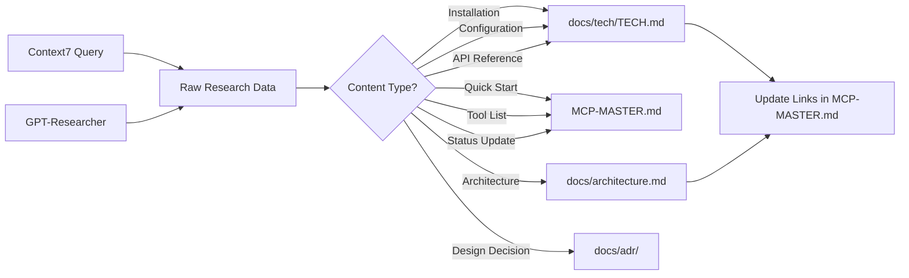

# Documentation Information Architecture

**Version:** 1.0
**Date:** 2025-11-16
**Purpose:** Define documentation organization, content boundaries, and navigation strategy for MCP project

---

## 1. Documentation Hierarchy Overview

```
MCP/
├── MCP-MASTER.md                    # Master planning & tracking (SINGLE SOURCE OF TRUTH)
├── README.md                         # Project introduction & quick start
├── docs/
│   ├── INFORMATION-ARCHITECTURE.md   # This document
│   ├── architecture.md               # Current system architecture
│   ├── PHASE0-RESEARCH-PLAN.md      # Phase 0 research organization (NEW)
│   │
│   ├── tech/                         # Technology deep-dives (REFERENCE)
│   │   ├── metamcp.md               # MetaMCP aggregator research
│   │   ├── cipher-aggregator.md     # Cipher implementation details
│   │   ├── mcpjungle.md            # MCPJungle documentation
│   │   ├── qdrant.md               # Vector store configuration
│   │   ├── kilo-code-context7.md   # Context7 integration
│   │   └── [future-tech-docs]      # Additional technology references
│   │
│   ├── migration/                   # Migration guides (PROCEDURES)
│   │   ├── migrate-to-openrouter-direct.md
│   │   └── [future-migration-docs]
│   │
│   ├── adr/                         # Architecture Decision Records (DECISIONS)
│   │   ├── adr-0001-direct-openrouter.md
│   │   └── [future-adrs]
│   │
│   └── resolved-tickets/            # Historical issue tracking
│       └── 2025-11-15-cline-mcp-connection-stdio-fix.md
│
└── possible-next-steps.md           # Tactical troubleshooting (TEMPORARY)
```

---

## 2. Content Boundaries & Responsibilities

### 2.1 MCP-MASTER.md (Actionable Content)

**Purpose:** Single source of truth for project planning, tracking, and decision-making

**Content Types:**
- ✅ **Project status** - Phase progress, task tracking, blockers
- ✅ **Master todo lists** - Consolidated 89-task tracking system
- ✅ **Quick start guides** - Testing, validation, operational commands
- ✅ **Decision summaries** - High-level architecture decisions with links to ADRs
- ✅ **Rollback procedures** - Emergency procedures and operational playbooks
- ✅ **Tool catalogs** - Quick reference for available tools (with links to details)
- ✅ **Configuration summaries** - Environment variables, key settings (not full specs)

**What NOT to include:**
- ❌ Technology deep-dives (→ docs/tech/)
- ❌ Complete API documentation (→ docs/tech/)
- ❌ Architecture diagrams (→ docs/architecture.md)
- ❌ Historical context (→ docs/adr/, docs/resolved-tickets/)

**Update Frequency:** Multiple times per day during active development

---

### 2.2 docs/tech/ (Reference Content)

**Purpose:** Comprehensive technology-specific documentation and research findings

**Content Types:**
- ✅ **Installation procedures** - Complete setup instructions with all options
- ✅ **Configuration schemas** - Full YAML/JSON specifications and examples
- ✅ **API references** - Complete tool/endpoint documentation
- ✅ **Integration patterns** - How to connect with other systems
- ✅ **Research findings** - Context7 and GPT-Researcher outputs
- ✅ **Code examples** - Extensive usage samples and patterns
- ✅ **Troubleshooting** - Technology-specific debugging guides
- ✅ **Performance data** - Benchmarks, metrics, optimization guides

**File Naming Convention:**
- Technology name in lowercase-with-hyphens: `metamcp.md`, `cipher-aggregator.md`
- Focus on single technology per file
- Use clear, searchable names

**Template Structure for tech/ files:**
```markdown
# [Technology Name]

**GitHub/Source:** [link]
**Status:** [Active/Beta/Deprecated]
**Purpose:** [One-line description]

## Overview
[High-level capabilities and use cases]

## Installation
[Complete setup procedures]

## Configuration
[Full schema and examples]

## Integration
[How to connect with our system]

## API Reference
[Complete tool/method documentation]

## Examples
[Comprehensive usage examples]

## Troubleshooting
[Common issues and solutions]

## Performance
[Benchmarks and optimization tips]

## Research Notes
[Context7/GPT-Researcher findings]
```

**Update Frequency:** When new research completes or technology changes

---

### 2.3 docs/architecture.md (System Design)

**Purpose:** Current system architecture and design documentation

**Content Types:**
- ✅ **Architecture diagrams** - Mermaid visualizations
- ✅ **Component responsibilities** - What each piece does
- ✅ **Data flow** - How information moves through the system
- ✅ **Integration points** - External connections and APIs
- ✅ **Security model** - Access control and boundaries
- ✅ **Operational interfaces** - Endpoints, ports, protocols

**Update Frequency:** When architecture changes (major versions)

---

### 2.4 docs/adr/ (Architecture Decision Records)

**Purpose:** Capture important architectural decisions and their context

**Content Types:**
- ✅ **Decision context** - Why we faced a choice
- ✅ **Alternatives considered** - What options we evaluated
- ✅ **Decision made** - What we chose and why
- ✅ **Consequences** - Positive and negative impacts

**File Naming:** `adr-NNNN-short-title.md` (e.g., `adr-0001-direct-openrouter.md`)

**Update Frequency:** When significant architectural decisions are made

---

### 2.5 docs/migration/ (Migration Guides)

**Purpose:** Step-by-step procedures for migrating between architectures

**Content Types:**
- ✅ **Prerequisites** - What you need before starting
- ✅ **Step-by-step procedures** - Numbered migration steps
- ✅ **Validation steps** - How to confirm success
- ✅ **Rollback procedures** - How to undo if needed

**Update Frequency:** When creating new migration paths

---

## 3. Linking Strategy

### 3.1 Internal Links

**Format:** Use relative paths with line numbers where applicable
```markdown
See [`filename.ext`](path/to/filename.ext:line) for details
```

**Examples:**
```markdown
- Configuration: [`cipher.yml`](../cipher.yml:1)
- Architecture details: [architecture.md](architecture.md#component-responsibilities)
- MetaMCP research: [docs/tech/metamcp.md](tech/metamcp.md#installation)
```

### 3.2 Cross-Document Navigation

**From MCP-MASTER.md → Reference Docs:**
```markdown
For complete MetaMCP configuration options, see [MetaMCP Tech Docs](docs/tech/metamcp.md#configuration)
```

**From Reference Docs → MCP-MASTER.md:**
```markdown
For current project status and implementation plan, see [MCP-MASTER.md](../../MCP-MASTER.md#master-todo-tracking)
```

**From Tech Docs → Other Tech Docs:**
```markdown
Cipher integrates with Qdrant for vector storage. See [Qdrant configuration](qdrant.md#local-setup)
```

### 3.3 Link Maintenance Rules

1. **Always use relative paths** - No absolute paths or URLs to local files
2. **Include line numbers** for code references - Helps readers jump to exact location
3. **Keep links bidirectional** - If A links to B, consider if B should link back to A
4. **Update links when moving files** - Use grep to find all references
5. **Validate links periodically** - Automated link checking recommended

---

## 4. Phase 0 Research Content Destinations

### 4.1 Research Plan Structure

**File:** `docs/PHASE0-RESEARCH-PLAN.md` (NEW - to be created)

**Purpose:** Organize Phase 0 research tasks and track completion

**Sections:**
1. **Research Objectives** - What we need to learn
2. **Research Tasks** - Specific queries and investigations
3. **Content Destinations** - Where findings will be documented
4. **Completion Criteria** - How we know research is done

### 4.2 Content Destination Matrix

| Research Topic             | Primary Destination               | Secondary References        | Status      |
| -------------------------- | --------------------------------- | --------------------------- | ----------- |
| **MetaMCP Installation**   | `docs/tech/metamcp.md`            | `MCP-MASTER.md` (summary)   | Pending     |
| **MetaMCP Configuration**  | `docs/tech/metamcp.md`            | `MCP-MASTER.md` (quick ref) | Pending     |
| **Cipher Default Mode**    | `docs/tech/cipher-aggregator.md`  | `docs/architecture.md`      | In Progress |
| **Namespace Design**       | `docs/tech/metamcp.md`            | ADR (if significant)        | Pending     |
| **Middleware Patterns**    | `docs/tech/metamcp.md`            | Examples in `docs/tech/`    | Pending     |
| **WebSocket Setup**        | `docs/tech/metamcp.md`            | `docs/architecture.md`      | Pending     |
| **Tool Discovery**         | `docs/tech/metamcp.md`            | `MCP-MASTER.md` (catalog)   | Pending     |
| **Performance Benchmarks** | `docs/tech/metamcp.md`            | `MCP-MASTER.md` (summary)   | Pending     |
| **Qdrant Configuration**   | `docs/tech/qdrant.md`             | `MCP-MASTER.md` (env vars)  | Complete    |
| **Context7 Usage**         | `docs/tech/kilo-code-context7.md` | `MCP-MASTER.md` (quick ref) | Pending     |

### 4.3 Research Tools → Documentation Flow



---

## 5. File Structure Plan for docs/tech/

### 5.1 Current State
```
docs/tech/
├── cipher-aggregator.md    # Complete (code snippets)
├── mcpjungle.md           # Unknown status
├── qdrant.md              # Configuration guide
└── kilo-code-context7.md  # Context7 integration
```

### 5.2 Target State (Post-Phase 0)

```
docs/tech/
├── aggregators/
│   ├── mcpjungle.md
│
├── servers/
│   ├── filesystem-mcp.md  # Filesystem server details
│   ├── httpie-mcp.md      # HTTP client server
│   ├── pytest-mcp.md      # Test runner server
│   └── [additional-servers]
│
├── tools/
│   ├── context7.md        # Documentation lookup
│   ├── gpt-researcher.md  # AI research tool
│   ├── brave-search.md    # Web search integration
│   └── [additional-tools]
│
├── infrastructure/
│   ├── qdrant.md          # Vector store
│   ├── openrouter.md      # LLM routing
│   └── docker-setup.md    # Container deployment
│
└── integrations/
    ├── vscode-mcp.md      # VSCode/IDE integration
    ├── kilo-code.md       # Kilo Code specifics
    └── cline-mcp.md       # Cline integration
```

### 5.3 Migration Plan

**Phase 1:** Keep existing structure, enhance content
- Complete research for `metamcp.md`
- Validate and update `cipher-aggregator.md`
- Review and organize `mcpjungle.md`

**Phase 2:** Reorganize when structure becomes clear
- Create subdirectories based on content volume
- Move files to appropriate categories
- Update all cross-references

**Decision Point:** Reorganize only if we have 10+ tech docs

---

## 6. Documentation Workflow

### 6.1 Adding New Technology Documentation

1. **Create stub file** in `docs/tech/[technology].md`
2. **Add research tasks** to Phase 0 research plan
3. **Execute research** using Context7/GPT-Researcher
4. **Document findings** in tech file using template
5. **Update MCP-MASTER.md** with summary and links
6. **Update architecture.md** if integration changes system
7. **Create ADR** if significant decision was made

### 6.2 Updating Existing Documentation

1. **Check current version** in file header
2. **Make updates** preserving existing structure
3. **Increment version** and add changelog entry
4. **Update related links** in other documents
5. **Validate all links** still work
6. **Commit with descriptive message**

### 6.3 Phase 0 Research Completion Criteria

**MCP-MASTER.md updates:**
- [ ] All Phase 0 tasks marked complete
- [ ] Links to detailed tech docs added
- [ ] Quick reference sections updated
- [ ] Tool catalog verified

**docs/tech/ completion:**
- [ ] MetaMCP installation fully documented
- [ ] Configuration schema complete with examples
- [ ] Integration patterns documented
- [ ] All placeholder sections filled
- [ ] Research findings incorporated

**Cross-references:**
- [ ] All links validated and working
- [ ] Bidirectional navigation in place
- [ ] No broken references

---

## 7. Document Ownership & Maintenance

| Document             | Primary Owner  | Update Triggers  | Review Frequency   |
| -------------------- | -------------- | ---------------- | ------------------ |
| MCP-MASTER.md        | Project Lead   | Daily during dev | Continuous         |
| docs/tech/*.md       | Research Team  | New findings     | Per research cycle |
| docs/architecture.md | Architect      | System changes   | Per major version  |
| docs/adr/*.md        | Decision Maker | Major decisions  | As needed          |
| docs/migration/*.md  | Migration Lead | New migrations   | Per migration      |

---

## 8. Success Metrics

### 8.1 Documentation Quality Indicators

**Completeness:**
- All Phase 0 research tasks have documented outputs
- No "TBD" or "Pending Research" sections in critical paths
- All configuration examples tested and working

**Navigability:**
- Can find any information in ≤3 clicks from MCP-MASTER.md
- All technical details accessible from high-level summaries
- Bidirectional links between related content

**Maintainability:**
- Clear ownership for each document type
- Update procedures documented
- Link checking automated

### 8.2 Phase 0 Completion Checklist

- [ ] Information architecture document created (this file)
- [ ] Content boundaries clearly defined
- [ ] docs/tech/ structure planned
- [ ] Linking strategy documented
- [ ] Phase 0 research plan created
- [ ] Content destination matrix complete
- [ ] All stakeholders reviewed and approved

---

## Appendix A: Document Templates

### A.1 Technology Documentation Template

See Section 2.2 for the complete template structure.

### A.2 ADR Template

```markdown
# ADR-NNNN: [Decision Title]

**Date:** YYYY-MM-DD
**Status:** [Proposed/Accepted/Deprecated/Superseded]
**Deciders:** [Names]

## Context
[What is the issue we're facing?]

## Decision
[What we decided to do]

## Consequences
**Positive:**
- [Benefit 1]

**Negative:**
- [Tradeoff 1]

## Alternatives Considered
- [Option 1] - [Why not chosen]
- [Option 2] - [Why not chosen]
```

---

## Appendix B: Link Validation Commands

```bash
# Find all markdown links
grep -r '\[.*\](.*\.md' docs/ MCP-MASTER.md

# Find broken relative links (requires custom script)
python scripts/validate-links.py

# Find all TODO/TBD markers
grep -r 'TODO\|TBD\|Pending' docs/ MCP-MASTER.md
```

---

## Version History

| Version | Date       | Author    | Changes                               |
| ------- | ---------- | --------- | ------------------------------------- |
| 1.0     | 2025-11-16 | Kilo Code | Initial information architecture plan |