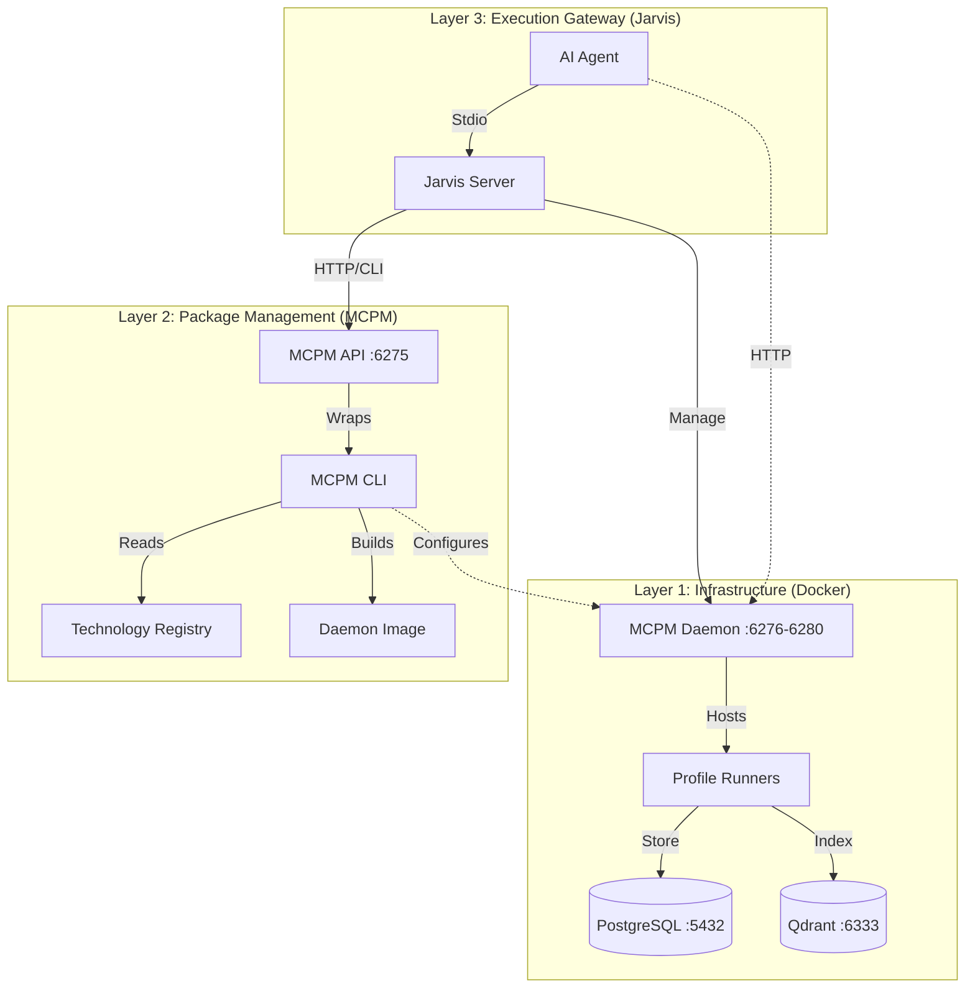

# MCP Ecosystem: Technical Reference

**System Context:** Model Context Protocol (MCP) Management & Execution Environment
**Primary Function:** Orchestration of MCP servers via CLI management and agentic gateways.
**Version:** 3.0 (Tool Consolidation)

## 1. System Architecture

The repository implements a layered architecture separating infrastructure, package management, and execution gateways.



## 2. Component Specifications

### 2.1. Jarvis Gateway (`./Jarvis/`)
*   **Type:** MCP Server (Go)
*   **Version:** 3.0 (Consolidated Tools)
*   **Role:** Agentic Interface & Presentation Layer.
*   **Mechanism:** Wraps `mcpm` CLI/API into 8 consolidated MCP tools (reduced from 24 for context efficiency).
*   **Enhancement:** Acts as a "Presentation Layer" by capturing raw output, stripping ANSI color codes, and wrapping the result in clean Markdown with status emojis (✅/❌) for optimal LLM consumption.
*   **Consolidated Tools (v3.0):**
    | Tool | Actions | Example |
    |:-----|:--------|:--------|
    | `jarvis_check_status` | (single purpose) | System diagnostics |
    | `jarvis_server` | list, info, install, uninstall, search, edit, create, usage | `jarvis_server(action="install", name="context7")` |
    | `jarvis_profile` | list, create, edit, delete, suggest, restart | `jarvis_profile(action="list")` |
    | `jarvis_client` | list, edit, import, config | `jarvis_client(action="edit", client_name="opencode")` |
    | `jarvis_config` | get, set, list, migrate | `jarvis_config(action="list")` |
    | `jarvis_project` | analyze, diff, devops | `jarvis_project(action="analyze")` |
    | `jarvis_system` | bootstrap, restart, restart_infra | `jarvis_system(action="bootstrap")` |
    | `jarvis_share` | start, stop, list | `jarvis_share(action="list")` |
*   **Dependency:** Requires `mcpm` binary in system PATH or MCPM API server running.

### 2.2. MCPM Core (`./MCPM/`)
*   **Type:** Node.js CLI Application
*   **Role:** Package Manager & Configuration Generator.
*   **Data Source:** `config/technologies.toml` (Registry of supported servers).
*   **Outputs:**
    *   `cline_mcp_settings.json`: Configuration for Cline IDE.
    *   `cursor_mcp_settings.json`: Configuration for Cursor IDE.

### 2.3. Infrastructure (`./`)
*   **Management:** `scripts/manage-mcp.sh` (Unified start/stop/logs/test controller).
*   **Container Runtime:** Docker Compose (`docker-compose.yml`).
*   **Services:**
    *   **MCPM Daemon:** `mcp-mcpm-daemon` (Hosts Streamable HTTP Profiles on ports 6276+).
    *   **PostgreSQL:** `postgres:15` on port `5432`.
    *   **Qdrant:** `qdrant/qdrant:latest` on port `6333` (Vector Store).

## 3. Operational Workflows

### 3.1. Server Installation Path
1.  **Trigger:** Agent calls `jarvis_server(action="install", name="brave")`.
2.  **Execution:** Jarvis calls MCPM API (or spawns `mcpm install brave` as fallback).
3.  **Resolution:** MCPM resolves "brave" from `technologies.toml`.
4.  **Action:** MCPM installs npm package `@modelcontextprotocol/server-brave-search`.
5.  **Config:** MCPM updates local registry and regenerates IDE config files.

### 3.2. Server Search Path
1.  **Trigger:** Agent calls `jarvis_server(action="search", query="web search")`.
2.  **Query:** Jarvis queries the MCPM registry for matching servers.
3.  **Result:** Returns relevant server packages based on name/description matching.

## 4. Development Environment Setup

### 4.1. Prerequisites
*   **Runtime:** Go 1.24+, Node.js 18+, Docker Engine.
*   **Environment:** Linux/macOS (Windows via WSL2).

### 4.2. Initialization Sequence

The system is designed to be bootstrapped by the agent itself.

1.  **Build Jarvis:**
    ```bash
    cd Jarvis
    go build -o jarvis .
    ```

2.  **Configure Agent:**
    Use the **3-Layer Profile Stack**. Do not just add the binary.
    *   **Reference:** See `AGENTS.md` or `docs/CONFIGURATION_STRATEGY.md`.
    *   **Pattern:** Wire `jarvis` (direct) AND `mcpm_profile_<name>` (via mcpm) into your client config.

3.  **Bootstrap via Agent:**
    Start your agent and give the instruction:
    > "Please bootstrap the system."

    Jarvis will call `jarvis_system(action="bootstrap")` which automatically:
    - Install the MCPM CLI dependencies.
    - Link the `mcpm` command to your system.
    - Start the Docker infrastructure (Postgres & Qdrant).

4.  **Verify:**
    Ask the agent: *"Check system status"* and Jarvis will call `jarvis_check_status()` to confirm everything is running.

## 5. Documentation Index

*   **Architecture:** [`ARCHITECTURE-MAP.md`](./ARCHITECTURE-MAP.md)
*   **MCPM Spec:** [`docs/MCPM-documentation.md`](./docs/MCPM-documentation.md)
*   **Server Registry:** [`MCPM/config/technologies.toml`](./MCPM/config/technologies.toml)

## 6. Reference Material

*   **`mcpm_source/`**: This directory contains source code for reference purposes only. It is not part of the active system or build pipeline.
