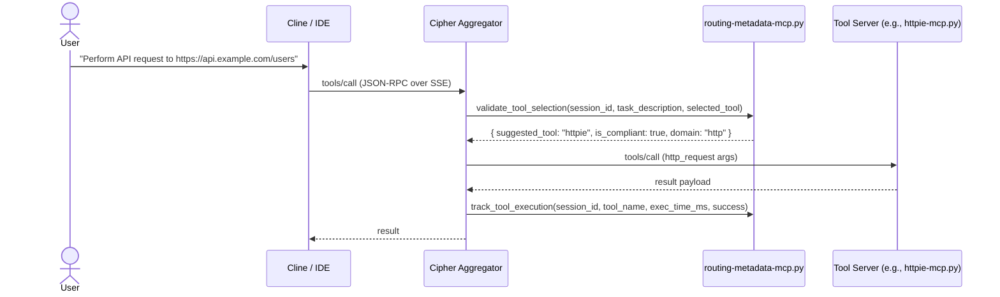

# Cipher Aggregator — Architecture and System Outline

See ADR for LM routing policy: [`docs/adr/adr-0001-direct-openrouter.md`](docs/adr/adr-0001-direct-openrouter.md:1). Summary: Cline routes LM requests directly to OpenRouter; Cipher remains the MCP tool aggregator.

- Config: [`cipher.yml`](cipher.yml:1)
- Manager: [`mcp-manager.sh`](mcp-manager.sh:1)
- Key servers:
  - Routing metadata: [`servers/routing-metadata-mcp.py`](servers/routing-metadata-mcp.py:1)
  - HTTP client: [`servers/httpie-mcp.py`](servers/httpie-mcp.py:1)
  - API testing: [`servers/schemathesis-mcp.py`](servers/schemathesis-mcp.py:1)
  - Filesystem (custom): [`servers/custom-filesystem-mcp.py`](servers/custom-filesystem-mcp.py:1)
  - File batch: [`servers/file-batch-mcp.py`](servers/file-batch-mcp.py:1)
  - Pytest: [`servers/pytest-mcp.py`](servers/pytest-mcp.py:1)
- Logs: [`logs/`](logs:1)
- Project: [`README.md`](README.md:1), [`pyproject.toml`](pyproject.toml:1)

## 1) High-level Architecture

```mermaid
graph LR
  subgraph Clients
    IDE[Cline / IDE]
    Auto[Automations / Scripts]
  end

  IDE -- "MCP tools over SSE (JSON-RPC)" --> Agg[(Cipher Aggregator)]
  Auto -- "MCP tools over SSE" --> Agg

  %% LM policy
  IDE -- "LM requests (direct)" --> OR[OpenRouter LLM]
  class OR external;

  subgraph AggDetails[Cipher Aggregator (MCP)]
    CFG[[cipher.yml]]
    MAN[mcp-manager.sh]
    ROUTE[routing-metadata-mcp]
    SVC[Tool Servers]
  end
  Agg --- AggDetails
  CFG -. config .- Agg
  MAN -. lifecycle .- Agg
  ROUTE -. routing/guardrails .- Agg

  %% Tool servers (examples)
  Agg --> HTTP[httpie-mcp]
  Agg --> ST[schemathesis-mcp]
  Agg --> FS[custom-filesystem-mcp]
  Agg --> FB[file-batch-mcp]
  Agg --> PY[pytest-mcp]

  %% Observability
  Agg --> LOGS[(logs/)]
  Agg --> OTEL((OTLP Exporter))
  class OTEL external;

  %% Transport
  Agg --> SSE[/SSE: http://127.0.0.1:3020/sse/]
```

Key properties:
- Transport: SSE (JSON-RPC) exposed locally at http://127.0.0.1:3020/sse
- Mode: Aggregator, multiplexing requests to multiple MCP servers
- Routing: Domain-specific-first rules enforced by routing middleware/server
- Observability: File logs under [`logs/`](logs:1), optional OpenTelemetry via environment
- Lifecycle: Managed by [`mcp-manager.sh`](mcp-manager.sh:1) (conflict detection, startup checks, logging)

## 2) Runtime Request Flow (Sequence)



## 3) Components and Responsibilities

- Aggregator core
  - Cipher runs in “aggregator” mode to multiplex tools and provide a single SSE endpoint.
  - Lifecycle, startup health, conflict cleanup handled by [`mcp-manager.sh`](mcp-manager.sh:1).
  - Configuration-driven via [`cipher.yml`](cipher.yml:1): system rules, server entries, env defaults.

- Routing and guardrails
  - Domain-specific-first policy defined in config (see systemPrompt in [`cipher.yml`](cipher.yml:1)).
  - Validation, compliance, and analytics provided by [`servers/routing-metadata-mcp.py`](servers/routing-metadata-mcp.py:1).
  - Tracks decisions into logs/JSONL for later analysis.

- Tool servers (selected)
  - HTTP client: [`servers/httpie-mcp.py`](servers/httpie-mcp.py:1) — perform HTTP requests, auth, formats.
  - API testing: [`servers/schemathesis-mcp.py`](servers/schemathesis-mcp.py:1) — schema validation and property-based tests.
  - Filesystem utilities: [`servers/custom-filesystem-mcp.py`](servers/custom-filesystem-mcp.py:1)
  - Batch operations: [`servers/file-batch-mcp.py`](servers/file-batch-mcp.py:1)
  - Python tests: [`servers/pytest-mcp.py`](servers/pytest-mcp.py:1)

- Observability
  - Logs under [`logs/`](logs:1); manager performs rotation/cleanup safeguards.
  - Optional OpenTelemetry export via OTLP (endpoint configurable in [`cipher.yml`](cipher.yml:1)).
  Agg --> LOGS[(logs/)]
  Agg --> OTEL((OTLP Exporter))

## 4) Configuration Overview (cipher.yml)

The aggregator is configured by [`cipher.yml`](cipher.yml:1). Notable sections:
- System prompt and routing rules
  - DOMAIN-SPECIFIC-FIRST flag; prefer dedicated servers (e.g., httpie for HTTP, schemathesis for API testing).
- Tool execution constraints
  - Global call timeout, max parallelism, and per-task tool call budget.
- Memory
  - Workspace memory capture and a memory-bank path (when enabled/implemented).
- Servers (stdio by default)
  - Enabled servers with commands and env mappings (see “Server Catalog” below).
- Env defaults
  - Non-secret defaults; secrets should come from process env or .env as loaded by manager.

## 5) Server Catalog

Active and present in repo:
- Routing Metadata: [`servers/routing-metadata-mcp.py`](servers/routing-metadata-mcp.py:1)
- Httpie: [`servers/httpie-mcp.py`](servers/httpie-mcp.py:1)
- Schemathesis: [`servers/schemathesis-mcp.py`](servers/schemathesis-mcp.py:1)
- Custom Filesystem: [`servers/custom-filesystem-mcp.py`](servers/custom-filesystem-mcp.py:1)
- File Batch: [`servers/file-batch-mcp.py`](servers/file-batch-mcp.py:1)
- Pytest: [`servers/pytest-mcp.py`](servers/pytest-mcp.py:1)

Configured in [`cipher.yml`](cipher.yml:1) but verify presence/enablement:
- Firecrawl (via npx)
- Code Index: [`servers/code-index-mcp.py`](servers/code-index-mcp.py:1) (verify file availability)
- Memory Bank: [`servers/memory-bank-mcp.py`](servers/memory-bank-mcp.py:1) (verify file availability)
- Logs MCP: [`servers/logs-mcp.py`](servers/logs-mcp.py:1) (verify file availability)
- LLM Inference (disabled by default; LM traffic is direct from IDE → OpenRouter per ADR)

Note: If a configured server binary/script is missing, either provide the implementation or disable the entry.

## 6) Features

- Deterministic routing and guardrails
  - Domain-first selection, compliance checks, and suggestions (e.g., suggest httpie over generic calls).
- Resource and concurrency limits
  - Global call timeouts, max parallel calls, and budget per task (see toolExecution in [`cipher.yml`](cipher.yml:1)).
- Workspace memory
  - Optional session/workspace memory capture paths for future/extended flows.
- Lifecycle management
  - [`mcp-manager.sh`](mcp-manager.sh:1) handles:
    - Startup safety (port checks, grace period).
    - Conflict detection and termination of stray MCP servers.
    - SSE readiness checks with retries/backoff.
    - Loading .env and exporting necessary environment.
- Observability
  - Structured logs under [`logs/`](logs:1).
  - Optional OpenTelemetry export (set OTEL_EXPORTER_OTLP_ENDPOINT in env/config).

## 7) Operations

- Start
  - ./[`mcp-manager.sh`](mcp-manager.sh:1) start
- Stop
  - ./[`mcp-manager.sh`](mcp-manager.sh:1) stop
- Restart
  - ./[`mcp-manager.sh`](mcp-manager.sh:1) restart
- Status
  - ./[`mcp-manager.sh`](mcp-manager.sh:1) status

Runtime interfaces:
- SSE endpoint: http://127.0.0.1:3020/sse
- Logs: [`logs/`](logs:1)
- Config: [`cipher.yml`](cipher.yml:1)

## 8) Security and Policy

- LM requests do not traverse the aggregator; IDE calls OpenRouter directly (see [`docs/adr/adr-0001-direct-openrouter.md`](docs/adr/adr-0001-direct-openrouter.md:1)).
- Secrets should be provided via environment; manager optionally sources .env.
- Aggregator typically binds to localhost; do not expose unintended ports externally.
- Server-specific env (API keys) constrained to their process environment per config.

## 9) Extensibility (Adding a Server)

1) Implement or select an MCP server (custom or package).
2) Add a server entry to [`cipher.yml`](cipher.yml:1) with command, args, env, and enabled: true.
3) Restart via ./[`mcp-manager.sh`](mcp-manager.sh:1) restart.
4) Validate with a simple tools/list and tools/call flow.
5) If domain-specific, update routing policy or validation logic via [`servers/routing-metadata-mcp.py`](servers/routing-metadata-mcp.py:1).

## 10) Known Gaps and Follow-ups

- Some configured servers may not have an implementation in-repo (e.g., [`servers/code-index-mcp.py`](servers/code-index-mcp.py:1), [`servers/memory-bank-mcp.py`](servers/memory-bank-mcp.py:1), [`servers/logs-mcp.py`](servers/logs-mcp.py:1)).
- Prior “health server” artifacts referenced in older docs are not present; rely on manager SSE checks and logs until reintroduced.
- Confirm the Firecrawl entry in [`cipher.yml`](cipher.yml:1) aligns with the intended package and credentials.

## 11) Appendix — References

- Project README: [`README.md`](README.md:1)
- Config: [`cipher.yml`](cipher.yml:1)
- Manager: [`mcp-manager.sh`](mcp-manager.sh:1)
- Servers:
  - Routing: [`servers/routing-metadata-mcp.py`](servers/routing-metadata-mcp.py:1)
  - HTTP: [`servers/httpie-mcp.py`](servers/httpie-mcp.py:1)
  - Schemathesis: [`servers/schemathesis-mcp.py`](servers/schemathesis-mcp.py:1)
  - Filesystem: [`servers/custom-filesystem-mcp.py`](servers/custom-filesystem-mcp.py:1)
  - File Batch: [`servers/file-batch-mcp.py`](servers/file-batch-mcp.py:1)
  - Pytest: [`servers/pytest-mcp.py`](servers/pytest-mcp.py:1)
- ADR: [`docs/adr/adr-0001-direct-openrouter.md`](docs/adr/adr-0001-direct-openrouter.md:1)

## 12) Current MCP servers and tool offerings

This reflects the current in-repo MCP servers and their exposed tool names, sourced directly from server implementations.

- Routing Metadata — [servers/routing-metadata-mcp.py](servers/routing-metadata-mcp.py:1)
  - validate_tool_selection — validate a tool choice against routing rules and return metadata [servers/routing-metadata-mcp.py](servers/routing-metadata-mcp.py:65)
  - track_tool_execution — record execution metrics for analytics [servers/routing-metadata-mcp.py](servers/routing-metadata-mcp.py:97)
  - initialize_session — set per-session execution constraints [servers/routing-metadata-mcp.py](servers/routing-metadata-mcp.py:127)
  - get_routing_analytics — retrieve aggregated routing analytics [servers/routing-metadata-mcp.py](servers/routing-metadata-mcp.py:151)

- Httpie (HTTP client) — [servers/httpie-mcp.py](servers/httpie-mcp.py:1)
  - make_request — HTTP request (method, url, headers, data, auth, timeout, format) [servers/httpie-mcp.py](servers/httpie-mcp.py:48)
  - upload_file — multipart upload with additional fields and auth [servers/httpie-mcp.py](servers/httpie-mcp.py:73)
  - download_file — download to path (resume optional) [servers/httpie-mcp.py](servers/httpie-mcp.py:89)
  - test_api_endpoint — quick endpoint test with expected_status [servers/httpie-mcp.py](servers/httpie-mcp.py:104)
  - manage_session — create/use/list/delete httpie sessions [servers/httpie-mcp.py](servers/httpie-mcp.py:121)
  - handle_authentication — basic/bearer/digest/netrc flows [servers/httpie-mcp.py](servers/httpie-mcp.py:139)
  - format_response — headers/body/meta/verbose formatting [servers/httpie-mcp.py](servers/httpie-mcp.py:156)
  - test_connectivity — probe endpoints with methods/ssl options [servers/httpie-mcp.py](servers/httpie-mcp.py:173)

- Schemathesis (API testing) — [servers/schemathesis-mcp.py](servers/schemathesis-mcp.py:1)
  - load_openapi_schema — load/validate OpenAPI schema from URL/file [servers/schemathesis-mcp.py](servers/schemathesis-mcp.py:34)
  - test_api_endpoints — property-based testing across schema endpoints [servers/schemathesis-mcp.py](servers/schemathesis-mcp.py:52)
  - validate_schema — structural validation and issue detection [servers/schemathesis-mcp.py](servers/schemathesis-mcp.py:89)
  - generate_test_data — sample data generation from schema specs [servers/schemathesis-mcp.py](servers/schemathesis-mcp.py:103)
  - test_specific_endpoint — focus tests for an endpoint/method [servers/schemathesis-mcp.py](servers/schemathesis-mcp.py:130)
  - run_schema_tests — run strategies (property_based, boundary_values, etc.) [servers/schemathesis-mcp.py](servers/schemathesis-mcp.py:167)

- Custom Filesystem — [servers/custom-filesystem-mcp.py](servers/custom-filesystem-mcp.py:1)
  - read_text_file — read file (head/tail controls) [servers/custom-filesystem-mcp.py](servers/custom-filesystem-mcp.py:49)
  - read_multiple_files — read multiple files and return JSON array [servers/custom-filesystem-mcp.py](servers/custom-filesystem-mcp.py:63)
  - write_file — write/overwrite file content [servers/custom-filesystem-mcp.py](servers/custom-filesystem-mcp.py:75)
  - list_directory — list directory with [DIR]/[FILE] markers [servers/custom-filesystem-mcp.py](servers/custom-filesystem-mcp.py:88)
  - create_directory — mkdir -p behavior [servers/custom-filesystem-mcp.py](servers/custom-filesystem-mcp.py:100)

- File Batch — [servers/file-batch-mcp.py](servers/file-batch-mcp.py:1)
  - read_files_batched — read multiple files with size/delay limits [servers/file-batch-mcp.py](servers/file-batch-mcp.py:58)

- Pytest — [servers/pytest-mcp.py](servers/pytest-mcp.py:1)
  - run_tests — run pytest in path with markers/patterns/coverage [servers/pytest-mcp.py](servers/pytest-mcp.py:37)
  - get_test_report — produce XML/JSON report, parse JUnit when available [servers/pytest-mcp.py](servers/pytest-mcp.py:76)
  - list_tests — collect to list tests without running [servers/pytest-mcp.py](servers/pytest-mcp.py:105)
  - run_specific_test — run a single test by function name [servers/pytest-mcp.py](servers/pytest-mcp.py:126)
  - check_test_coverage — run with coverage analysis (pytest-cov) [servers/pytest-mcp.py](servers/pytest-mcp.py:153)
  - validate_test_structure — validate tests/naming/imports [servers/pytest-mcp.py](servers/pytest-mcp.py:179)

Configured in aggregator but implemented externally or pending local implementation — [cipher.yml](cipher.yml:26)
- firecrawl (npx) — web crawling/indexing; tools provided by external package [cipher.yml](cipher.yml:51)
- code-index — codebase indexing/introspection (verify script presence) [cipher.yml](cipher.yml:55)
- memory-bank — memory storage/retrieval (verify script presence) [cipher.yml](cipher.yml:59)
- logs — log query tools (verify script presence) [cipher.yml](cipher.yml:63)
- llm-inference (disabled by default; not used by IDE per ADR) [cipher.yml](cipher.yml:35)

Tip: Use tools/list against the aggregator SSE endpoint to view the live merged catalog exposed at runtime.