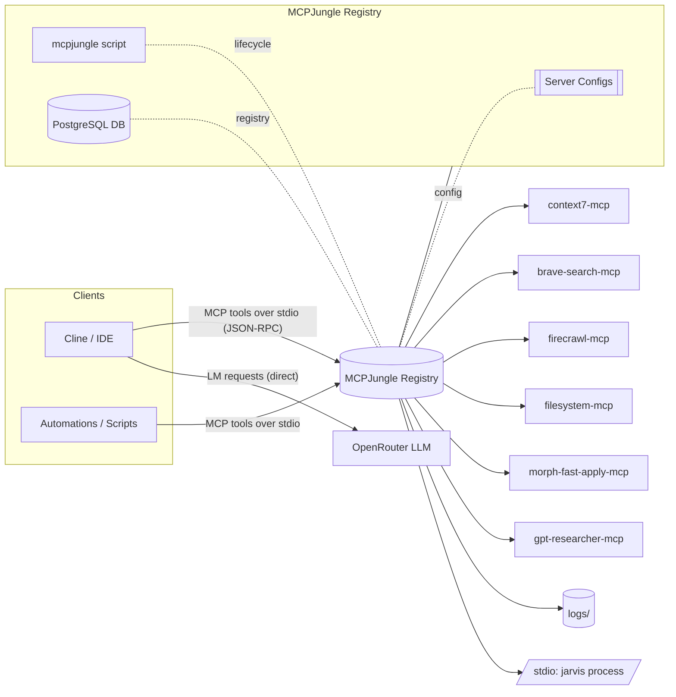
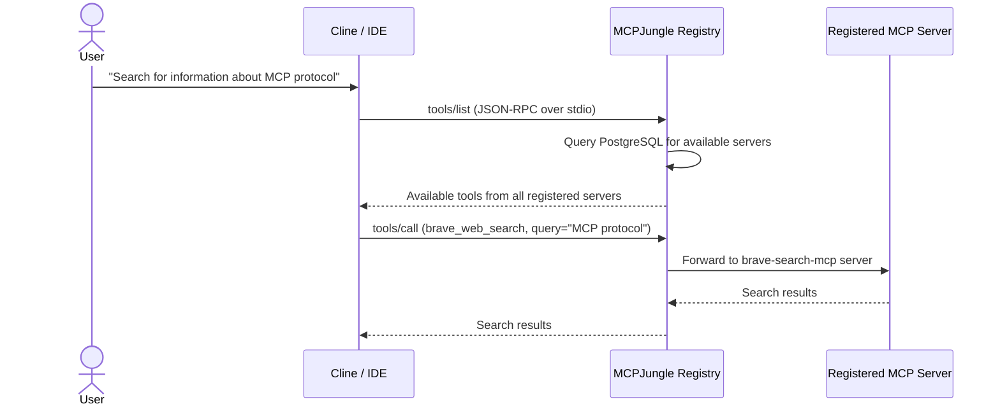

# MCPJungle (jarvis) — Architecture and System Outline

**Status**: ✅ **Active** - MCPJungle is the primary MCP gateway and registry

- Config: [`config/jarvis/servers/*.json`](config/jarvis/servers/)
- Manager: [`mcpjungle`](mcpjungle:1) (executable script)
- Docker: [`docker-compose.yml`](docker-compose.yml:1)
- Project: [`README.md`](README.md:1)

## 1) High-level Architecture



Key properties:
- Transport: stdio (JSON-RPC) via jarvis executable
- Mode: Registry and gateway for MCP servers
- Routing: Direct tool invocation via server registration
- Observability: File logs under [`logs/`](logs:1)
- Lifecycle: Managed by [`mcpjungle`](mcpjungle:1) script and Docker Compose
- Database: PostgreSQL for server registry and tool metadata

## 2) Runtime Request Flow (Sequence)



## 3) Components and Responsibilities

- **Registry Core**
  - MCPJungle runs as a registry to manage and route requests to registered MCP servers
  - Server configurations stored in PostgreSQL database
  - Lifecycle managed by [`mcpjungle`](mcpjungle:1) script and Docker Compose

- **Server Management**
  - Servers registered via configuration files in [`config/jarvis/servers/*.json`](config/jarvis/servers/)
  - Each server has its own configuration with command, args, and environment
  - Health checks and monitoring via jarvis health endpoint

- **Database Backend**
  - PostgreSQL stores server registrations, tool metadata, and usage statistics
  - Persistent storage for server configurations and state

- **Current MCP Servers** (6 active)
  - **context7**: Code analysis and search tools
  - **brave-search**: Web search functionality
  - **firecrawl**: Web crawling and content extraction
  - **filesystem**: File system operations
  - **morph-fast-apply**: Code transformation and application
  - **gpt-researcher**: Research and content generation

## 4) Configuration Overview

Server configurations are stored as JSON files in [`config/jarvis/servers/`](config/jarvis/servers/):

```json
{
  "name": "server-name",
  "command": "npx",
  "args": ["package-name"],
  "env": {
    "API_KEY": "your-api-key"
  },
  "enabled": true
}
```

Key configuration elements:
- **Server identification**: Name and description
- **Execution**: Command and arguments for starting the server
- **Environment**: API keys and configuration variables
- **Enablement**: Toggle servers on/off without deletion

## 5) Features

- **Single Aggregation Layer**
  - No complex middleware or routing layers
  - Direct server-to-tool mapping
  - Simplified architecture with jarvis as the single gateway

- **PostgreSQL Backend**
  - Persistent server registry
  - Tool metadata and usage tracking
  - Configuration management and versioning

- **Docker Deployment**
  - Containerized jarvis and PostgreSQL
  - Easy deployment and scaling
  - Environment-based configuration

- **Health Monitoring**
  - Health endpoint at `http://localhost:8080/health`
  - Server status monitoring
  - Automatic restart capabilities

## 6) Operations

- **Start Services**
  - `sudo docker compose up -d` (starts jarvis + PostgreSQL)
  - `./mcpjungle start` (starts jarvis locally)

- **Stop Services**
  - `sudo docker compose down` (stops all containers)
  - `./mcpjungle stop` (stops local jarvis)

- **Register Servers**
  - `./mcpjungle register -c config/jarvis/servers/server.json`
  - Or use API: `POST http://localhost:8080/servers`

- **Check Status**
  - `./mcpjungle status` (local status)
  - `curl http://localhost:8080/health` (container health)

- **List Tools**
  - `./mcpjungle tools` (list all available tools)
  - Or use API: `GET http://localhost:8080/tools`

## 7) Security and Policy

- LM requests do not traverse jarvis; IDE calls OpenRouter directly
- Secrets provided via environment variables in server configurations
- jarvis typically binds to localhost; do not expose unintended ports externally
- Server-specific API keys constrained to their process environment per config

## 8) Extensibility (Adding a Server)

1) Implement or select an MCP server (custom or package)
2) Create configuration file in [`config/jarvis/servers/`](config/jarvis/servers/)
3) Register server: `./mcpjungle register -c config/jarvis/servers/new-server.json`
4) Validate with `./mcpjungle tools` to see new tools
5) Test with `./mcpjungle invoke tool-name --input '{"param": "value"}'`

## 9) Current MCP Servers and Tool Offerings

This reflects the current registered MCP servers and their exposed tool names:

- **context7** — Code analysis and search
  - context7__search_code — Search for code patterns and references
  - context7__analyze_file — Analyze code file structure and dependencies

- **brave-search** — Web search functionality
  - brave_web_search — Perform web searches
  - brave_news_search — Search news articles
  - brave_local_search — Search local businesses

- **firecrawl** — Web crawling and content extraction
  - firecrawl__scrape_url — Scrape web page content
  - firecrawl__crawl_site — Crawl entire website

- **filesystem** — File system operations
  - filesystem__read_file — Read file contents
  - filesystem__write_file — Write file contents
  - filesystem__list_directory — List directory contents
  - filesystem__create_directory — Create directories

- **morph-fast-apply** — Code transformation
  - morph-fast-apply__transform_code — Apply code transformations

- **gpt-researcher** — Research and content generation
  - gpt-researcher__research_topic — Research specific topics
  - gpt-researcher__generate_content — Generate content based on research

**Total**: 6 servers, 34 tools available for invocation

## 10) References

- Project README: [`README.md`](README.md:1)
- Docker Configuration: [`docker-compose.yml`](docker-compose.yml:1)
- Server Configs: [`config/jarvis/servers/`](config/jarvis/servers/)
- Manager Script: [`mcpjungle`](mcpjungle:1)
- Runbooks: [`docs/runbooks/`](docs/runbooks/)
