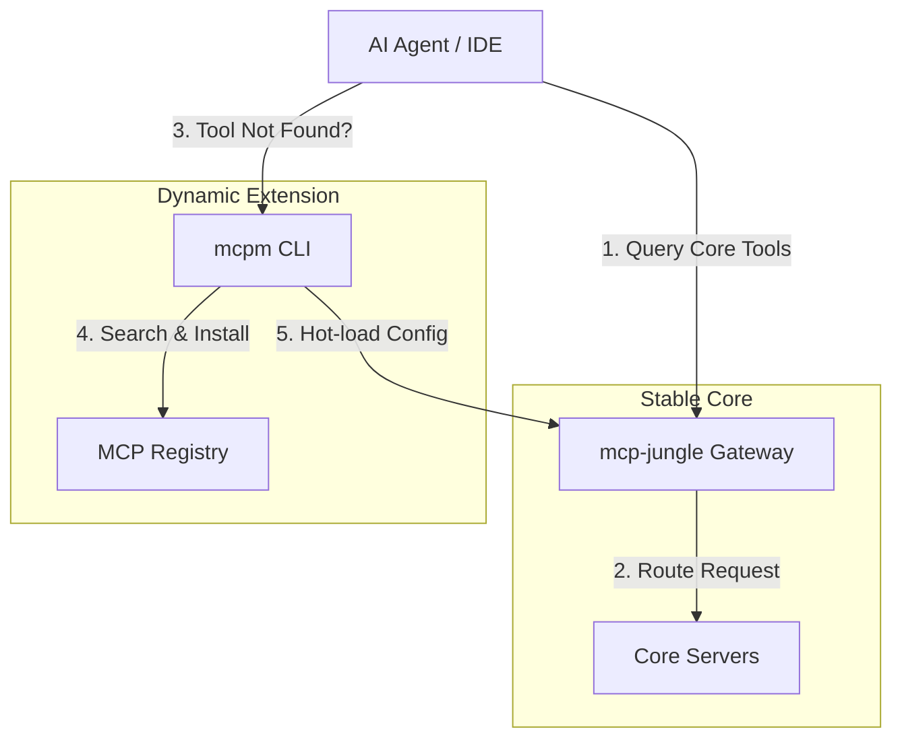

# MCP Environment Optimization Roadmap

# MCP Environment Optimization Roadmap

**Version:** 1.0
**Date:** 2025-11-19
**Status:** Draft Strategy
**Objective:** Optimize the 'mcp-jungle' environment for maximum tool discoverability, semantic intent matching, and scalable agent orchestration.

---

## 1. Infrastructure Strategy: Hybrid to Full Migration
GREENLIT ALL SYSTEMS GOOOOOO
**Reason:** The `mcpm` package available on npm (v0.4.0) is the "Minecraft Package Manager", not the Model Context Protocol Manager. The correct MCP package manager is not currently available under this name in the public registry.
**New Strategy:** We will continue to use `mcp-jungle` as the primary registry and gateway. Future dynamic capabilities will be built directly into `mcp-jungle` or via a custom management script, rather than relying on the external `mcpm` tool.

To balance stability with dynamic scalability, we propose a phased transition from `mcp-jungle` to a fully `mcpm`-driven architecture.

### Phase 1: Hybrid "Best of Both Worlds" (Current Target)

| Component      | Role                   | Responsibility                                                                                                                                                       |
| -------------- | ---------------------- | -------------------------------------------------------------------------------------------------------------------------------------------------------------------- |
| **mcp-jungle** | **Registry & Gateway** | Acts as the stable, "always-on" backbone. Manages core tool groups (Universal, Backend, Frontend), handles authentication, and provides a unified endpoint for IDEs. |
| **mcpm**       | **Package Manager**    | Handles dynamic discovery and installation. Allows agents to "self-install" specialized tools on-demand without bloating the core registry.                          |

### Phase 2: Migration & Retirement Plan

**STATUS: IN PROGRESS**

The goal is to gradually shift responsibility from the static `mcp-jungle` registry to the dynamic `mcpm` ecosystem.

#### Step 1: Parallel Operation (Weeks 1-4)
- **Action:** Deploy `mcpm` alongside `mcp-jungle`.
- **Status:** ✅ COMPLETED (2025-11-22)
- **Technical Implementation:**
  1. Installed `mcpm` v2.9.0 in a dedicated virtual environment (`.mcpm_venv`) to resolve dependency conflicts with Pydantic.
  2. Applied manual patch to `fastmcp` to fix `default_factory` issue.
  3. Installed core servers: `brave-search`, `context7`, `memory`, `firecrawl`, `fetch-mcp`, `mcp-server-qdrant`, etc.
  4. Verified server listing via `mcpm ls`.

#### Step 2: Dynamic Routing (Weeks 5-8)
- **Action:** Update the "Router Agent" to prefer `mcpm` for new tool requests.
- **Technical Implementation:**
  - **Fallback Logic:**
    ```python
    def get_tool(tool_name):
        # 1. Check Core Registry (mcp-jungle)
        if tool := jungle_registry.get(tool_name):
            return tool

        # 2. Check Dynamic Registry (mcpm)
        if mcpm_registry.has(tool_name):
            return mcpm_registry.get(tool_name)

        # 3. Attempt Dynamic Install
        if allow_dynamic_install:
            return mcpm.install(tool_name)
    ```
- **Goal:** If a tool is missing, the agent attempts `mcpm install <tool>` automatically instead of failing.
- **Validation:** Successful "self-healing" when an agent requests a non-core tool (e.g., `ffmpeg`).

#### Step 3: Core Migration (Weeks 9-12)
- **Action:** Begin migrating "Universal" group tools from `mcp-jungle` config to `mcpm` manifests.
- **Technical Implementation:**
  1. Create a `universal-tools` package list for `mcpm`.
  2. Script the transition:
     ```bash
     # Example migration script
     mcpm install $(cat config/jarvis/groups/universal.json | jq -r '.tools[]')
     ```
  3. Update `mcp-jungle` to proxy requests to the `mcpm` managed processes.
- **Goal:** `mcp-jungle` becomes a thin wrapper/gateway that simply exposes the `mcpm` installed packages.
- **Validation:** `mcp-jungle` configuration files are empty/minimal; all tools are sourced from `mcpm`.

#### Step 4: Retirement (Week 13+)
- **Action:** Decommission `mcp-jungle` container.
- **Goal:** IDEs and Agents connect directly to the `mcpm` gateway/interface.
- **Validation:** Full system functionality without the `mcp-jungle` service running.

### Workflow Integration (Phase 1)



---

## 2. Semantic Schema Design

To reduce hallucination and improve vector retrieval, we enforce strict naming and typing standards.

### 2.1 Naming Conventions: `verb_noun_context`

Tools must follow a predictable pattern to aid the agent's semantic parser.

- **Pattern:** `[action]_[entity]_[context/modifier]`
- **Bad:** `search`, `get_data`, `run`
- **Good:** `search_web_general`, `fetch_file_content`, `execute_python_script`

### 2.2 Description Granularity

Descriptions are the primary vector for semantic matching. They must be:
1. **Intent-Focused:** Describe *why* to use the tool, not just *what* it does.
2. **Constraint-Explicit:** Clearly state limitations (e.g., "Returns max 10 results").
3. **Output-Defined:** Describe the shape of the returned data.

### 2.3 Parameter Typing

Use specific types over generic strings whenever possible.

- **Bad:** `path: string` (Ambiguous)
- **Good:** `file_path: string` (format: absolute path, e.g., `/home/user/file.txt`)
- **Enums:** Use enums for finite sets (e.g., `mode: ["read", "write", "append"]`) to eliminate guessing.

---

## 3. Metadata & Taxonomy Configuration

We introduce a standardized metadata layer to enrich tool definitions.

### Proposed Configuration Structure (YAML/JSON)

```yaml
tool_name: search_web_general
namespace: information_retrieval.web
tags: ["search", "internet", "external", "brave"]
complexity: low
latency: medium
usage_examples:
  - input: { "query": "latest react patterns" }
    reasoning: "User is asking for current trends, requiring live web data."
  - input: { "query": "weather in NY", "count": 1 }
    reasoning: "Simple fact retrieval."
```

### Key Elements
- **Hierarchical Namespaces:** `domain.subdomain.tool` (e.g., `filesystem.read.text`) allows for scoped enabling/disabling.
- **Tags:** Enable fuzzy matching and dynamic grouping (e.g., "Enable all `read-only` tools").
- **Usage Examples (Few-Shot):** Critical for teaching the agent *when* to use the tool, reducing trial-and-error loops.

---

## 4. Context Management Strategy

Prevent context window pollution and cognitive overload through dynamic management.

### 4.1 Dynamic Loading/Unloading
- **Lazy Loading:** Only load tool definitions for the active `Tool Group` (e.g., "Backend Dev" group loads SQL tools, but hides CSS tools).
- **Context-Aware Routing:**
  - *Idle State:* Expose only "Router" or "Menu" tools.
  - *Active State:* Upon intent detection (e.g., "I need to debug DB"), hot-load the relevant namespace (`database.*`).

### 4.2 Intent-Based Routing
Implement a lightweight "Router Agent" that sits before the tool execution layer.
1. **Analyze Request:** "Fix the CSS bug."
2. **Match Intent:** `frontend_development`
3. **Load Context:** Enable `frontend-dev` tool group.
4. **Execute:** Agent now sees `css_modify`, `browser_reload`, etc.

---

## 5. Refactoring Case Study: `brave-search`

**Scenario:** A generic "search" tool often confuses agents—should they search the web, the local file system, or the vector database?

### BEFORE: Vague & Overloaded

```json
{
  "name": "search",
  "description": "Search for things.",
  "inputSchema": {
    "type": "object",
    "properties": {
      "q": { "type": "string", "description": "The query" }
    }
  }
}
```
*Issues:*
- **Name:** `search` is too generic. Collides with file search, code search, etc.
- **Description:** "Search for things" provides no semantic hook for the agent.
- **Params:** `q` is ambiguous.

### AFTER: Deterministic & Intent-Driven

```json
{
  "name": "search_web_brave",
  "description": "Performs a live web search using the Brave Search API. Use this tool when you need current, external information that is not available in the local codebase or memory. Returns a list of search results with titles, snippets, and URLs.",
  "inputSchema": {
    "type": "object",
    "properties": {
      "query": {
        "type": "string",
        "description": "The search string. Optimize for a search engine (e.g., use keywords)."
      },
      "count": {
        "type": "integer",
        "description": "Number of results to return (default: 5, max: 20).",
        "default": 5
      },
      "search_type": {
        "type": "string",
        "enum": ["web", "news", "images"],
        "description": "The type of content to search for.",
        "default": "web"
      }
    },
    "required": ["query"]
  }
}
```
*Improvements:*
- **Name:** `search_web_brave` clearly scopes the tool to the *web* domain and *Brave* provider.
- **Description:** Explicitly states *when* to use it ("current, external information") and *what* it returns.
- **Params:** Typed (`integer`), constrained (`enum`), and descriptive (`query` vs `q`). versión

---

## 6. Next Steps

1. **Audit:** Scan all existing tools in `mcp-jungle` against the new Semantic Schema.
2. **Prototype:** Implement the `usage_examples` metadata field in the `universal` tool group configuration.
3. **Pilot:** Refactor the `brave-search` server configuration to match the "After" example and test agent performance.