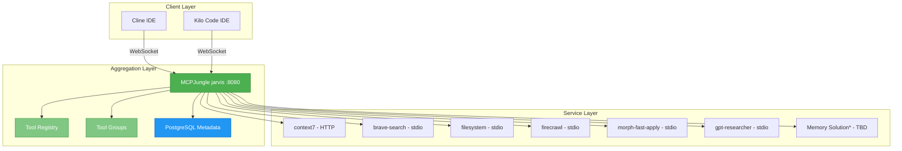
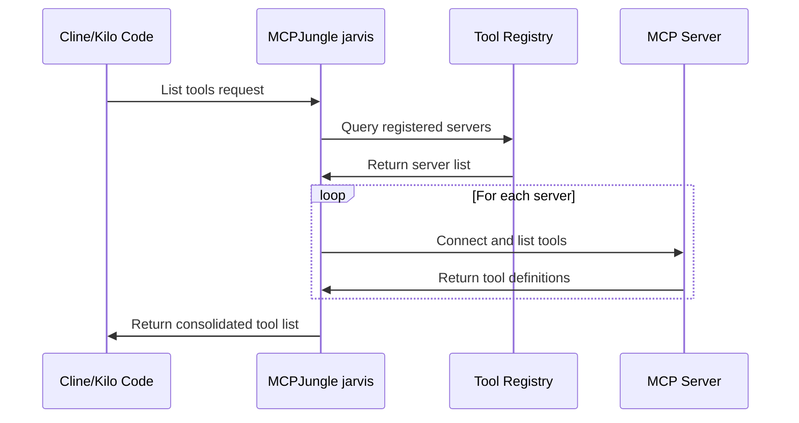
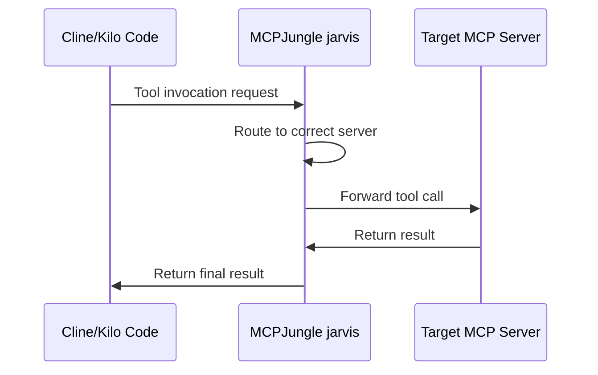
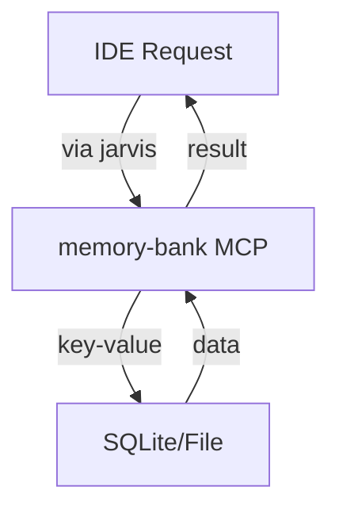
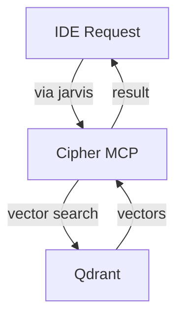
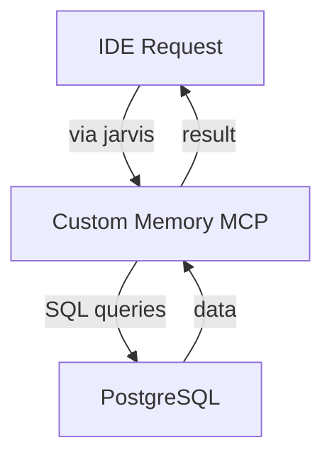

# Simplified MCPJungle Architecture

**Version:** 1.0
**Date:** 2025-11-18
**Status:** Architecture Design Document

---

## Overview

This document describes the simplified MCPJungle (jarvis) architecture that eliminates the complexity of multi-layer aggregation while maintaining all functionality through incremental memory research and implementation.

## Architecture Philosophy

**Before (Complex Multi-Layer):**
```
[IDEs] → [Cipher Aggregator] → [jarvis] → [MCP Servers]
```

**After (Simplified Single-Layer):**
```
[IDEs] → [jarvis] → [MCP Servers]
```

**Benefits:**
- ✅ Single aggregation point
- ✅ Reduced complexity
- ✅ Easier debugging
- ✅ Faster implementation
- ✅ Lower maintenance burden
- ✅ Incremental memory research

---

## Component Architecture

### **Core Components**



---

## Data Flow

### **Tool Discovery Flow**


### **Tool Invocation Flow**


---

## Component Details

### **MCPJungle (jarvis)**
- **Role**: Single aggregation point
- **Port**: 8080 (HTTP/WebSocket)
- **Features**:
  - Tool registry and discovery
  - Tool groups for organization
  - PostgreSQL for metadata
  - OpenTelemetry metrics
  - Access control (enterprise mode)

### **MCP Servers**
Each server is registered directly with jarvis:

| Server | Transport | Description | Status |
|--------|-----------|-------------|---------|
| **context7** | streamable-HTTP | Documentation lookup | ✅ Ready |
| **brave-search** | stdio | Web search via Brave | ✅ Ready |
| **filesystem** | stdio | File operations | ✅ Ready |
| **firecrawl** | stdio | Web crawling | ✅ Ready |
| **morph-fast-apply** | stdio | Code editing | ✅ Ready |
| **gpt-researcher** | stdio | AI research | ✅ Ready |
| **Memory Solution** | TBD | To be researched | 🔍 Phase 2 |

### **Memory Solution (Phase 2)**
Three options to be researched incrementally:
1. **memory-bank MCP server** - Simple key-value persistence
2. **Cipher default mode** - Advanced vector search and reasoning
3. **Custom solution** - PostgreSQL-based with custom features

---

## Transport Mechanisms

### **Streamable-HTTP (context7)**
- **Protocol**: HTTP with Server-Sent Events
- **Connection**: Persistent HTTP connection
- **Use Case**: Remote servers, cloud services
- **Example**: context7 documentation lookup

### **STDIO (all others)**
- **Protocol**: Standard input/output pipes
- **Connection**: Process spawning per request
- **Use Case**: Local tools, npm packages
- **Examples**: brave-search, filesystem, firecrawl

### **WebSocket (jarvis endpoint)**
- **Protocol**: WebSocket for IDE connections
- **Connection**: Persistent bidirectional
- **Use Case**: IDE integration (Cline, Kilo Code)

---

## Tool Groups

MCPJungle supports organizing tools into groups for different use cases:

```json
{
  "name": "development-tools",
  "description": "Essential development tools",
  "included_servers": ["filesystem", "brave-search", "context7"]
}
```

**Planned Groups:**
- **development-tools**: Core coding tools
- **research-tools**: Search and documentation
- **minimal-tools**: Basic functionality only
- **all-tools**: Everything available

---

## Security Model

### **Local Development**
- **Authentication**: None required
- **Network**: Localhost only
- **Access**: All tools available

### **Production/Enterprise**
- **Authentication**: Bearer tokens
- **Access Control**: Per-client tool permissions
- **Audit**: PostgreSQL logging
- **Monitoring**: OpenTelemetry metrics

---

## Memory Architecture (Phase 2)

### **Option A: memory-bank (Simple)**


### **Option B: Cipher Default (Advanced)**


### **Option C: Custom (Future)**


---

## Deployment Options

### **Development (Docker Compose)**
```yaml
services:
  mcpjungle:
    image: mcpjungle/mcpjungle:latest-stdio
    ports:
      - "8080:8080"
    volumes:
      - ./data:/data
    environment:
      - DATABASE_URL=sqlite:///data/mcpjungle.db
```

### **Production (PostgreSQL)**
```yaml
services:
  mcpjungle:
    image: mcpjungle/mcpjungle:latest-stdio
    ports:
      - "8080:8080"
    environment:
      - DATABASE_URL=postgres://user:pass@db:5432/mcpjungle
      - SERVER_MODE=enterprise
  postgres:
    image: postgres:15
    # PostgreSQL configuration
```

---

## Monitoring & Observability

### **Health Checks**
- **Endpoint**: `http://localhost:8080/health`
- **CLI**: `mcpjungle version`
- **Docker**: Built-in health checks

### **Metrics**
- **Endpoint**: `http://localhost:8080/metrics` (enterprise mode)
- **Format**: OpenTelemetry/Prometheus
- **Metrics**: Tool invocations, response times, error rates

### **Logging**
- **Location**: Docker logs or file-based
- **Levels**: Configurable via environment
- **Format**: Structured JSON logs

---

## Backup & Recovery

### **Configuration Backup**
```bash
# Export server registrations
mcpjungle list servers --json > servers-backup.json

# Export tool groups
mcpjungle list groups --json > groups-backup.json
```

### **Database Backup**
```bash
# PostgreSQL backup
pg_dump mcpjungle_db > mcpjungle-backup.sql

# SQLite backup (development)
cp mcpjungle.db mcpjungle-backup.db
```

---

## Rollback Strategy

### **Immediate Rollback**
1. Stop jarvis: `docker compose down`
2. Revert IDE configurations to direct MCP connections
3. Restart with previous setup

### **Gradual Rollback**
1. Keep jarvis running for testing
2. Configure IDEs to use both jarvis and direct connections
3. Gradually migrate back if issues arise

---

## Future Enhancements

### **Phase 5+ (Future Research)**
- **Learning Layer**: Analyze tool usage patterns
- **Auto-Grouping**: Suggest optimal tool groups
- **Performance Optimization**: Connection pooling improvements
- **Multi-Tenant**: Support for multiple teams/projects
- **Custom Analytics**: Usage dashboards and insights

---

## Success Metrics

### **Phase 1 Success**
- ✅ All MCP servers registered and accessible
- ✅ Tool discovery < 5 seconds
- ✅ Tool invocation success rate > 95%
- ✅ No memory leaks or connection issues

### **Phase 2 Success**
- ✅ Memory solution chosen based on testing
- ✅ Memory persistence verified
- ✅ Performance benchmarks documented

### **Phase 4 Success**
- ✅ Both IDEs connected exclusively to jarvis
- ✅ All previous workflows functional
- ✅ Tool groups improve user experience
- ✅ Rollback procedures tested

---

## Documentation References

- **Installation**: `docs/guides/install-mcpjungle.md`
- **Configuration**: `docs/config/`
- **Registration**: `docs/guides/server-registration.md`
- **IDE Setup**: `docs/guides/ide-configuration.md`
- **Memory Research**: `docs/research/memory-comparison.md`

---

## Version History

| Version | Date | Author | Changes |
|---------|------|--------|---------|
| 1.0 | 2025-11-18 | Kilo Code | Initial simplified architecture document |
| 1.1 | TBD | TBD | Add memory architecture details (Phase 2) |
| 1.2 | TBD | TBD | Add monitoring and analytics (Phase 5) |

**Status**: ✅ **Architecture Approved** - Ready for Phase 1 implementation

**Next Steps**:
1. Create detailed implementation guides
2. Set up development environment
3. Begin Phase 1: Core MCPJungle Setup
