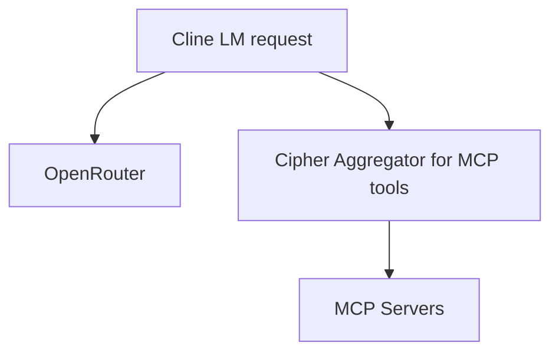

# Migration Guide — Move LM calls to OpenRouter direct and keep Cipher MCP-only

Decision reference
- ADR: [`adr-0001-direct-openrouter.md`](../adr/adr-0001-direct-openrouter.md:1)
- Deprecated spec: [`open/specs/vscode-lm-provider-cipher/spec.md`](../../open/specs/vscode-lm-provider-cipher/spec.md:1)
- Archived provider package: [`clients/vscode-lm-provider/ARCHIVED.md`](../../clients/vscode-lm-provider/ARCHIVED.md:1)

Summary
- LM requests: Cline → OpenRouter (direct)
- MCP tools: Cline → Cipher Aggregator → MCP servers

Mermaid overview

Pre‑migration checklist
- Confirm no critical workflows depend on the VS Code Cipher LM Provider UX.
- Ensure OpenRouter credentials are available for the target environments.
- Ensure Cipher Aggregator remains required for MCP tools (github, firecrawl, httpie, schemathesis, etc.).

Step 1 — Disable VS Code Cipher LM Provider
- Treat the provider package as archived/legacy:
  - Package marked private/deprecated in [`clients/vscode-lm-provider/package.json`](../../clients/vscode-lm-provider/package.json:1)
  - Archive notice: [`clients/vscode-lm-provider/ARCHIVED.md`](../../clients/vscode-lm-provider/ARCHIVED.md:1)
- Remove any references to selecting "Cipher LM Provider" in IDE settings.
- Do not publish or bundle this extension in build artifacts.

Step 2 — Configure Cline for OpenRouter direct
- Set OpenRouter API key and model defaults in Cline configuration according to Cline docs.
- Ensure no LM traffic is routed to Cipher endpoints.
- Keep Cipher running for MCP tools only per [`cipher.yml`](../../cipher.yml:1).

Step 3 — Verify Cipher remains MCP‑only
- Start or validate Cipher Aggregator, then test:
  - tools/list:
    - POST JSON‑RPC or use your existing aggregator client to list tools.
  - Call a known tool:
    - httpie/schemathesis/firecrawl to confirm normal operation.
- Reference routing rules and server inventory in:
  - [`README.md`](../../README.md:1)
  - [`docs/routing-metadata-usage.md`](../routing-metadata-usage.md:1)

Step 4 — Documentation and pattern updates
- Routing pattern updated to new direction:
  - [`data/memory-bank/routing-patterns/vscode-lm-to-cipher-routing.md`](../../data/memory-bank/routing-patterns/vscode-lm-to-cipher-routing.md:1)
- Deprecated spec marked:
  - [`open/specs/vscode-lm-provider-cipher/spec.md`](../../open/specs/vscode-lm-provider-cipher/spec.md:1)
- Keep llm‑inference MCP as optional/legacy for server‑side usage; not for IDE LM routing:
  - See server reference: [`servers/llm-inference-mcp.py`](../../servers/llm-inference-mcp.py:1)

Step 5 — Clean up legacy artifacts
- Integration harness and scripts for the provider can be retained for history or removed:
  - [`clients/vscode-lm-provider/scripts/run_integration.js`](../../clients/vscode-lm-provider/scripts/run_integration.js:1)
  - [`clients/vscode-lm-provider/test/integration.md`](../../clients/vscode-lm-provider/test/integration.md:1)
- Ensure no CI workflow references the provider (none present by default). If you add one in the future, mark it disabled or delete:
  - [`.github/workflows/vscode-lm-provider-integration.yml`](../../.github/workflows/vscode-lm-provider-integration.yml:1)

Verification checklist
- From Cline, issue an LM completion; verify success and that no Cipher logs show LM traffic.
- From Cline, call MCP tool operations; verify Cipher receives and executes tool calls.
- Confirm no IDE prompts suggest selecting a Cipher LM provider.

Rollback plan
- If issues are detected with OpenRouter direct calls:
  - Revert Cline LM configuration to previous known-good state.
  - Keep Cipher Aggregator active for tools; LM traffic should never be routed back through Cipher.

Notes and considerations
- Cost/telemetry centralization previously in Cipher no longer applies to LM calls; rely on OpenRouter’s telemetry/logging or Cline‑side lightweight metrics if needed.
- Keep llm‑inference MCP server available only for non‑IDE paths requiring controlled routing, or disable it by setting enabled: false in [`cipher.yml`](../../cipher.yml:31).

Change log
- 2025‑11‑13: Initial migration guide created to align with ADR‑0001.