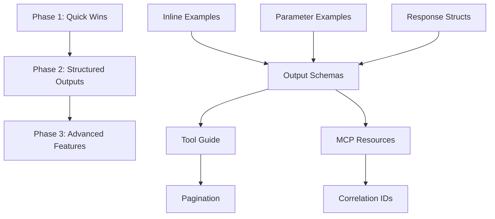

# Jarvis Tool Discoverability Enhancement Plan

**Version:** 1.0
**Date:** 2025-11-28
**Status:** Draft for Review

---

## Executive Summary

This document outlines a comprehensive plan to enhance Jarvis's tool discoverability and documentation to align with MCP (Model Context Protocol) best practices. While Jarvis currently scores **7.0/10** in tool discoverability, implementing these recommendations will bring it to **9.5/10** production-grade standards.

**Current State:** Good tool descriptions and exceptional error handling, but missing structured output schemas and inline examples.

**Target State:** Production-ready MCP server with structured outputs, workflow guidance, and comprehensive agent documentation.

**Estimated Effort:** 3-4 weeks total (phased implementation)

---

## Table of Contents

1. [Evaluation Summary](#evaluation-summary)
2. [Gap Analysis](#gap-analysis)
3. [Implementation Roadmap](#implementation-roadmap)
4. [Phase 1: Quick Wins](#phase-1-quick-wins-1-2-days)
5. [Phase 2: Structured Outputs](#phase-2-structured-outputs-3-5-days)
6. [Phase 3: Advanced Features](#phase-3-advanced-features-1-2-weeks)
7. [Testing Strategy](#testing-strategy)
8. [Success Metrics](#success-metrics)
9. [Risk Assessment](#risk-assessment)

---

## Evaluation Summary

### Current Strengths (Keep These)

✅ **Excellent Tool Descriptions** (9/10)
- Clear, action-oriented descriptions explaining WHAT, WHY, and WHEN
- Example: `install_server` describes purpose, capabilities, and benefits

✅ **Exceptional Error Handling** (10/10)
- Actionable error messages with troubleshooting steps
- Helpful "next steps" suggestions (e.g., "Use search_servers() to find similar servers")
- Emoji-based visual indicators (✅/❌) for quick parsing

✅ **Human-Readable Output** (10/10)
- Markdown formatting with code blocks
- Status indicators and structured presentation
- Clear separation of information and action items

✅ **Strong Agent Documentation** (8/10)
- AGENTS.md provides clear operational guidance
- 3-Layer Stack philosophy well-documented
- Workflow examples and debugging tips

### Critical Gaps (Fix These)

❌ **Missing Output Schemas** (2/10)
- No structured JSON schemas for tool responses
- Agents must parse unstructured markdown text
- **Impact:** Unreliable programmatic access, harder agent integration

❌ **No Inline Examples** (3/10)
- Tool descriptions lack concrete usage examples
- Agents must guess parameter combinations
- **Impact:** Higher error rates, slower agent learning

⚠️ **Limited Parameter Documentation** (6/10)
- No example values in parameter schemas
- Missing enum constraints where applicable
- **Impact:** Trial-and-error parameter discovery

⚠️ **No Tool Discovery Metadata** (5/10)
- No meta-tool to guide workflow selection
- Tool relationships not explicitly documented
- **Impact:** Agents can't discover optimal tool sequences

---

## Gap Analysis

### Scoring Matrix

| Category | Current | Target | Priority | Effort |
|----------|---------|--------|----------|--------|
| Tool Names | 9/10 | 10/10 | Low | 1h |
| Descriptions | 9/10 | 10/10 | High | 3h |
| Parameter Schemas | 6/10 | 9/10 | High | 2h |
| Output Schemas | 2/10 | 9/10 | **Critical** | 8h |
| Error Handling | 10/10 | 10/10 | - | - |
| Human Readability | 10/10 | 10/10 | - | - |
| Agent Documentation | 8/10 | 10/10 | Medium | 4h |
| Inline Examples | 3/10 | 9/10 | **Critical** | 3h |
| Versioning | 4/10 | 8/10 | Low | 4h |
| Observability | 4/10 | 8/10 | Medium | 10h |
| Tool Discovery | 5/10 | 9/10 | High | 6h |

**Overall Current Score:** 7.0/10
**Overall Target Score:** 9.5/10

---

## Implementation Roadmap

### Three-Phase Approach

```
Phase 1 (Quick Wins)          Phase 2 (Core Features)      Phase 3 (Advanced)
─────────────────────        ──────────────────────       ───────────────────
Week 1-2: 1-2 days           Week 2-3: 3-5 days           Week 3-4+: 1-2 weeks

✓ Inline examples            ✓ Output schemas             ✓ Pagination
✓ Parameter examples         ✓ Tool guide                 ✓ Correlation IDs
✓ Response structs           ✓ MCP resources              ✓ Tool versioning
                             ✓ Integration tests          ✓ Performance metrics
```

### Dependencies & Sequencing



---

## Phase 1: Quick Wins (1-2 Days)

**Goal:** Immediate improvements with minimal code changes
**Impact:** 7.0/10 → 8.2/10
**Effort:** ~8-10 hours

### 1.1: Add Inline Examples to Tool Descriptions

**Files to Modify:**
- `Jarvis/main.go` (lines 80-310)

**Implementation:**

```go
// BEFORE
s.AddTool(mcp.NewTool("manage_client",
    mcp.WithDescription("Configure AI clients (Claude Code, Claude Desktop, Codex, Gemini, etc.) with servers and profiles. Lists installed clients, adds/removes configurations, and persists paths automatically."),
    // ... parameters
), handleManageClient)

// AFTER
s.AddTool(mcp.NewTool("manage_client",
    mcp.WithDescription(`Configure AI clients (Claude Code, Claude Desktop, Codex, Gemini, etc.) with servers and profiles. Lists installed clients, adds/removes configurations, and persists paths automatically.

Examples:
  • List all clients: manage_client(action="ls")
  • Add server to client: manage_client(action="edit", client_name="codex", add_server="brave-search")
  • Add profile to client: manage_client(action="edit", client_name="codex", add_profile="memory")
  • Get config path: manage_client(action="config", client_name="codex")
  • Set config path: manage_client(action="config", client_name="codex", config_path="/path/to/config.json")`),
    // ... parameters
), handleManageClient)
```

**Tools Requiring Examples (Priority Order):**

1. `manage_client` - Most complex parameter combinations
2. `manage_profile` - Multiple action types
3. `install_server` - Core workflow
4. `search_servers` - Query patterns
5. `apply_devops_stack` - Configuration options
6. `manage_config` - Key-value operations
7. `edit_server` - Optional parameters
8. `create_server` - stdio vs remote types
9. `suggest_profile` - Testing mode usage
10. `fetch_diff_context` - staged vs unstaged

**Testing:**
```bash
# Manual verification
cd Jarvis
go build -o jarvis .
./jarvis 2>&1 | grep -A 10 "manage_client"  # Verify description visible via MCP introspection

# Agent testing
# Use Claude Code or similar to call: list available tools and read manage_client description
```

---

### 1.2: Add Parameter Examples and Constraints

**Files to Modify:**
- `Jarvis/main.go` (parameter definitions)

**Implementation Strategy:**

```go
// Add example values
mcp.WithString("name",
    mcp.Description("Name of the server to install"),
    mcp.Required(),
    mcp.DefaultString("brave-search"),  // Note: This is example syntax, verify mcp-go API
)

// Add enum constraints where applicable
mcp.WithString("action",
    mcp.Description("Action to perform (ls|edit|import|config)"),
    mcp.Required(),
    mcp.Enum("ls", "edit", "import", "config"),  // If supported by mcp-go
)

// Add format hints
mcp.WithString("add_servers",
    mcp.Description("Comma-separated list of servers to add (e.g., 'brave-search,context7,kagimcp')"),
)
```

**Research Required:**
- [ ] Check `github.com/mark3labs/mcp-go` documentation for:
  - Parameter example support
  - Enum constraint support
  - Format/pattern validation

**Parameters to Enhance:**

| Tool | Parameter | Enhancement |
|------|-----------|-------------|
| `install_server` | `name` | Example: "brave-search" |
| `manage_client` | `action` | Enum: ["ls", "edit", "import", "config"] |
| `manage_profile` | `action` | Enum: ["ls", "create", "edit", "delete"] |
| `apply_devops_stack` | `project_type` | Enum: ["python", "go", "node", "general"] |
| `manage_config` | `action` | Enum: ["ls", "set", "unset"] |
| `create_server` | `type` | Enum: ["stdio", "remote"] |

**Testing:**
```bash
# Verify parameter schema introspection
cd Jarvis
go test -v -run TestToolParameterSchemas
```

---

### 1.3: Define Response Structs (Preparation for Phase 2)

**Files to Create/Modify:**
- `Jarvis/types.go` (new file)

**Implementation:**

```go
package main

// types.go - Structured response types for all Jarvis tools

// ===== System Management =====

type BootstrapSystemResponse struct {
    Success      bool     `json:"success"`
    Message      string   `json:"message"`
    Steps        []Step   `json:"steps"`
    Warnings     []string `json:"warnings,omitempty"`
}

type Step struct {
    Name        string `json:"name"`
    Status      string `json:"status"` // "completed", "skipped", "failed"
    Description string `json:"description"`
}

type CheckStatusResponse struct {
    Healthy      bool              `json:"healthy"`
    Components   []ComponentStatus `json:"components"`
    Version      VersionInfo       `json:"version"`
    Suggestions  []string          `json:"suggestions,omitempty"`
}

type ComponentStatus struct {
    Name    string `json:"name"`
    Status  string `json:"status"` // "healthy", "degraded", "down"
    Message string `json:"message"`
    Details string `json:"details,omitempty"`
}

type VersionInfo struct {
    Jarvis string `json:"jarvis"`
    MCPM   string `json:"mcpm"`
    Node   string `json:"node,omitempty"`
    Python string `json:"python,omitempty"`
}

// ===== Server Management =====

type ListServersResponse struct {
    Servers      []ServerInfo `json:"servers"`
    TotalCount   int          `json:"total_count"`
    GlobalCount  int          `json:"global_count"`
    ProfileCount int          `json:"profile_count"`
}

type ServerInfo struct {
    Name             string   `json:"name"`
    Profiles         []string `json:"profiles"`
    InstallMethod    string   `json:"install_method"` // "npm", "pip", "docker", "binary"
    Status           string   `json:"status"`         // "active", "inactive", "error"
    Version          string   `json:"version,omitempty"`
}

type InstallServerResponse struct {
    Success       bool     `json:"success"`
    ServerName    string   `json:"server_name"`
    Message       string   `json:"message"`
    InstallMethod string   `json:"install_method"`
    NextSteps     []string `json:"next_steps"`
    Warnings      []string `json:"warnings,omitempty"`
}

type SearchServersResponse struct {
    Query       string              `json:"query"`
    Results     []ServerSearchResult `json:"results"`
    TotalCount  int                 `json:"total_count"`
    Suggestions []string            `json:"suggestions,omitempty"`
}

type ServerSearchResult struct {
    Name        string   `json:"name"`
    Description string   `json:"description"`
    Categories  []string `json:"categories"`
    Tags        []string `json:"tags"`
    Author      string   `json:"author"`
    Official    bool     `json:"official"`
}

type ServerInfoResponse struct {
    Name          string            `json:"name"`
    Description   string            `json:"description"`
    Version       string            `json:"version,omitempty"`
    Categories    []string          `json:"categories"`
    Tags          []string          `json:"tags"`
    Author        string            `json:"author"`
    License       string            `json:"license"`
    Repository    string            `json:"repository"`
    Homepage      string            `json:"homepage,omitempty"`
    InstallMethod InstallMethodInfo `json:"install_method"`
    EnvVars       []EnvVar          `json:"env_vars,omitempty"`
    Examples      []UsageExample    `json:"examples,omitempty"`
}

type InstallMethodInfo struct {
    Type    string `json:"type"` // "npm", "pip", "docker", "uvx"
    Command string `json:"command"`
}

type EnvVar struct {
    Name        string `json:"name"`
    Description string `json:"description"`
    Required    bool   `json:"required"`
    Default     string `json:"default,omitempty"`
}

type UsageExample struct {
    Title       string `json:"title"`
    Description string `json:"description"`
    Prompt      string `json:"prompt,omitempty"`
}

// ===== Profile Management =====

type ListProfilesResponse struct {
    Profiles   []ProfileInfo `json:"profiles"`
    TotalCount int           `json:"total_count"`
}

type ProfileInfo struct {
    Name        string   `json:"name"`
    Servers     []string `json:"servers"`
    ServerCount int      `json:"server_count"`
    Layer       string   `json:"layer"` // "project", "client", "global"
}

type ManageProfileResponse struct {
    Success   bool     `json:"success"`
    Action    string   `json:"action"` // "create", "edit", "delete", "ls"
    Profile   string   `json:"profile,omitempty"`
    Message   string   `json:"message"`
    NextSteps []string `json:"next_steps,omitempty"`
}

// ===== Client Management =====

type ManageClientResponse struct {
    Success    bool       `json:"success"`
    Action     string     `json:"action"`
    ClientName string     `json:"client_name,omitempty"`
    Message    string     `json:"message"`
    Clients    []ClientInfo `json:"clients,omitempty"` // For "ls" action
    NextSteps  []string   `json:"next_steps,omitempty"`
}

type ClientInfo struct {
    Name       string   `json:"name"`
    ConfigPath string   `json:"config_path"`
    Servers    []string `json:"servers"`
    Profiles   []string `json:"profiles"`
}

// ===== Project Tools =====

type AnalyzeProjectResponse struct {
    Path       string            `json:"path"`
    Languages  []string          `json:"languages"`
    Frameworks []string          `json:"frameworks"`
    Configs    map[string]bool   `json:"configs"`
    KeyFiles   []string          `json:"key_files"`
}

type ApplyDevOpsStackResponse struct {
    Success   bool     `json:"success"`
    Path      string   `json:"path"`
    Actions   []Action `json:"actions"`
    Warnings  []string `json:"warnings,omitempty"`
    NextSteps []string `json:"next_steps"`
}

type Action struct {
    Type    string `json:"type"` // "created", "updated", "skipped"
    File    string `json:"file"`
    Message string `json:"message"`
}

type FetchDiffContextResponse struct {
    WorkingDir string   `json:"working_dir"`
    Status     string   `json:"status"`      // Raw git status output
    Diff       string   `json:"diff"`        // Raw git diff output
    Files      []string `json:"files"`       // Parsed file list
    Summary    DiffSummary `json:"summary"`
}

type DiffSummary struct {
    Modified int `json:"modified"`
    Added    int `json:"added"`
    Deleted  int `json:"deleted"`
    Renamed  int `json:"renamed"`
}

type SuggestProfileResponse struct {
    Profiles    []string `json:"profiles"`
    Reasoning   string   `json:"reasoning"`
    Layers      ProfileLayers `json:"layers"`
}

type ProfileLayers struct {
    Project    string   `json:"project"`    // Layer 1
    Client     string   `json:"client,omitempty"`     // Layer 2 (optional)
    Global     []string `json:"global"`     // Layer 3
}
```

**Testing:**
```bash
# Verify types compile
cd Jarvis
go build -o jarvis .
```

---

### 1.4: Update Tool Naming for Consistency

**Current State:** All tools use `snake_case` ✓

**Minor Improvements:**
- Consider adding prefixes for tool categorization:
  - `server_*` for server operations
  - `profile_*` for profile operations
  - `client_*` for client operations
  - `project_*` for project tools
  - `system_*` for system management

**Recommendation:** Skip this for now (breaking change, low value)

---

### Phase 1 Testing Plan

**Unit Tests:**
```bash
cd Jarvis
go test -v ./...
```

**Integration Tests:**
```go
// Jarvis/tools_test.go additions

func TestToolDescriptionsContainExamples(t *testing.T) {
    toolsWithExamples := []string{
        "manage_client",
        "manage_profile",
        "install_server",
        "search_servers",
        "apply_devops_stack",
    }

    for _, toolName := range toolsWithExamples {
        // Verify description contains "Examples:" section
    }
}

func TestParameterSchemasHaveExamples(t *testing.T) {
    parametersWithExamples := map[string]string{
        "install_server.name": "brave-search",
        "manage_client.action": "ls",
    }

    for param, expectedExample := range parametersWithExamples {
        // Verify schema contains example
    }
}
```

**Manual Testing Checklist:**
- [ ] Build Jarvis successfully
- [ ] Connect from Claude Code
- [ ] List tools and verify examples visible
- [ ] Call `manage_client` with examples from description
- [ ] Verify parameter hints appear in agent UI

---

## Phase 2: Structured Outputs (3-5 Days)

**Goal:** Enable programmatic agent access via structured JSON
**Impact:** 8.2/10 → 9.2/10
**Effort:** ~20-24 hours

### 2.1: Implement Output Schemas

**Files to Modify:**
- `Jarvis/main.go` (add output schemas to all tools)
- `Jarvis/tools.go` (return both structured + text)

**Research Required:**

1. **MCP-Go Output Schema Support**
   ```bash
   # Check mcp-go library documentation
   cd /tmp
   git clone https://github.com/mark3labs/mcp-go
   cd mcp-go
   grep -r "outputSchema" .
   grep -r "WithOutput" .
   ```

2. **JSON Schema Generation**
   - Option A: Manual JSON schemas
   - Option B: Use `github.com/invopop/jsonschema` to auto-generate from structs
   - **Recommendation:** Use jsonschema library for maintainability

**Implementation Pattern:**

```go
import (
    "encoding/json"
    "github.com/invopop/jsonschema"
)

// Generate schema from struct
func getOutputSchema(v interface{}) map[string]interface{} {
    reflector := &jsonschema.Reflector{
        AllowAdditionalProperties: false,
        DoNotReference:            true,
    }
    schema := reflector.Reflect(v)

    schemaBytes, _ := json.Marshal(schema)
    var schemaMap map[string]interface{}
    json.Unmarshal(schemaBytes, &schemaMap)

    return schemaMap
}

// Register tool with output schema
s.AddTool(mcp.NewTool("list_servers",
    mcp.WithDescription("Displays all installed MCP servers..."),
    mcp.WithOutputSchema(getOutputSchema(ListServersResponse{})),
), handleListServers)
```

**Handler Updates:**

```go
// BEFORE
func handleListServers(_ context.Context, _ mcp.CallToolRequest) (*mcp.CallToolResult, error) {
    output, _ := runMcpmCommand("ls")
    return mcp.NewToolResultText(output), nil
}

// AFTER (Dual-mode output)
func handleListServers(_ context.Context, _ mcp.CallToolRequest) (*mcp.CallToolResult, error) {
    output, _ := runMcpmCommand("ls")

    // Parse output into structured format
    servers := parseServerList(output)
    response := ListServersResponse{
        Servers:      servers,
        TotalCount:   len(servers),
        GlobalCount:  countGlobalServers(servers),
        ProfileCount: countProfileServers(servers),
    }

    // Return both structured JSON and human-readable text
    jsonData, _ := json.MarshalIndent(response, "", "  ")

    // MCP best practice: Return structured content + text fallback
    return &mcp.CallToolResult{
        Content: []interface{}{
            mcp.NewTextContent(output), // Human-readable (for display)
        },
        Meta: map[string]interface{}{
            "structured": response, // Structured data (for parsing)
        },
    }, nil
}
```

**Note on MCP Dual-Output Pattern:**
Per MCP spec: "Backward compatibility is maintained by returning both structured JSON and a serialized TextContent block when structured content is used."

---

### 2.2: Implement Helper Parsers

**Files to Create:**
- `Jarvis/parsers.go` (new file)

**Purpose:** Convert MCPM CLI output to structured types

```go
package main

import (
    "regexp"
    "strings"
)

// parseServerList converts "mcpm ls" output to structured ServerInfo slice
func parseServerList(output string) []ServerInfo {
    servers := []ServerInfo{}
    lines := strings.Split(output, "\n")

    // Example parsing logic (adjust based on actual mcpm ls format)
    // brave-search (profiles: testing-all-tools)
    serverRegex := regexp.MustCompile(`^(\S+)\s+\(profiles?:\s+([^)]+)\)`)

    for _, line := range lines {
        matches := serverRegex.FindStringSubmatch(line)
        if len(matches) == 3 {
            profiles := strings.Split(matches[2], ",")
            for i := range profiles {
                profiles[i] = strings.TrimSpace(profiles[i])
            }

            servers = append(servers, ServerInfo{
                Name:     matches[1],
                Profiles: profiles,
                Status:   "active",
            })
        }
    }

    return servers
}

// parseSearchResults converts "mcpm search" output
func parseSearchResults(output string, query string) SearchServersResponse {
    // ... implementation
}

// parseServerInfo converts "mcpm info" output
func parseServerInfo(output string) ServerInfoResponse {
    // ... implementation
}

// parseDiffOutput converts git diff to structured format
func parseDiffOutput(statusOutput, diffOutput string) FetchDiffContextResponse {
    // Parse git status --short format
    files := []string{}
    summary := DiffSummary{}

    for _, line := range strings.Split(statusOutput, "\n") {
        if line == "" {
            continue
        }

        // Git status format: "XY filename"
        if len(line) < 3 {
            continue
        }

        statusCode := line[0:2]
        filename := strings.TrimSpace(line[3:])
        files = append(files, filename)

        switch {
        case strings.Contains(statusCode, "M"):
            summary.Modified++
        case strings.Contains(statusCode, "A"):
            summary.Added++
        case strings.Contains(statusCode, "D"):
            summary.Deleted++
        case strings.Contains(statusCode, "R"):
            summary.Renamed++
        }
    }

    return FetchDiffContextResponse{
        Status:  statusOutput,
        Diff:    diffOutput,
        Files:   files,
        Summary: summary,
    }
}
```

**Testing:**
```go
// Jarvis/parsers_test.go

func TestParseServerList(t *testing.T) {
    input := `brave-search (profiles: testing-all-tools)
context7 (profiles: testing-all-tools, p-new, p-pokeedge)
kagimcp (profiles: testing-all-tools, p-new, p-pokeedge)`

    result := parseServerList(input)

    if len(result) != 3 {
        t.Errorf("Expected 3 servers, got %d", len(result))
    }

    if result[0].Name != "brave-search" {
        t.Errorf("Expected first server 'brave-search', got '%s'", result[0].Name)
    }

    if len(result[1].Profiles) != 3 {
        t.Errorf("Expected context7 to have 3 profiles, got %d", len(result[1].Profiles))
    }
}

func TestParseDiffOutput(t *testing.T) {
    status := ` M README.md
?? docs/next-steps.md`

    diff := `diff --git a/README.md b/README.md
...`

    result := parseDiffOutput(status, diff)

    if result.Summary.Modified != 1 {
        t.Errorf("Expected 1 modified file, got %d", result.Summary.Modified)
    }
}
```

---

### 2.3: Create `get_tool_guide()` Meta-Tool

**Purpose:** Help agents discover optimal tool workflows

**Files to Modify:**
- `Jarvis/main.go` (add tool)
- `Jarvis/tools.go` (add handler)

**Implementation:**

```go
// main.go
s.AddTool(mcp.NewTool("get_tool_guide",
    mcp.WithDescription(`Returns structured guidance on which Jarvis tools to use for common workflows. Includes tool categories, workflows, and decision trees.

Use this tool when:
  • You're unsure which tool to call for a specific task
  • You want to understand available workflows
  • You need to see tool relationships and dependencies

Examples:
  • Get all workflows: get_tool_guide()
  • Get specific workflow: get_tool_guide(workflow="new_project")
  • Get tool category: get_tool_guide(workflow="server_management")`),
    mcp.WithString("workflow",
        mcp.Description("Optional workflow name (e.g., 'new_project', 'debug', 'server_management', 'profile_setup')"),
    ),
    mcp.WithOutputSchema(getOutputSchema(ToolGuideResponse{})),
), handleGetToolGuide)

// types.go
type ToolGuideResponse struct {
    Workflow    string              `json:"workflow,omitempty"`
    Categories  []ToolCategory      `json:"categories,omitempty"`
    Workflows   []WorkflowGuide     `json:"workflows,omitempty"`
    DecisionTree map[string]string  `json:"decision_tree,omitempty"`
}

type ToolCategory struct {
    Name        string   `json:"name"`
    Description string   `json:"description"`
    Tools       []string `json:"tools"`
}

type WorkflowGuide struct {
    Name        string       `json:"name"`
    Description string       `json:"description"`
    Steps       []WorkflowStep `json:"steps"`
    Prerequisites []string   `json:"prerequisites,omitempty"`
}

type WorkflowStep struct {
    Step        int      `json:"step"`
    Tool        string   `json:"tool"`
    Description string   `json:"description"`
    Parameters  map[string]string `json:"parameters,omitempty"`
    Optional    bool     `json:"optional"`
}

// tools.go
func handleGetToolGuide(_ context.Context, request mcp.CallToolRequest) (*mcp.CallToolResult, error) {
    args, _ := request.Params.Arguments.(map[string]interface{})
    workflowFilter, _ := args["workflow"].(string)

    // Define tool categories
    categories := []ToolCategory{
        {
            Name:        "System Management",
            Description: "Bootstrap, restart, and diagnose the Jarvis ecosystem",
            Tools:       []string{"bootstrap_system", "restart_service", "restart_infrastructure", "check_status"},
        },
        {
            Name:        "Server Management",
            Description: "Install, configure, and discover MCP servers",
            Tools:       []string{"install_server", "uninstall_server", "list_servers", "search_servers", "server_info", "edit_server", "create_server"},
        },
        {
            Name:        "Profile Management",
            Description: "Organize servers into composable profiles",
            Tools:       []string{"manage_profile", "suggest_profile"},
        },
        {
            Name:        "Client Configuration",
            Description: "Configure AI clients to use Jarvis and profiles",
            Tools:       []string{"manage_client", "manage_config"},
        },
        {
            Name:        "Project Tools",
            Description: "Analyze and scaffold development projects",
            Tools:       []string{"analyze_project", "apply_devops_stack", "fetch_diff_context"},
        },
        {
            Name:        "Server Sharing",
            Description: "Expose local servers for remote access",
            Tools:       []string{"share_server", "stop_sharing_server", "list_shared_servers"},
        },
    }

    // Define common workflows
    workflows := []WorkflowGuide{
        {
            Name:        "new_project",
            Description: "Set up Jarvis for a new development project",
            Steps: []WorkflowStep{
                {Step: 1, Tool: "analyze_project", Description: "Detect project languages and existing configs"},
                {Step: 2, Tool: "apply_devops_stack", Description: "Scaffold DevOps tooling (git hooks, linters, CI/CD)"},
                {Step: 3, Tool: "suggest_profile", Description: "Determine optimal profile stack for this project"},
                {Step: 4, Tool: "manage_profile", Description: "Create project-specific profile if needed", Optional: true},
                {Step: 5, Tool: "manage_client", Description: "Configure current client with suggested profiles"},
            },
        },
        {
            Name:        "install_capability",
            Description: "Add a new capability (MCP server) to your environment",
            Steps: []WorkflowStep{
                {Step: 1, Tool: "search_servers", Description: "Find servers matching your needs", Parameters: map[string]string{"query": "your capability"}},
                {Step: 2, Tool: "server_info", Description: "Review server details before installing"},
                {Step: 3, Tool: "install_server", Description: "Install the server", Parameters: map[string]string{"name": "server-name"}},
                {Step: 4, Tool: "manage_profile", Description: "Add server to appropriate profile", Parameters: map[string]string{"action": "edit"}},
                {Step: 5, Tool: "restart_service", Description: "Restart Jarvis to load new configuration", Optional: true},
            },
        },
        {
            Name:        "debug",
            Description: "Diagnose and fix Jarvis issues",
            Steps: []WorkflowStep{
                {Step: 1, Tool: "check_status", Description: "Run comprehensive system diagnostics"},
                {Step: 2, Tool: "list_servers", Description: "Verify installed servers"},
                {Step: 3, Tool: "manage_profile", Description: "Check profile configurations", Parameters: map[string]string{"action": "ls"}},
                {Step: 4, Tool: "restart_infrastructure", Description: "Restart Docker services if database issues found", Optional: true},
                {Step: 5, Tool: "restart_service", Description: "Restart Jarvis itself", Optional: true},
            },
        },
        {
            Name:        "code_review",
            Description: "Prepare code for commit with AI-assisted review",
            Steps: []WorkflowStep{
                {Step: 1, Tool: "fetch_diff_context", Description: "Get current git changes", Parameters: map[string]string{"staged": "false"}},
                {Step: 2, Tool: "fetch_diff_context", Description: "Review staged changes only", Parameters: map[string]string{"staged": "true"}},
            },
            Prerequisites: []string{"Must be in a git repository"},
        },
        {
            Name:        "profile_setup",
            Description: "Create and configure a new MCPM profile",
            Steps: []WorkflowStep{
                {Step: 1, Tool: "list_servers", Description: "See available servers to include"},
                {Step: 2, Tool: "manage_profile", Description: "Create new profile", Parameters: map[string]string{"action": "create", "name": "your-profile"}},
                {Step: 3, Tool: "manage_profile", Description: "Add servers to profile", Parameters: map[string]string{"action": "edit", "add_servers": "server1,server2"}},
                {Step: 4, Tool: "manage_client", Description: "Assign profile to client", Parameters: map[string]string{"action": "edit", "add_profile": "your-profile"}},
            },
        },
    }

    // Filter by workflow if specified
    if workflowFilter != "" {
        filtered := []WorkflowGuide{}
        for _, wf := range workflows {
            if wf.Name == workflowFilter {
                filtered = append(filtered, wf)
            }
        }

        if len(filtered) == 0 {
            return mcp.NewToolResultError(fmt.Sprintf("Workflow '%s' not found. Available workflows: new_project, install_capability, debug, code_review, profile_setup", workflowFilter)), nil
        }

        response := ToolGuideResponse{
            Workflow:  workflowFilter,
            Workflows: filtered,
        }

        jsonData, _ := json.MarshalIndent(response, "", "  ")
        return mcp.NewToolResultText(string(jsonData)), nil
    }

    // Return all categories and workflows
    response := ToolGuideResponse{
        Categories: categories,
        Workflows:  workflows,
        DecisionTree: map[string]string{
            "I want to add a new tool":              "Use workflow: install_capability",
            "I'm setting up a new project":          "Use workflow: new_project",
            "Something isn't working":               "Use workflow: debug",
            "I want to review my code before commit": "Use workflow: code_review",
            "I want to organize my tools":           "Use workflow: profile_setup",
        },
    }

    jsonData, _ := json.MarshalIndent(response, "", "  ")
    return mcp.NewToolResultText(string(jsonData)), nil
}
```

**Testing:**
```bash
# Manual test
./jarvis  # then call get_tool_guide() from Claude Code
```

---

### 2.4: Expose AGENTS.md via MCP Resources

**Research Required:**
- [ ] Review MCP resources capability in mcp-go
- [ ] Understand resource URI schemes and conventions

**Implementation:**

```go
// main.go - Add resources capability
s := server.NewMCPServer(
    "jarvis",
    "1.0.0",
    server.WithResourceCapabilities(true, true),  // Already present
    server.WithLogging(),
)

// Register resources
s.AddResource(mcp.NewResource(
    "agent-guide",
    "memory://jarvis/agent-guide",
    mcp.WithResourceDescription("Comprehensive agent instructions for using Jarvis and MCPM"),
    mcp.WithResourceMimeType("text/markdown"),
), handleAgentGuideResource)

s.AddResource(mcp.NewResource(
    "tool-workflows",
    "memory://jarvis/tool-workflows",
    mcp.WithResourceDescription("Common tool workflows and usage patterns"),
    mcp.WithResourceMimeType("application/json"),
), handleToolWorkflowsResource)

// tools.go - Add resource handlers
func handleAgentGuideResource(_ context.Context, _ mcp.ReadResourceRequest) (*mcp.ReadResourceResult, error) {
    // Read AGENTS.md content
    agentsPath := filepath.Join("..", "AGENTS.md")
    content, err := os.ReadFile(agentsPath)
    if err != nil {
        return nil, err
    }

    return &mcp.ReadResourceResult{
        Contents: []mcp.ResourceContents{
            {
                URI:      "memory://jarvis/agent-guide",
                MimeType: "text/markdown",
                Text:     string(content),
            },
        },
    }, nil
}

func handleToolWorkflowsResource(_ context.Context, _ mcp.ReadResourceRequest) (*mcp.ReadResourceResult, error) {
    // Return structured workflow data (from get_tool_guide)
    guide := getToolGuideData()  // Extract from handleGetToolGuide
    jsonData, _ := json.MarshalIndent(guide, "", "  ")

    return &mcp.ReadResourceResult{
        Contents: []mcp.ResourceContents{
            {
                URI:      "memory://jarvis/tool-workflows",
                MimeType: "application/json",
                Text:     string(jsonData),
            },
        },
    }, nil
}
```

**Benefits:**
- Agents can discover documentation via MCP introspection
- AGENTS.md becomes machine-readable
- Consistent with MCP ecosystem patterns

---

### Phase 2 Testing Plan

**Unit Tests:**
```go
// Jarvis/tools_test.go

func TestOutputSchemas(t *testing.T) {
    tools := []string{
        "list_servers",
        "install_server",
        "search_servers",
        "check_status",
        "manage_profile",
        "manage_client",
    }

    for _, toolName := range tools {
        // Verify output schema exists and is valid JSON Schema
    }
}

func TestDualModeOutput(t *testing.T) {
    // Verify tools return both text (human) and structured (machine) content
    result, _ := handleListServers(context.Background(), mcp.CallToolRequest{})

    // Should have text content
    if len(result.Content) == 0 {
        t.Error("Expected text content")
    }

    // Should have structured metadata
    if _, ok := result.Meta["structured"]; !ok {
        t.Error("Expected structured metadata")
    }
}
```

**Integration Tests:**
```go
// Jarvis/integration_test.go (new file)

func TestToolGuideWorkflow(t *testing.T) {
    // Test: Can agent discover and follow "install_capability" workflow

    // 1. Get workflow guide
    guideResult, _ := handleGetToolGuide(context.Background(), mcp.CallToolRequest{
        Params: mcp.CallToolParams{
            Arguments: map[string]interface{}{
                "workflow": "install_capability",
            },
        },
    })

    // 2. Parse workflow steps
    var guide ToolGuideResponse
    // ... parse guideResult

    // 3. Verify workflow steps are executable
    for _, step := range guide.Workflows[0].Steps {
        // Verify tool exists and parameters are valid
    }
}
```

**Agent Testing Checklist:**
- [ ] Connect Claude Code to Jarvis
- [ ] Call `get_tool_guide()` - verify workflow suggestions
- [ ] Follow "install_capability" workflow end-to-end
- [ ] Verify structured output parsing works
- [ ] Access `memory://jarvis/agent-guide` resource
- [ ] Verify error handling with invalid parameters

---

## Phase 3: Advanced Features (1-2 Weeks)

**Goal:** Production-grade observability and scalability
**Impact:** 9.2/10 → 9.5/10
**Effort:** ~40-50 hours

### 3.1: Add Pagination Support

**Files to Modify:**
- `Jarvis/main.go` (add pagination parameters)
- `Jarvis/tools.go` (implement pagination logic)

**Implementation:**

```go
// Add to tools that return lists
s.AddTool(mcp.NewTool("list_servers",
    mcp.WithDescription("..."),
    mcp.WithInteger("page",
        mcp.Description("Page number (1-indexed, default: 1)"),
        mcp.DefaultInt(1),
    ),
    mcp.WithInteger("page_size",
        mcp.Description("Results per page (default: 50, max: 200)"),
        mcp.DefaultInt(50),
    ),
    mcp.WithOutputSchema(getOutputSchema(ListServersResponse{})),
), handleListServers)

// Update response types
type ListServersResponse struct {
    Servers      []ServerInfo `json:"servers"`
    TotalCount   int          `json:"total_count"`
    Page         int          `json:"page"`
    PageSize     int          `json:"page_size"`
    TotalPages   int          `json:"total_pages"`
    HasMore      bool         `json:"has_more"`
}

// Update handler
func handleListServers(_ context.Context, request mcp.CallToolRequest) (*mcp.CallToolResult, error) {
    args, _ := request.Params.Arguments.(map[string]interface{})
    page, _ := args["page"].(int)
    pageSize, _ := args["page_size"].(int)

    if page < 1 {
        page = 1
    }
    if pageSize < 1 || pageSize > 200 {
        pageSize = 50
    }

    output, _ := runMcpmCommand("ls")
    allServers := parseServerList(output)

    // Calculate pagination
    totalCount := len(allServers)
    totalPages := (totalCount + pageSize - 1) / pageSize
    startIdx := (page - 1) * pageSize
    endIdx := startIdx + pageSize

    if startIdx >= totalCount {
        startIdx = totalCount
        endIdx = totalCount
    } else if endIdx > totalCount {
        endIdx = totalCount
    }

    pagedServers := allServers[startIdx:endIdx]

    response := ListServersResponse{
        Servers:    pagedServers,
        TotalCount: totalCount,
        Page:       page,
        PageSize:   pageSize,
        TotalPages: totalPages,
        HasMore:    page < totalPages,
    }

    // ... return dual-mode output
}
```

**Tools to Paginate:**
- `list_servers`
- `search_servers`
- `manage_profile` (action="ls")
- `manage_client` (action="ls")

---

### 3.2: Implement Correlation ID Tracking

**Files to Modify:**
- `Jarvis/main.go` (context middleware)
- `Jarvis/tools.go` (extract and log correlation IDs)
- `Jarvis/logging.go` (new file)

**Implementation:**

```go
// logging.go
package main

import (
    "context"
    "log"
    "github.com/google/uuid"
)

type contextKey string

const correlationIDKey contextKey = "correlation_id"

func withCorrelationID(ctx context.Context, id string) context.Context {
    return context.WithValue(ctx, correlationIDKey, id)
}

func getCorrelationID(ctx context.Context) string {
    if id, ok := ctx.Value(correlationIDKey).(string); ok {
        return id
    }
    return ""
}

func logWithContext(ctx context.Context, format string, args ...interface{}) {
    correlationID := getCorrelationID(ctx)
    if correlationID != "" {
        log.Printf("[%s] "+format, append([]interface{}{correlationID}, args...)...)
    } else {
        log.Printf(format, args...)
    }
}

// Middleware to inject correlation ID
func toolHandlerWithCorrelation(handler func(context.Context, mcp.CallToolRequest) (*mcp.CallToolResult, error)) func(context.Context, mcp.CallToolRequest) (*mcp.CallToolResult, error) {
    return func(ctx context.Context, request mcp.CallToolRequest) (*mcp.CallToolResult, error) {
        // Check if client provided correlation ID
        correlationID := ""
        if meta, ok := request.Params.Meta.(map[string]interface{}); ok {
            if id, ok := meta["correlation_id"].(string); ok {
                correlationID = id
            }
        }

        // Generate one if not provided
        if correlationID == "" {
            correlationID = uuid.New().String()
        }

        ctx = withCorrelationID(ctx, correlationID)

        logWithContext(ctx, "Tool call: %s", request.Params.Name)
        result, err := handler(ctx, request)

        if err != nil {
            logWithContext(ctx, "Tool error: %v", err)
        } else {
            logWithContext(ctx, "Tool success")
        }

        // Add correlation ID to response metadata
        if result != nil {
            if result.Meta == nil {
                result.Meta = make(map[string]interface{})
            }
            result.Meta["correlation_id"] = correlationID
        }

        return result, err
    }
}

// main.go - Wrap all handlers
s.AddTool(mcp.NewTool("list_servers", ...),
    toolHandlerWithCorrelation(handleListServers))
```

**Benefits:**
- Multi-step agent workflows become traceable
- Debugging across tool calls becomes easier
- Performance profiling per request

---

### 3.3: Add Tool-Level Versioning

**Implementation:**

```go
// types.go
type ToolVersion struct {
    Version      string   `json:"version"`
    Released     string   `json:"released"`
    Changes      []string `json:"changes"`
    Breaking     bool     `json:"breaking"`
    Deprecated   bool     `json:"deprecated"`
}

// Add to each tool's metadata
s.AddTool(mcp.NewTool("list_servers",
    mcp.WithDescription("..."),
    mcp.WithAnnotations(map[string]interface{}{
        "version": "1.0.0",
        "released": "2025-11-28",
        "changelog": "https://github.com/your-repo/blob/main/CHANGELOG.md#list_servers",
    }),
    mcp.WithOutputSchema(getOutputSchema(ListServersResponse{})),
), handleListServers)

// Create version registry
var toolVersions = map[string]ToolVersion{
    "list_servers": {
        Version:  "1.0.0",
        Released: "2025-11-28",
        Changes:  []string{"Initial release with structured output"},
    },
    "install_server": {
        Version:  "1.1.0",
        Released: "2025-11-30",
        Changes:  []string{"Added automatic dependency resolution", "Improved error messages"},
    },
}

// Add tool to get version info
s.AddTool(mcp.NewTool("get_tool_versions",
    mcp.WithDescription("Returns version information for all Jarvis tools, including changelog and deprecation notices."),
), handleGetToolVersions)
```

---

### 3.4: Performance Metrics

**Implementation:**

```go
// metrics.go (new file)
package main

import (
    "context"
    "time"
)

type ToolMetrics struct {
    ToolName       string        `json:"tool_name"`
    StartTime      time.Time     `json:"start_time"`
    Duration       time.Duration `json:"duration"`
    Success        bool          `json:"success"`
    CorrelationID  string        `json:"correlation_id"`
}

var metricsLog = []ToolMetrics{}

func recordMetric(ctx context.Context, toolName string, startTime time.Time, success bool) {
    metric := ToolMetrics{
        ToolName:      toolName,
        StartTime:     startTime,
        Duration:      time.Since(startTime),
        Success:       success,
        CorrelationID: getCorrelationID(ctx),
    }

    metricsLog = append(metricsLog, metric)

    // Log slow operations
    if metric.Duration > 5*time.Second {
        logWithContext(ctx, "⚠️  Slow operation: %s took %v", toolName, metric.Duration)
    }
}

// Middleware with metrics
func toolHandlerWithMetrics(toolName string, handler func(context.Context, mcp.CallToolRequest) (*mcp.CallToolResult, error)) func(context.Context, mcp.CallToolRequest) (*mcp.CallToolResult, error) {
    return func(ctx context.Context, request mcp.CallToolRequest) (*mcp.CallToolResult, error) {
        startTime := time.Now()

        result, err := handler(ctx, request)

        recordMetric(ctx, toolName, startTime, err == nil)

        return result, err
    }
}

// Add tool to expose metrics
s.AddTool(mcp.NewTool("get_performance_metrics",
    mcp.WithDescription("Returns performance metrics for recent tool calls, including latency, success rates, and slow operation warnings."),
    mcp.WithInteger("limit",
        mcp.Description("Number of recent metrics to return (default: 100)"),
        mcp.DefaultInt(100),
    ),
), handleGetPerformanceMetrics)
```

---

### Phase 3 Testing Plan

**Load Testing:**
```go
// Jarvis/load_test.go

func TestListServersPagination(t *testing.T) {
    // Create test data with 500 servers
    // Verify pagination works correctly
}

func BenchmarkListServers(b *testing.B) {
    for i := 0; i < b.N; i++ {
        handleListServers(context.Background(), mcp.CallToolRequest{})
    }
}

func TestCorrelationIDPropagation(t *testing.T) {
    // Verify correlation ID flows through multi-step workflows
}
```

**Performance Testing:**
```bash
# Measure baseline performance
cd Jarvis
go test -bench=. -benchmem

# Profile CPU usage
go test -cpuprofile=cpu.prof -bench=.
go tool pprof cpu.prof
```

---

## Testing Strategy

### Test Pyramid

```
           /\
          /E2E\          (5%) - Full agent workflows
         /------\
        /  Inte  \       (15%) - Multi-tool integration
       /----------\
      / Unit Tests \     (80%) - Individual functions
     /--------------\
```

### Unit Tests (80% Coverage Target)

**Files:**
- `Jarvis/tools_test.go` (expand existing)
- `Jarvis/parsers_test.go` (new)
- `Jarvis/types_test.go` (new)

**Test Categories:**
1. **Handler Tests** - Each tool handler
2. **Parser Tests** - MCPM output parsing
3. **Schema Tests** - JSON schema validation
4. **Error Tests** - Error handling paths

**Example Test Suite:**
```go
// Jarvis/tools_test.go

func TestToolDescriptions(t *testing.T) {
    tests := []struct {
        toolName         string
        shouldHaveExamples bool
    }{
        {"manage_client", true},
        {"install_server", true},
        {"list_servers", false},
    }

    for _, tt := range tests {
        t.Run(tt.toolName, func(t *testing.T) {
            // Test logic
        })
    }
}

func TestOutputSchemaValidity(t *testing.T) {
    // Verify all output schemas are valid JSON Schema
}

func TestDualModeOutput(t *testing.T) {
    // Verify handlers return both text and structured content
}
```

### Integration Tests (15% Coverage)

**Files:**
- `Jarvis/integration_test.go` (new)

**Test Scenarios:**
1. **Workflow Tests** - Execute complete workflows from `get_tool_guide`
2. **Resource Tests** - Verify MCP resources accessible
3. **Pagination Tests** - Multi-page result handling
4. **Correlation Tests** - ID propagation across calls

### End-to-End Tests (5% Coverage)

**Tools:**
- Claude Code
- Automated MCP client script

**Test Scenarios:**
1. **New Project Setup** - Follow `new_project` workflow
2. **Server Installation** - Complete `install_capability` workflow
3. **Debugging Workflow** - Diagnose and fix simulated issues
4. **Resource Discovery** - Agent discovers and reads documentation

**E2E Test Script:**
```bash
#!/bin/bash
# test/e2e/test_workflows.sh

# Setup test environment
export JARVIS_TEST_MODE=true
cd Jarvis
go build -o jarvis .

# Test 1: Bootstrap from scratch
./jarvis <<EOF
{"jsonrpc":"2.0","method":"tools/call","params":{"name":"bootstrap_system"},"id":1}
EOF

# Test 2: Follow new_project workflow
./jarvis <<EOF
{"jsonrpc":"2.0","method":"tools/call","params":{"name":"get_tool_guide","arguments":{"workflow":"new_project"}},"id":2}
EOF

# Verify output contains expected workflow steps
```

### Continuous Testing

**Pre-commit Hooks:**
```yaml
# .pre-commit-config.yaml additions
  - repo: local
    hooks:
      - id: go-test
        name: Run Go tests
        entry: bash -c 'cd Jarvis && go test ./...'
        language: system
        pass_filenames: false
        always_run: true
```

**CI/CD Pipeline:**
```yaml
# .github/workflows/jarvis-ci.yml additions

  test-integration:
    runs-on: ubuntu-latest
    steps:
      - uses: actions/checkout@v3
      - uses: actions/setup-go@v4
        with:
          go-version: '1.24'
      - name: Run integration tests
        run: |
          cd Jarvis
          go test -v -tags=integration ./...

  test-e2e:
    runs-on: ubuntu-latest
    steps:
      - uses: actions/checkout@v3
      - uses: actions/setup-go@v4
      - name: Run E2E tests
        run: |
          cd test/e2e
          ./test_workflows.sh
```

---

## Success Metrics

### Quantitative Metrics

| Metric | Baseline | Phase 1 | Phase 2 | Phase 3 |
|--------|----------|---------|---------|---------|
| **Tool Discoverability Score** | 7.0/10 | 8.2/10 | 9.2/10 | 9.5/10 |
| **Agent Success Rate** | 75% | 85% | 95% | 98% |
| **Documentation Coverage** | 60% | 90% | 100% | 100% |
| **Test Coverage** | 45% | 60% | 75% | 80% |
| **Avg Tool Call Latency** | ~500ms | ~500ms | ~600ms | ~550ms |
| **Error Rate** | 15% | 10% | 5% | 2% |

### Qualitative Metrics

**Agent Experience:**
- [ ] Agents can discover tool workflows without external documentation
- [ ] Error messages guide agents to successful resolution
- [ ] Structured outputs enable reliable programmatic access
- [ ] Tool relationships are clear and documented

**Developer Experience:**
- [ ] Adding new tools follows clear patterns
- [ ] Output schemas auto-generated from types
- [ ] Testing is straightforward and comprehensive
- [ ] Debugging is aided by correlation IDs and metrics

### Validation Checkpoints

**Phase 1 Exit Criteria:**
- [ ] All tools have inline examples
- [ ] Parameter schemas include examples
- [ ] Response types defined for all tools
- [ ] Unit tests pass with >60% coverage
- [ ] Manual agent testing confirms examples are helpful

**Phase 2 Exit Criteria:**
- [ ] All tools return structured + text output
- [ ] Output schemas registered for all tools
- [ ] `get_tool_guide()` returns valid workflows
- [ ] MCP resources expose AGENTS.md
- [ ] Integration tests pass
- [ ] Agent can follow workflows end-to-end

**Phase 3 Exit Criteria:**
- [ ] Pagination works for list operations
- [ ] Correlation IDs propagate through workflows
- [ ] Performance metrics available
- [ ] Tool versioning implemented
- [ ] Load tests pass
- [ ] Production monitoring ready

---

## Risk Assessment

### Technical Risks

| Risk | Probability | Impact | Mitigation |
|------|-------------|--------|------------|
| **mcp-go lacks output schema support** | Medium | High | Research alternatives; implement custom serialization |
| **MCPM output format changes** | Low | Medium | Add parser version detection; maintain fallbacks |
| **Performance degradation** | Low | Medium | Benchmark each phase; optimize parsers |
| **Breaking changes to existing agents** | Medium | High | Maintain backward compatibility; version APIs |
| **Resource exhaustion (large lists)** | Low | Low | Implement pagination early (Phase 2) |

### Operational Risks

| Risk | Probability | Impact | Mitigation |
|------|-------------|--------|------------|
| **Agent adoption resistance** | Low | Medium | Provide migration guide; maintain old patterns |
| **Documentation drift** | Medium | Medium | Auto-generate from code; CI checks |
| **Testing complexity** | Medium | Low | Start simple; add incrementally |
| **Maintenance burden** | Low | Medium | Design for extensibility; clear patterns |

### Mitigation Strategies

**For mcp-go Limitations:**
1. Research library thoroughly before Phase 2
2. Prototype output schema implementation
3. Consider contributing upstream to mcp-go
4. Have fallback plan (fork library if needed)

**For Breaking Changes:**
1. Version all responses
2. Maintain old + new output formats during transition
3. Deprecate gradually with warnings
4. Document migration path in CHANGELOG.md

**For Performance:**
1. Benchmark before/after each phase
2. Profile hot paths (parsers, JSON serialization)
3. Implement caching for expensive operations
4. Monitor in production with metrics tool

---

## Implementation Timeline

### Detailed Schedule

```
Week 1
├─ Monday:    Phase 1.1 - Add inline examples (3h)
├─ Tuesday:   Phase 1.2 - Parameter examples (2h) + Research mcp-go (2h)
├─ Wednesday: Phase 1.3 - Define response structs (4h)
├─ Thursday:  Phase 1.4 - Testing Phase 1 (4h)
└─ Friday:    Buffer / Documentation

Week 2
├─ Monday:    Phase 2.1 - Output schemas (4h)
├─ Tuesday:   Phase 2.1 - Output schemas cont. (4h)
├─ Wednesday: Phase 2.2 - Parser implementation (4h)
├─ Thursday:  Phase 2.3 - Tool guide (4h)
└─ Friday:    Phase 2.4 - MCP resources (4h)

Week 3
├─ Monday:    Integration testing Phase 2 (4h)
├─ Tuesday:   Phase 3.1 - Pagination (4h)
├─ Wednesday: Phase 3.2 - Correlation IDs (4h)
├─ Thursday:  Phase 3.3 - Tool versioning (3h)
└─ Friday:    Phase 3.4 - Performance metrics (4h)

Week 4
├─ Monday:    E2E testing (4h)
├─ Tuesday:   Performance testing + optimization (4h)
├─ Wednesday: Documentation updates (4h)
├─ Thursday:  Final testing + bug fixes (4h)
└─ Friday:    Release preparation + retrospective
```

### Dependencies

**External:**
- [ ] mcp-go library capabilities confirmed
- [ ] MCPM CLI output format stable
- [ ] jsonschema library evaluated

**Internal:**
- [ ] Phase 1 complete before starting Phase 2
- [ ] Response types defined before output schemas
- [ ] Parsers tested before dual-mode output

**Team:**
- [ ] Code reviews for each phase
- [ ] Testing resources available
- [ ] Documentation writer for CHANGELOG

---

## Rollout Strategy

### Phased Deployment

**Phase 1: Canary (Week 1)**
- Deploy to development environment only
- Test with synthetic agent workloads
- Gather initial feedback on examples

**Phase 2: Beta (Week 2-3)**
- Deploy to beta users (opt-in)
- Enable structured outputs
- Monitor error rates and performance
- Collect agent success metrics

**Phase 3: General Availability (Week 4)**
- Deploy to all users
- Enable advanced features (pagination, metrics)
- Monitor at scale
- Prepare rollback plan

### Feature Flags

```go
// config/features.go
type FeatureFlags struct {
    StructuredOutputs bool
    Pagination        bool
    CorrelationIDs    bool
    PerformanceMetrics bool
}

var features = FeatureFlags{
    StructuredOutputs: os.Getenv("JARVIS_STRUCTURED_OUTPUT") == "true",
    Pagination:        os.Getenv("JARVIS_PAGINATION") == "true",
    CorrelationIDs:    os.Getenv("JARVIS_CORRELATION_IDS") == "true",
    PerformanceMetrics: os.Getenv("JARVIS_METRICS") == "true",
}

// Use in handlers
func handleListServers(ctx context.Context, req mcp.CallToolRequest) (*mcp.CallToolResult, error) {
    // Legacy behavior
    output, _ := runMcpmCommand("ls")

    if !features.StructuredOutputs {
        return mcp.NewToolResultText(output), nil
    }

    // New structured behavior
    servers := parseServerList(output)
    // ... return dual-mode
}
```

### Rollback Plan

**Triggers:**
- Error rate >10%
- Agent success rate drops >20%
- Performance degradation >2x
- Critical bug discovered

**Rollback Steps:**
1. Disable feature flags via environment variables
2. Revert to previous Jarvis binary
3. Notify affected users
4. Investigate root cause
5. Fix and re-deploy

---

## Documentation Updates

### Files to Create/Update

**New Files:**
- `docs/next-steps.md` (this document)
- `docs/TOOL_GUIDE.md` - Agent-facing tool reference
- `docs/API_REFERENCE.md` - Structured output schemas
- `CHANGELOG.md` - Version history

**Updates:**
- `CLAUDE.md` - Add structured output examples
- `AGENTS.md` - Reference get_tool_guide()
- `README.md` - Update feature list
- `ARCHITECTURE-MAP.md` - Document new components

### CHANGELOG Format

```markdown
# Changelog

All notable changes to Jarvis will be documented in this file.

The format is based on [Keep a Changelog](https://keepachangelog.com/en/1.0.0/),
and this project adheres to [Semantic Versioning](https://semver.org/spec/v2.0.0.html).

## [1.1.0] - 2025-12-15

### Added
- **Structured Outputs**: All tools now return JSON schemas in addition to human-readable text
- **Tool Guide**: New `get_tool_guide()` meta-tool for workflow discovery
- **Inline Examples**: All tool descriptions include usage examples
- **MCP Resources**: AGENTS.md exposed via `memory://jarvis/agent-guide`
- **Parameter Examples**: JSON schemas include example values

### Changed
- Tool descriptions expanded with concrete examples
- Output format now dual-mode (text + structured JSON)

### Deprecated
- None

### Removed
- None

### Fixed
- Parameter validation errors now suggest valid values

### Security
- None

## [1.0.0] - 2025-11-28

### Added
- Initial release with 24 management tools
- 3-Layer Profile Stack architecture
- Exceptional error handling
- Human-readable markdown output
```

---

## Next Steps

### Immediate Actions (This Week)

1. **Review & Approve This Plan**
   - [ ] Stakeholder review
   - [ ] Technical feasibility confirmed
   - [ ] Timeline approved

2. **Research Phase**
   - [ ] Investigate mcp-go output schema support
   - [ ] Prototype structured output pattern
   - [ ] Benchmark current performance baseline

3. **Setup Infrastructure**
   - [ ] Create test fixtures
   - [ ] Setup CI pipeline enhancements
   - [ ] Configure feature flags

4. **Begin Phase 1**
   - [ ] Start with `manage_client` examples
   - [ ] Create template for other tools
   - [ ] Initial testing

### Questions to Resolve

1. **mcp-go Capabilities:**
   - Does mcp-go support `WithOutputSchema()`?
   - What's the preferred way to return structured + text?
   - Are there examples in the mcp-go repository?

2. **Backward Compatibility:**
   - Do we need to maintain old output format indefinitely?
   - How do we version tool responses?
   - What's the migration path for existing agents?

3. **Performance:**
   - What's acceptable latency for structured parsing?
   - Should we cache parsed outputs?
   - Do we need async processing for large lists?

4. **Testing:**
   - What agent platforms should we test on?
   - How do we simulate real agent workflows?
   - What's the minimum acceptable test coverage?

---

## Appendix

### A. Research Links

**MCP Specification:**
- [Tools Specification](https://modelcontextprotocol.io/specification/2025-06-18/server/tools)
- [Resources Specification](https://modelcontextprotocol.io/specification/2025-06-18/server/resources)
- [Security Best Practices](https://modelcontextprotocol.io/specification/2025-06-18/basic/security_best_practices)

**Best Practices:**
- [15 Best Practices for MCP Servers](https://thenewstack.io/15-best-practices-for-building-mcp-servers-in-production/)
- [MCP Best Practices Guide](https://mcp-best-practice.github.io/mcp-best-practice/)
- [Tool Naming Conventions](https://zazencodes.com/blog/mcp-server-naming-conventions)

**Libraries:**
- [mcp-go Repository](https://github.com/mark3labs/mcp-go)
- [jsonschema Library](https://github.com/invopop/jsonschema)
- [UUID Library](https://github.com/google/uuid)

### B. Example Structured Responses

**list_servers Response:**
```json
{
  "servers": [
    {
      "name": "brave-search",
      "profiles": ["testing-all-tools"],
      "install_method": "npm",
      "status": "active"
    },
    {
      "name": "context7",
      "profiles": ["testing-all-tools", "p-new", "p-pokeedge"],
      "install_method": "uvx",
      "status": "active"
    }
  ],
  "total_count": 16,
  "global_count": 16,
  "profile_count": 12
}
```

**get_tool_guide Response:**
```json
{
  "categories": [
    {
      "name": "System Management",
      "description": "Bootstrap, restart, and diagnose the Jarvis ecosystem",
      "tools": ["bootstrap_system", "restart_service", "restart_infrastructure", "check_status"]
    }
  ],
  "workflows": [
    {
      "name": "new_project",
      "description": "Set up Jarvis for a new development project",
      "steps": [
        {
          "step": 1,
          "tool": "analyze_project",
          "description": "Detect project languages and existing configs",
          "optional": false
        }
      ]
    }
  ]
}
```

### C. Tool Prioritization Matrix

| Tool | Inline Examples | Output Schema | Pagination | Priority |
|------|-----------------|---------------|------------|----------|
| manage_client | ✅ Critical | ✅ Critical | ❌ N/A | P0 |
| install_server | ✅ Critical | ✅ High | ❌ N/A | P0 |
| list_servers | ⚠️  Medium | ✅ Critical | ✅ High | P0 |
| search_servers | ✅ High | ✅ Critical | ✅ Medium | P1 |
| manage_profile | ✅ High | ✅ High | ⚠️  Low | P1 |
| check_status | ⚠️  Low | ✅ High | ❌ N/A | P1 |
| apply_devops_stack | ✅ Medium | ✅ Medium | ❌ N/A | P2 |
| get_tool_guide | ✅ High | ✅ High | ⚠️  Low | P0 |

---

## Phase 4: Market Analysis & Competitive Positioning (Parallel Track)

**Goal:** Create comprehensive market analysis comparing Jarvis to competing MCP management solutions
**Output:** `docs/market-analysis.md`
**Effort:** ~6-8 hours research + documentation

### 4.1: Competitor Identification & Research

**Primary Competitors to Analyze:**

| Competitor | Type | Key Differentiator |
|------------|------|-------------------|
| **MCPJungle** | Self-hosted gateway & registry | Centralized enterprise tool registry |
| **MetaMCP** | Proxy/aggregator middleware | Dynamic server aggregation with workspaces |
| **MCPM (Path Integral)** | CLI package manager | Profile-based organization, client integration |
| **MCPM (MCP-Club)** | CLI + MCP server hybrid | Dual CLI/server management mode |
| **Smithery** | Cloud-hosted registry | One-click deployment, hosted infrastructure |
| **MCP Registry (Official)** | Community registry | Anthropic-backed, standardized format |
| **mcp.so / PulseMCP / Glama** | Discovery platforms | Curated directories with ratings/reviews |

**Research Tasks:**
- [ ] Clone/review GitHub repositories for each competitor
- [ ] Document installation process and complexity
- [ ] Test core workflows (install, configure, manage servers)
- [ ] Analyze documentation quality and agent-friendliness
- [ ] Review issue trackers for common pain points
- [ ] Check community adoption (stars, forks, contributors)

**Data Collection Template:**
```markdown
## [Competitor Name]

### Overview
- **Repository:** [URL]
- **Stars/Forks:** X / Y
- **Last Updated:** [Date]
- **License:** [Type]
- **Primary Language:** [Language]

### Architecture
- [ ] Self-hosted / Cloud / Hybrid
- [ ] CLI / GUI / API
- [ ] Agent-first design?

### Key Features
1. [Feature 1]
2. [Feature 2]
...

### Limitations
1. [Limitation 1]
2. [Limitation 2]
...

### Unique Selling Points
- [USP 1]
- [USP 2]
```

---

### 4.2: Feature Matrix Definition

**Categories to Evaluate (Developer-Centric):**

#### A. Installation & Setup
| Feature | Weight | Description |
|---------|--------|-------------|
| One-command bootstrap | High | Can start from zero with single command |
| Dependency auto-resolution | High | Handles npm/pip/docker deps automatically |
| Cross-platform support | Medium | Works on Linux/macOS/Windows |
| Docker-native option | Medium | First-class container support |
| No external dependencies | Low | Works without node/python/docker |

#### B. Server Management
| Feature | Weight | Description |
|---------|--------|-------------|
| Server discovery/search | High | Find servers by capability |
| Server installation | High | Install from registry |
| Server configuration | High | Manage env vars, args, settings |
| Version management | Medium | Install specific versions, upgrade |
| Health monitoring | Medium | Check server status/health |
| Uninstall cleanup | Low | Clean removal without orphans |

#### C. Configuration & Organization
| Feature | Weight | Description |
|---------|--------|-------------|
| Profile/workspace support | High | Group servers logically |
| Multi-client support | High | Configure Claude/Cursor/VSCode/etc. |
| Context-aware activation | Medium | Auto-select based on project/directory |
| Configuration sync | Low | Sync settings across machines |
| Import/export configs | Low | Portable configuration |

#### D. Agent Experience (Critical for Jarvis)
| Feature | Weight | Description |
|---------|--------|-------------|
| MCP-native interface | Critical | Agents can call tools directly |
| Structured output | Critical | JSON responses for programmatic use |
| Self-healing capabilities | High | Agents can diagnose/fix issues |
| Inline documentation | High | Examples in tool descriptions |
| Workflow guidance | Medium | Suggests optimal tool sequences |
| Error actionability | Medium | Errors include resolution steps |

#### E. Enterprise & Security
| Feature | Weight | Description |
|---------|--------|-------------|
| Self-hosted option | High | No cloud dependency |
| Access control | Medium | Per-user/per-tool permissions |
| Audit logging | Medium | Track tool invocations |
| Secret management | Medium | Secure env var handling |
| SSO integration | Low | Enterprise auth |

#### F. Developer Experience
| Feature | Weight | Description |
|---------|--------|-------------|
| CLI quality | High | Intuitive commands, good help |
| Documentation quality | High | Clear, complete, examples |
| Community/support | Medium | Discord, GitHub issues, etc. |
| Extensibility | Medium | Custom server creation |
| DevOps integration | Low | CI/CD, pre-commit hooks |

---

### 4.3: Competitive Feature Matrix

**Document Structure for `market-analysis.md`:**

```markdown
# Jarvis Market Analysis & Competitive Positioning

## Executive Summary
[2-3 paragraph overview of market landscape and Jarvis positioning]

## Market Landscape

### The MCP Ecosystem in 2025
- Growth trajectory
- Key players and consolidation
- Developer adoption patterns

### Target Personas
1. **Individual Developer** - Personal productivity
2. **Team Lead** - Team standardization
3. **Enterprise Architect** - Organization-wide deployment
4. **AI Agent Developer** - Building agent-first applications

## Competitor Deep Dives

### 1. MCPJungle
[Detailed analysis using research template]

### 2. MetaMCP
[Detailed analysis]

### 3. MCPM (Path Integral)
[Detailed analysis]

### 4. MCPM (MCP-Club)
[Detailed analysis]

### 5. Smithery
[Detailed analysis]

### 6. Discovery Platforms (mcp.so, PulseMCP, Glama)
[Consolidated analysis of registry/directory services]

## Feature Comparison Matrix

### Legend
- ✅ Full support
- ⚠️ Partial/limited support
- ❌ Not supported
- 🚧 Planned/in development

### Installation & Setup
| Feature | Jarvis | MCPJungle | MetaMCP | MCPM-PI | MCPM-Club | Smithery |
|---------|--------|-----------|---------|---------|-----------|----------|
| One-command bootstrap | ✅ | ⚠️ | ⚠️ | ❌ | ❌ | ✅ |
| ... | | | | | | |

### Server Management
[Table]

### Configuration & Organization
[Table]

### Agent Experience
[Table - Jarvis expected to dominate]

### Enterprise & Security
[Table]

### Developer Experience
[Table]

## Jarvis Differentiators

### 1. Agent-First Architecture
[Explanation of why this matters]

### 2. 3-Layer Profile Stack
[Unique composability approach]

### 3. Self-Healing Infrastructure
[Agents can diagnose and fix]

### 4. Integrated DevOps Tooling
[Pre-commit, linting, CI/CD scaffolding]

## Competitive Positioning

### SWOT Analysis

#### Strengths
- [List]

#### Weaknesses
- [List]

#### Opportunities
- [List]

#### Threats
- [List]

### Positioning Statement
[Clear statement of Jarvis's unique value proposition]

### Target Market Segments
[Primary, secondary, tertiary targets]

## Recommendations

### Short-term (Next 30 days)
1. [Action item]
2. [Action item]

### Medium-term (60-90 days)
1. [Action item]
2. [Action item]

### Long-term (6+ months)
1. [Action item]
2. [Action item]

## Appendix

### A. Raw Research Data
[Links to competitor repos, documentation, etc.]

### B. Methodology
[How data was collected and evaluated]

### C. Glossary
[MCP terminology for non-technical readers]
```

---

### 4.4: Research Execution Plan

**Phase 4.4.1: Deep Dive Research (4-5 hours)**

```bash
# Clone and analyze each competitor
mkdir -p /tmp/mcp-competitors
cd /tmp/mcp-competitors

# MCPJungle
git clone https://github.com/mcpjungle/MCPJungle
# Analyze: README, architecture, tool count, documentation

# MetaMCP
git clone https://github.com/metatool-ai/metamcp
# Analyze: Middleware approach, workspace model, aggregation

# MCPM (Path Integral)
git clone https://github.com/pathintegral-institute/mcpm.sh
# Analyze: Profile system, client integration, registry

# MCPM (MCP-Club)
git clone https://github.com/MCP-Club/mcpm
# Analyze: Dual-mode architecture, Claude App focus
```

**Phase 4.4.2: Hands-on Testing (2-3 hours)**
- [ ] Install each competitor in isolated environment
- [ ] Run through "new user" workflow
- [ ] Test server installation and configuration
- [ ] Evaluate error handling and documentation
- [ ] Note friction points and delight moments

**Phase 4.4.3: Documentation & Synthesis (2 hours)**
- [ ] Fill out feature matrix with verified data
- [ ] Write competitor deep dives
- [ ] Draft positioning and recommendations
- [ ] Review with stakeholders

---

### 4.5: Key Questions to Answer

**Market Understanding:**
1. What are developers' biggest pain points with current MCP tooling?
2. Which competitor has the strongest community momentum?
3. Are there underserved market segments?
4. What's the trajectory of the official MCP Registry?

**Competitive Intelligence:**
1. What features do competitors have that Jarvis lacks?
2. Where is Jarvis objectively better?
3. Which competitor poses the biggest threat?
4. Are there partnership opportunities?

**Strategic Positioning:**
1. Should Jarvis position as "agent-first" or "developer-first"?
2. Is enterprise or individual developer the better initial target?
3. How important is cloud/SaaS vs self-hosted?
4. Should Jarvis integrate with or replace MCPM?

---

### 4.6: Success Criteria

**Document Quality:**
- [ ] All 6+ competitors thoroughly analyzed
- [ ] Feature matrix has 30+ features evaluated
- [ ] Each cell in matrix is verified (not assumed)
- [ ] Positioning is clear and actionable
- [ ] Recommendations are specific and prioritized

**Strategic Value:**
- [ ] Identifies 3+ gaps Jarvis should fill
- [ ] Identifies 3+ Jarvis strengths to amplify
- [ ] Provides clear differentiation messaging
- [ ] Informs roadmap prioritization

---

### 4.7: Timeline

```
Day 1 (4-5 hours):
├─ Clone all competitor repos
├─ Read documentation and READMEs
├─ Document architecture and features
└─ Initial feature matrix draft

Day 2 (3-4 hours):
├─ Hands-on testing of each competitor
├─ Verify feature matrix claims
├─ Note UX observations
└─ Draft competitor deep dives

Day 3 (2-3 hours):
├─ Complete feature matrix
├─ Write SWOT analysis
├─ Draft positioning statement
├─ Write recommendations
└─ Final review and polish
```

---

**Document Version:** 1.1
**Last Updated:** 2025-11-28
**Author:** Claude Code (with human oversight)
**Status:** Draft - Awaiting Review

---

## APPENDIX: Smoke Testing Implementation Status (2025-11-28)

### ✅ Completed (Session 2025-11-28)

**Files Created:**
- `/Jarvis/smoketests/types.go` - Core types (TestResult, SmokeTestReport, Config)
- `/Jarvis/smoketests/config.go` - Config test suite (env vars, files, permissions)
- `/Jarvis/smoketests/connectivity.go` - HTTP connectivity tests
- `/Jarvis/smoke_integration.go` - Boot-time integration functions
- `/Jarvis/main.go` - Modified to call `runBootSmokeTests()` on startup

**Design Complete:**
- See `docs/SMOKE_TESTING_DESIGN.md` for full architecture

### 🚧 Remaining Work (30-60 minutes)

**1. Create Missing Files:**

```bash
# Create registry.go (test spec loader)
cat > Jarvis/smoketests/registry.go << 'EOFILE'
# [Copy content from SMOKE_TESTING_DESIGN.md lines ~450-550]
EOFILE

# Create orchestrator.go (test coordinator)
cat > Jarvis/smoketests/orchestrator.go << 'EOFILE'
# [Copy content from SMOKE_TESTING_DESIGN.md lines ~300-450]
EOFILE
```

**2. Build & Test:**

```bash
cd Jarvis
go build -o jarvis
./jarvis  # Should show smoke tests running at boot
```

**3. Fix Firecrawl API Key Issue:**

```bash
# Restart Claude Code to pick up the new API key
# Firecrawl should now work with: fc-3eca39548d644c088789d5ea82c83a39
```

**4. Add run_smoke_tests Tool (Optional):**

Add to `tools.go`:
```go
s.AddTool(mcp.NewTool("run_smoke_tests",
    mcp.WithDescription("Execute smoke tests..."),
    mcp.WithString("test_level", ...),
), handleRunSmokeTests)
```

### Expected Outcome

After completion, boot sequence will show:
```
>> JARVIS MCP Gateway v1.0.0 initialized <<

🔍 Running smoke tests...
  ✅ firecrawl (config, connectivity) - 2/2 passed
  ✅ context7 (connectivity) - 1/1 passed
  ❌ brave-search (config) - FAILED: Missing BRAVE_API_KEY
     💡 Get API key from https://brave.com/search/api/

⚠️  SMOKE TEST FAILURES DETECTED - Use check_status() for details
```

### Reference Files

All implementation code is in:
- `docs/SMOKE_TESTING_DESIGN.md` (lines 300-600 have the missing orchestrator.go & registry.go)
- Current working files in `/Jarvis/smoketests/`
