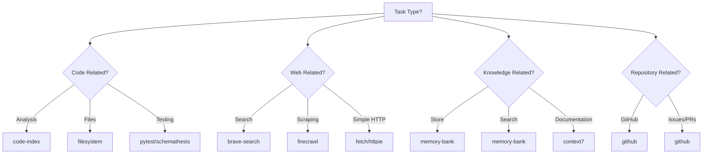

# Cipher Aggregator: Enhanced Tool Routing Guide

## Executive Summary

The cipher aggregator currently exposes **21 different MCP servers** with **dozens of specialized tools**. This guide establishes **intelligent routing rules** to ensure AI agents use the **best tool for the job**, maximizing efficiency and accuracy.

## Tool Capability Matrix

### 🏗️ **Development & Code Management**

| Task Category | Preferred Tool | Alternative Tools | When NOT to Use |
|---------------|----------------|-------------------|-----------------|
| **Code Analysis** | `code-index` | `filesystem` | Never use `fetch` for local code |
| **File Operations** | `filesystem` | `file-batch` | Never use `fetch` for local files |
| **Code Search** | `code-index` | `filesystem_list` | Avoid manual file scanning |
| **Code Edits** | `morph` | `filesystem_write` | Only use `filesystem` for simple writes |
| **Repository Operations** | `github` | `fetch` | **Always prefer `github`** for GitHub operations |
| **Testing** | `pytest` | `schemathesis` | Use `schemathesis` for API testing only |

### 🌐 **Web Operations & Data Retrieval**

| Task Category | Preferred Tool | Alternative Tools | When NOT to Use |
|---------------|----------------|-------------------|-----------------|
| **Web Search** | `brave-search` | `firecrawl_search` | Avoid generic web scraping for search |
| **Web Scraping** | `firecrawl` | `fetch` | **Use `fetch` only for simple HTTP requests** |
| **Content Extraction** | `firecrawl_extract` | `firecrawl_scrape` | Prefer structured extraction over scraping |
| **Website Crawling** | `firecrawl_crawl` | `fetch` | Use `fetch` only for single URLs |
| **HTTP Requests** | `httpie` | `fetch` | **Use `fetch` for basic GET requests only** |

### 💾 **Data Management & Storage**

| Task Category | Preferred Tool | Alternative Tools | When NOT to Use |
|---------------|----------------|-------------------|-----------------|
| **Knowledge Storage** | `memory-bank` | `filesystem` | Use `filesystem` only for simple file storage |
| **Knowledge Retrieval** | `memory-bank` | `code-index` | Use `code-index` only for code-specific queries |
| **Documentation** | `context7` | `firecrawl` | Use `firecrawl` only for external docs |
| **Database Operations** | `sql` | `fetch` | Never use `fetch` for database queries |

### 🔍 **Monitoring & Observability**

| Task Category | Preferred Tool | Alternative Tools | When NOT to Use |
|---------------|----------------|-------------------|-----------------|
| **Metrics & Monitoring** | `prometheus` | `fetch` | Always prefer dedicated monitoring tools |
| **Performance Analysis** | `prometheus` | `code-index` | Use `code-index` for static analysis |

### 🎨 **UI & Development Tools**

| Task Category | Preferred Tool | Alternative Tools | When NOT to Use |
|---------------|----------------|-------------------|-----------------|
| **TUI Development** | `textual-devtools` | `filesystem` | Only use `filesystem` for file creation |
| **Svelte Development** | `svelte` | `filesystem` | Use `filesystem` only for basic file ops |
| **Browser Automation** | `playwright` | `fetch` | Never use `fetch` for browser automation |
| **UI Magic Tools** | `magic-mcp` | `filesystem` | Use `filesystem` for basic file operations |

### 🐳 **Infrastructure & Deployment**

| Task Category | Preferred Tool | Alternative Tools | When NOT to Use |
|---------------|----------------|-------------------|-----------------|
| **Docker Operations** | `docker` | `filesystem` | Use `filesystem` for file operations only |

## 🚦 **Critical Routing Rules**

### Rule 1: **Domain-Specific First**
- **GitHub Operations** → Always use `github` MCP server
- **Web Search** → Always use `brave-search`
- **API Testing** → Always use `schemathesis`
- **Database Queries** → Always use `sql`
- **Monitoring** → Always use `prometheus`

### Rule 2: **Capability Specialization**
- **Code Analysis** → `code-index` (indexed search) over `filesystem` (manual)
- **Knowledge Management** → `memory-bank` over `filesystem`
- **Web Scraping** → `firecrawl` over `fetch`
- **File Operations** → `filesystem` over `fetch`

### Rule 3: **Performance Hierarchy**
- **Speed**: Use specialized tools over generic ones
- **Accuracy**: Use tools with domain knowledge over generic HTTP clients
- **Reliability**: Use maintained MCP servers over ad-hoc solutions

## 🎯 **Task-Specific Routing Decisions**

### Scenario Analysis & Tool Selection

#### **"Get information about a GitHub repository"**
❌ **Wrong**: `fetch` with GitHub API URLs
✅ **Correct**: `github_list_repos`, `github_search_issues`

#### **"Search for Python tutorials online"**
❌ **Wrong**: `firecrawl_search` (web scraping engine)
✅ **Correct**: `brave_web_search` (search engine)

#### **"Read a local Python file"**
❌ **Wrong**: `fetch` with file:// URLs
✅ **Correct**: `filesystem_read` or `code-index_file_summary`

#### **"Test an API endpoint"**
❌ **Wrong**: `fetch` or `httpie` for complex testing
✅ **Correct**: `schemathesis` for schema-based testing

#### **"Scrape product data from e-commerce site"**
❌ **Wrong**: `fetch` with manual parsing
✅ **Correct**: `firecrawl_extract` with structured schema

#### **"Store project knowledge for team"**
❌ **Wrong**: `filesystem_write` to random files
✅ **Correct**: `memory_bank_store` with project categorization

## 🔄 **Fallback Strategy Matrix**

| Primary Tool Failed | Fallback Tool | Limitations |
|-------------------|---------------|-------------|
| `github` | `fetch` | Limited to read-only operations |
| `brave-search` | `firecrawl_search` | Less comprehensive, slower |
| `firecrawl` | `fetch` | Manual parsing required |
| `code-index` | `filesystem` | No indexing, manual search |
| `memory-bank` | `filesystem` | No semantic search |
| `pytest` | Manual test execution | No structured reporting |

## 📊 **Tool Performance Characteristics**

### Speed Ranking (Fastest to Slowest)
1. `filesystem` - Local file operations
2. `code-index` - Indexed search
3. `memory-bank` - Semantic search
4. `github` - API calls
5. `brave-search` - Web search
6. `firecrawl` - Web scraping
7. `prometheus` - Metrics queries

### Reliability Ranking (Most to Least Reliable)
1. `filesystem` - Local operations
2. `code-index` - Indexed queries
3. `github` - Official API
4. `memory-bank` - Semantic storage
5. `brave-search` - Search engine
6. `firecrawl` - Web scraping
7. `prometheus` - Monitoring system

## 🚨 **Common Anti-Patterns to Avoid**

### ❌ **Never Do This:**
1. **Use `fetch` for GitHub operations** → Use `github` MCP server
2. **Use `fetch` for local files** → Use `filesystem` or `code-index`
3. **Use `firecrawl_search` for general web search** → Use `brave-search`
4. **Use `fetch` for API testing** → Use `schemathesis`
5. **Use `filesystem` for knowledge management** → Use `memory-bank`
6. **Manual file scanning instead of `code-index`**
7. **Use `fetch` for database operations** → Use `sql` MCP server

### ✅ **Always Do This:**
1. **Check capability matrix before tool selection**
2. **Use domain-specific tools when available**
3. **Prefer indexed/search tools over manual operations**
4. **Use semantic tools for knowledge management**
5. **Leverage specialized testing frameworks**

## 🎯 **Decision Tree for Tool Selection**

## 📈 **Future Enhancement Opportunities**

1. **Smart Tool Suggestions** - AI-powered tool recommendation based on task context
2. **Performance Metrics** - Track tool success rates and response times
3. **Learning System** - Adapt routing rules based on successful patterns
4. **Tool Health Monitoring** - Automatic fallback activation
5. **Cost Optimization** - Route based on API usage costs

## 🎯 **Success Metrics**

- **Tool Selection Accuracy**: >90% of agents choose optimal tool
- **Task Completion Speed**: 50% reduction in average task time
- **Error Rate Reduction**: 70% fewer tool-related failures
- **User Satisfaction**: Improved agent performance ratings

---

*This guide should be updated as new MCP servers are added or existing tools evolve.*